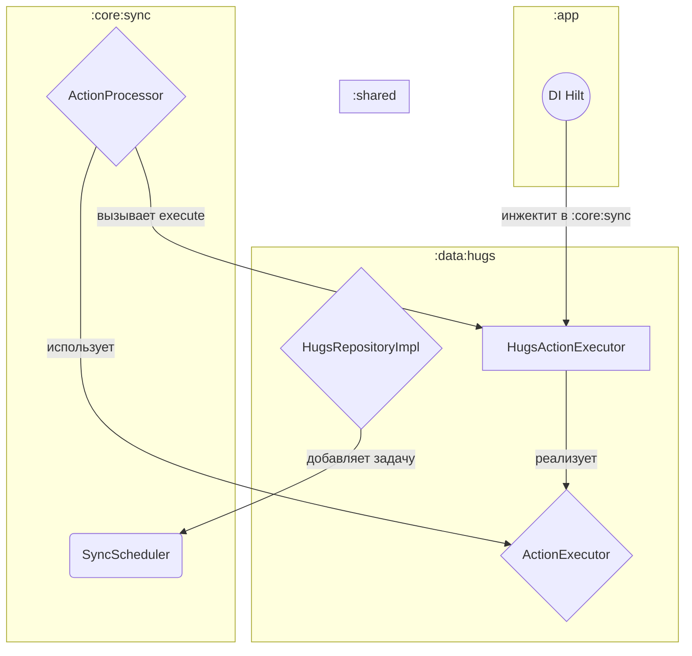

## Детализация модульности (Modularization Rules)

Документ фиксирует обязательные правила модульной архитектуры проекта. Он является источником истины для настройки `settings.gradle.kts` и `build.gradle.kts` в каждом модуле.

### 1. Визуальная схема зависимостей

Актуальная схема (строгая изоляция фич):

```
:app
 ├─ :feature:* ──┐        (зависят только от интерфейсов из :shared и UI из :core:design)
 │               └─ :shared
 ├─ :data:* ──────┐
 │                ├─ :shared (интерфейсы, DTO)
 │                ├─ :core:network
 │                ├─ :core:database
 │                └─ :core:ble (по необходимости)
 └─ DI: bind(Impl из :data:* as интерфейсы из :shared)
```

Детализация типов модулей:

- `:app` — точка входа Android, навигация, DI-композиция.
- `:shared` — KMP Domain: модели/DTO, интерфейсы репозиториев, UseCase/оркестраторы. Без Android/Compose/Retrofit/Room.
- `:core:*` — инфраструктура платформы (Android): сеть, БД, BLE, дизайн-система, конфиг, телеметрия.
- `:core:sync` — инфраструктура планирования и исполнения фоновой синхронизации/очередей (WorkManager, диспетчер действий).
- `:data:*` — реализации репозиториев. Инкапсулируют Network/DB/BLE, но не зависят от `:feature:*`.
- `:feature:*` — экраны/бизнес‑UI. Смотрят только на `:shared` и `:core:design`.

### 2. Правила зависимостей (обязательны)

- `:feature:*`
  - Разрешено: `implementation(project(":shared"))`, `implementation(project(":core:design"))`.
  - Запрещено: прямые зависимости на `:data:*`, `:core:*` (кроме `:core:design`), `feature ↔ feature`.

- `:data:*`
  - Разрешено: `implementation(project(":shared"))`, `implementation(project(":core:network"))`, `implementation(project(":core:database"))`, опционально `implementation(project(":core:ble"))`, `implementation(project(":core:telemetry"))`, `implementation(project(":core:config"))`.
  - Запрещено: зависимости на `:feature:*` и на `:app`.

- `:core:*`
  - Разрешено: зависимости на Android SDK и сторонние библиотеки; `:core:*` могут зависеть друг от друга, но только «вниз» по абстракциям (например, `:core:network` не должен зависеть от `:core:database`).
  - Запрещено: зависимости на `:feature:*` и `:data:*`.

- `:core:sync` (специализация правил):
  - Разрешено: `implementation(project(":shared"))`, `implementation(project(":core:database"))`, `implementation("androidx.work:work-runtime-ktx:<version>")`.
  - Запрещено: любые зависимости на `:data:*` и `:feature:*`.

- `:shared`
  - Разрешено: только KMP‑совместимые зависимости (stdlib, coroutines, kotlinx.serialization, Koin/Kodein — опционально). Никаких Android артефактов.
  - Запрещено: зависимости на `:core:*`, `:data:*`, `:feature:*`, `:app`.

- `:app`
  - Разрешено: зависимости на все `:feature:*`, все нужные `:data:*` и `:core:*`, а также на `:shared` для DI‑моста.
  - Обязанность: связывание реализаций из `:data:*` с интерфейсами из `:shared` (через Hilt/Koin‑мост).

Нарушение правил запрещено и должно блокироваться линтерами/проверками зависимостей (см. раздел 5).

### 3. Конфигурация Gradle: api vs implementation

Принцип: минимизировать поверхность «утечки» API. По умолчанию используем `implementation`. `api` применяем только для экспортируемых контрактов (редко и осознанно).

- `:shared`
  - Внутренние зависимости (coroutines, serialization, result и т.д.) — `implementation`.
  - Если `:shared` предоставляет «публичные» типы, которые требуют транзитивного доступа потребителям (обычно не требуется), допустим `api` для конкретной библиотеки. По умолчанию — избегать.

- `:core:*`
  - Всегда `implementation` на внешние либы (Retrofit, Room, BLE и т.д.). Эти детали не должны «просачиваться» вверх.
  - Внутри `:core:*` при зависимости одного core‑модуля на другой используем `implementation`. Исключение — явно разделяемые «контракты» (интерфейсы) в отдельном модуле `:core:contracts` (если потребуется) — тогда `api` для контрактов допустим.

- `:data:*`
  - Зависимости на `:shared` — `implementation`.
  - Зависимости на `:core:*` — только `implementation`.
  - Никаких `api`.

- `:feature:*`
  - Зависимости на `:shared`, `:core:design` — `implementation`.
  - Не использовать `api`.

- `:app`
  - Может использовать `implementation` на все модули. `api` из `:app` не нужно.

Шаблоны:

```kotlin
// build.gradle.kts в :feature:hugs
dependencies {
    implementation(project(":shared"))
    implementation(project(":core:design"))
    // Доп. UI либы, Hilt/ViewModel, Compose — implementation
}

// build.gradle.kts в :data:hugs
dependencies {
    implementation(project(":shared"))
    implementation(project(":core:network"))
    implementation(project(":core:database"))
    // по необходимости
    implementation(project(":core:ble"))
}

// build.gradle.kts в :app
dependencies {
    implementation(project(":shared"))
    implementation(project(":feature:hugs"))
    implementation(project(":feature:devices"))
    implementation(project(":data:hugs"))
    implementation(project(":data:devices"))
    implementation(project(":core:network"))
    implementation(project(":core:database"))
    implementation(project(":core:design"))
}
```

### 4. Соглашения по именованию модулей, пакетов и ПАПОК (обязательно)

- Иерархия модулей: `:<layer>:<name>`.
  - **feature**: `:feature:dashboard`, `:feature:hugs`, `:feature:patterns`, `:feature:devices`, `:feature:sessions`, `:feature:settings`, `:feature:library`.
  - **data**: `:data:user`, `:data:devices`, `:data:hugs`, `:data:patterns`, `:data:practices`, `:data:rules`, `:data:privacy`.
  - **core**: `:core:network`, `:core:database`, `:core:ble`, `:core:telemetry`, `:core:design`, `:core:config`.
  - Дополнительно: `:core:sync`.
  - **shared**: один модуль `:shared`.
  - **app**: один модуль `:app`.

- Физическая структура папок ДОЛЖНА зеркалировать путь модуля в Gradle:
  - `:feature:hugs` → `feature/hugs/`
  - `:feature:devices` → `feature/devices/`
  - `:data:hugs` → `data/hugs/`
  - `:data:devices` → `data/devices/`
  - `:core:network` → `core/network/`
  - `:core:database` → `core/database/`
  - `:core:design` → `core/design/`
  - `:core:sync` → `core/sync/`
  - `:shared` → `shared/`
  - `:app` → `app/`

- Пакеты внутри модулей:
  - `:feature:*`: `com.example.amulet_android_app.feature.<name>`
  - `:data:*`: `com.example.amulet_android_app.data.<name>`
  - `:core:*`: `com.example.amulet_android_app.core.<name>`
  - `:shared`: `com.example.amulet.shared` (с сохранением KMP структуры `commonMain` и т.д.)

- Имена артефактов Gradle: `moduleName` должен соответствовать физическому пути. Используем подпапки `feature/<name>`, `data/<name>`, `core/<name>`. Альтернативные схемы именования директорий не допускаются.

### 5. Ограничение зависимостей и автоматические проверки

Рекомендуется закрепить правила статически:

- Gradle Convention Plugin с преднастроенными зависимостями и запретами (например, `project.dependencies.components {}` + custom check).
- Детектор запрещённых зависимостей (например, [`ForbiddenApis`/custom task], компоновка через `configuration.attributes` и проверка графа).
- CI‑проверка: задача `:depcheck`/`:verifyModuleGraph` должна падать, если:
  - `:feature:*` ссылается на `:data:*` или любой `:core:*`, кроме `:core:design`.
  - `:data:*` ссылается на `:feature:*`.
  - Любой модуль зависит на `:app`.

Минимальный пример проверки на уровне Gradle (идея):

```kotlin
// build-logic/src/main/kotlin/DependencyRulesPlugin.kt (эскиз)
gradle.projectsEvaluated {
    allprojects.forEach { p ->
        val name = p.path
        val deps = p.configurations.matching { it.name.endsWith("Implementation") || it.name.endsWith("Api") }
            .flatMap { it.dependencies }
            .filterIsInstance<ProjectDependency>()
            .map { it.dependencyProject.path }

        if (name.startsWith(":feature:")) {
            require(deps.all { it == ":shared" || it == ":core:design" }) {
                "Feature module $name may depend only on :shared and :core:design, but has $deps"
            }
        }
        if (name.startsWith(":data:")) {
            require(deps.none { it.startsWith(":feature:") || it == ":app" }) {
                "Data module $name must not depend on :feature:* or :app, but has $deps"
            }
        }
        if (name.startsWith(":core:")) {
            require(deps.none { it.startsWith(":feature:") || it.startsWith(":data:") || it == ":app" }) {
                "Core module $name must not depend on :feature:* / :data:* / :app, but has $deps"
            }
        }
        if (name == ":shared") {
            require(deps.none { it.startsWith(":core:") || it.startsWith(":data:") || it.startsWith(":feature:") || it == ":app" }) {
                "Shared must not depend on platform modules, but has $deps"
            }
        }
    }
}
```

### 6. Подключение модулей в settings.gradle.kts

Новые модули добавляются декларативно:

```kotlin
// settings.gradle.kts
include(":app")
include(":shared")

include(":core:network", ":core:database", ":core:ble", ":core:telemetry", ":core:design", ":core:config")
include(":core:sync")
include(":data:user", ":data:devices", ":data:hugs", ":data:patterns", ":data:practices", ":data:rules", ":data:privacy")
include(":feature:dashboard", ":feature:library", ":feature:hugs", ":feature:patterns", ":feature:sessions", ":feature:devices", ":feature:settings")

// Жёсткая привязка путей к папкам (обязательно)
project(":shared").projectDir = file("shared")
project(":app").projectDir = file("app")

project(":core:network").projectDir = file("core/network")
project(":core:database").projectDir = file("core/database")
project(":core:ble").projectDir = file("core/ble")
project(":core:telemetry").projectDir = file("core/telemetry")
project(":core:design").projectDir = file("core/design")
project(":core:config").projectDir = file("core/config")
project(":core:sync").projectDir = file("core/sync")

project(":data:user").projectDir = file("data/user")
project(":data:devices").projectDir = file("data/devices")
project(":data:hugs").projectDir = file("data/hugs")
project(":data:patterns").projectDir = file("data/patterns")
project(":data:practices").projectDir = file("data/practices")
project(":data:rules").projectDir = file("data/rules")
project(":data:privacy").projectDir = file("data/privacy")

project(":feature:dashboard").projectDir = file("feature/dashboard")
project(":feature:library").projectDir = file("feature/library")
project(":feature:hugs").projectDir = file("feature/hugs")
project(":feature:patterns").projectDir = file("feature/patterns")
project(":feature:sessions").projectDir = file("feature/sessions")
project(":feature:devices").projectDir = file("feature/devices")
project(":feature:settings").projectDir = file("feature/settings")
```

Расположение исходников (обязательно):

- `core/network/build.gradle.kts` → проект `:core:network` и т.д.
- `feature/hugs/build.gradle.kts` → проект `:feature:hugs`.
- Любой модуль обязан иметь корень в соответствующей папке по схеме из раздела 4.

### 7. DI‑композиция и точка связывания

- Все биндинги интерфейсов `Repository` (из `:shared`) на реализации (из `:data:*`) выполняются в `:app`.
- `:feature:*` получают только интерфейсы/UseCase из `:shared` через DI.
- Пример (эскиз):

```kotlin
@Module
@InstallIn(SingletonComponent::class)
abstract class RepositoryBindingsModule {
    @Binds abstract fun bindHugs(impl: HugsRepositoryImpl): HugsRepository
    @Binds abstract fun bindDevices(impl: DevicesRepositoryImpl): DevicesRepository
}
```

### 8. Гайд по созданию нового модуля

1) Определите слой и имя: `:feature:<name>` | `:data:<name>` | `:core:<name>`.
2) Добавьте `include(":<layer>:<name>")` в `settings.gradle.kts` и создайте папку `<layer>/<name>/`.
3) Скопируйте шаблон `build.gradle.kts` соответствующего слоя (plugins, android/kotlin, common deps).
4) Подключите только разрешённые межмодульные зависимости по правилам раздела 2.
5) Проверьте сборку и прогоните задачу проверки зависимостей в CI.

### 9. Часто задаваемые вопросы

- Вопрос: «Можно ли `:feature:*` напрямую ходить в сеть/БД?» — Ответ: нет. Только через интерфейсы UseCase/Repository из `:shared`.
- Вопрос: «Когда использовать `api`?» — Ответ: практически никогда. Только для отдельных модулей‑контрактов, где транзитивность — часть дизайна (у нас таких нет по умолчанию).
- Вопрос: «Можно ли `:feature` зависеть от `:feature`?» — Ответ: нет. Общие UI‑компоненты перенесите в `:core:design`.

---

Данный документ обязателен к соблюдению. Любые отступления обсуждаются через ADR и фиксируются в `docs/10_ARCHITECTURE`.


### 10. build-logic и Convention Plugins (рекомендуется, по сути — обязательно)

Чтобы исключить дублирование Gradle-конфигурации и гарантировать единообразие по всем модулям, используем отдельный Gradle Composite Build `build-logic/` с Convention Plugins.

Структура папок:

```
build-logic/
  ├─ settings.gradle.kts
  ├─ build.gradle.kts
  └─ src/main/kotlin/
       ├─ amulet.android.app.gradle.kts
       ├─ amulet.android.library.gradle.kts
       ├─ amulet.android.feature.gradle.kts
       ├─ amulet.android.core.gradle.kts
       └─ amulet.kotlin.multiplatform.shared.gradle.kts
```

Подключение Composite Build из корня репозитория (корневой `settings.gradle.kts`):

```kotlin
// Подключаем build-logic как composite build
includeBuild("build-logic")
```

Рекомендуемые ID плагинов:

- `amulet.android.app` — для `:app`
- `amulet.android.feature` — для `:feature:*`
- `amulet.android.library` — для Android библиотек общего назначения (`:data:*`, части `:core:*`)
- `amulet.android.core` — для инфраструктурных модулей `:core:*` с общими настройками (может расширять library)
- `amulet.kotlin.multiplatform.shared` — для `:shared` (KMP)

Советы по внедрению:

- Общие версии библиотек держать в `gradle/libs.versions.toml` и использовать в build-logic через Version Catalog (`libs`).
- Базовые Android параметры (`compileSdk`, `minSdk`, `kotlinOptions.jvmTarget`, Compose) зашить в convention‑плагины.
- Проверки зависимостей из раздела 5 вынести в отдельный плагин `DependencyRulesPlugin` в `build-logic` и применять его ко всем Android модулям.

### 11. Синхронизация: роль `:core:sync` и поток данных

`:`core:sync` обеспечивает планирование фоновых задач (WorkManager), диспетчеризацию и выполнение действий доменной очереди, не зная о конкретных реализациях репозиториев.

Правила зависимостей для `:core:sync`:

- Разрешено: `implementation(project(":shared"))`, `implementation(project(":core:database"))`, `implementation("androidx.work:work-runtime-ktx:<version>")`.
- Запрещено: зависимости на `:data:*` и `:feature:*`.

Диаграмма потока данных:




