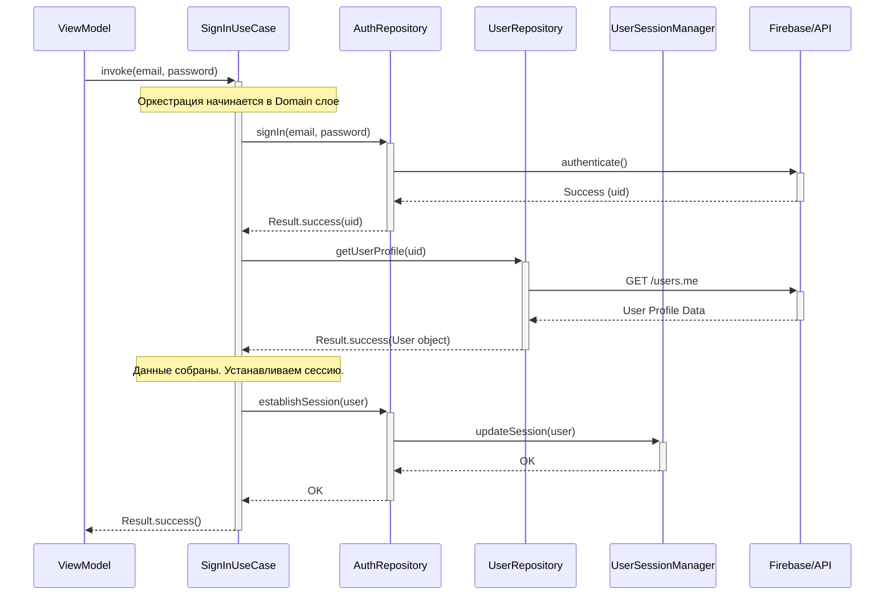

### Суть документа

Этот документ определяет централизованную стратегию управления состоянием аутентификации и контекстом текущего пользователя. Его цель — создать единый, быстрый, типобезопасный и реактивный источник правды о сессии, который будет использоваться всеми слоями приложения.

**Проблема, которую мы решаем:**
- Избежать дублирования логики проверки статуса "залогинен/не залогинен".
- Предотвратить множественные запросы к БД/сети за одними и теми же базовыми данными пользователя (ID, согласия).
- Обеспечить атомарное обновление состояния сессии, исключая гонку состояний.
- Создать чистый и масштабируемый механизм для реакции всего приложения на вход или выход пользователя.

**Решение:**
Мы вводим `UserSessionManager` — компонент в модуле `:core:auth`, который предоставляет единый поток `StateFlow<UserSessionContext>`. Этот поток является единственным источником правды о состоянии сессии. Управление этим состоянием (логин, логаут) делегируется `AuthRepository`, который, в свою очередь, координируется `UseCase`'ами из доменного слоя.

---

### 1. Ключевые компоненты и их роли

| Компонент | Модуль | Роль |
| :--- | :--- | :--- |
| **`UserSessionManager`** | `:core:auth` | **Пассивный хранитель состояния.** Хранит и предоставляет `UserSessionContext` для всего приложения. Не содержит бизнес-логики. |
| **`UserSessionContext`** | `:core:auth` | **Иммутабельная модель данных.** Полностью описывает текущее состояние сессии (`Loading`, `LoggedOut`, `LoggedIn`). |
| **`AuthRepository`** | `:data:auth` | **Менеджер процесса аутентификации.** Отвечает за взаимодействие с Firebase/API для входа/выхода и **управляет** состоянием в `UserSessionManager`. |
| **`SignInUseCase`** (Пример) | `:shared` | **Оркестратор бизнес-процесса.** Координирует вызовы `AuthRepository` и `UserRepository` для выполнения полного флоу входа пользователя. |

---

### 2. Диаграмма потока данных (Пример: Вход пользователя)

Эта диаграмма показывает правильное взаимодействие между слоями без нарушения зависимостей. `AuthRepository` и `UserRepository` не общаются напрямую.



---

### 3. Размещение и Зависимости

Компонент `UserSessionManager` разделен на три части в соответствии с принципом инверсии зависимостей и строгой типизации:

*   **`UserSessionProvider` (интерфейс в `:shared`):**
    *   **Назначение:** Безопасный интерфейс только для чтения состояния сессии. Используется `UseCase`'ами в доменном слое.
    *   **Зависимости:** Не имеет зависимостей от внешних слоев.
    *   **Безопасность:** Содержит только методы чтения, предотвращает случайное изменение состояния.

*   **`UserSessionUpdater` (интерфейс в `:data:auth`):**
    *   **Назначение:** Интерфейс для управления состоянием сессии. Используется исключительно `AuthRepositoryImpl`.
    *   **Зависимости:** Не экспортируется в `:shared`, остается внутренним для data слоя.
    *   **Безопасность:** Типобезопасное разделение ответственности.

*   **`UserSessionManager` (объединенный интерфейс в `:core:auth`):**
    *   **Назначение:** Полный интерфейс, объединяющий чтение и запись. Реализуется `UserSessionManagerImpl`.
    *   **Зависимости:** Зависит от `:shared` (для `UserSessionProvider`) и Android-библиотек.
    *   **DI:** Используется для связывания реализации с интерфейсами через Hilt.

**Процесс DI:**
1.  `UserSessionProvider` запрашивается `UseCase`'ами в `:shared`.
2.  `UserSessionUpdater` используется только в `AuthRepositoryImpl` в `:data:auth`.
3.  `UserSessionManagerImpl` реализует оба интерфейса в `:core:auth`.
4.  Hilt-модуль в `:core:auth` связывает (`@Binds`) реализацию с интерфейсами.
5.  На уровне `:app` Hilt обеспечивает правильное внедрение зависимостей.

---

### 4. Контракты и канонический код (Обновлено)

#### UserSessionContext.kt (`:shared`)

```kotlin
/**
 * Sealed interface, описывающий все возможные состояния сессии.
 * Является единым источником правды для всего приложения.
 */
sealed interface UserSessionContext {
    /**
     * Начальное состояние при запуске приложения, до того как сессия была проверена.
     * UI на этом состоянии должен показывать сплэш-скрин.
     */
    object Loading : UserSessionContext

    /**
     * Терминальное состояние, когда пользователь не аутентифицирован.
     * UI на этом состоянии должен показывать экраны входа/регистрации.
     */
    object LoggedOut : UserSessionContext

    /**
     * Состояние активной сессии. Содержит легковесный, критически важный
     * и часто используемый контекст пользователя.
     *
     * ВАЖНО: Не храните здесь полную, "тяжелую" модель User из доменного слоя.
     * Этот объект предназначен для быстрого доступа. За полной моделью User
     * следует обращаться в UserRepository.
     */
    data class LoggedIn(
        val userId: String,
        val displayName: String?,
        val avatarUrl: String?,
        val consents: UserConsents // Модель согласий из :shared
    ) : UserSessionContext
}
```

#### UserSessionProvider.kt (интерфейс в `:shared`)

```kotlin
/**
 * Интерфейс для доступа к контексту сессии.
 * Является частью доменного слоя.
 * Содержит только методы чтения - безопасен для использования в UseCase'ах.
 */
interface UserSessionProvider {

    /**
     * Основной реактивный поток состояния сессии.
     */
    val sessionContext: StateFlow<UserSessionContext>

    /**
     * Удобное свойство для синхронного доступа к текущему состоянию.
     */
    val currentContext: UserSessionContext get() = sessionContext.value
}
```

#### UserSessionUpdater.kt (интерфейс в `:data:auth`)

```kotlin
/**
 * Интерфейс для управления состоянием сессии.
 * Предназначен ИСКЛЮЧИТЕЛЬНО для использования в AuthRepository.
 * Не экспортируется в :shared для предотвращения случайного использования.
 */
interface UserSessionUpdater {
    /**
     * Обновляет сессию, переводя ее в состояние LoggedIn.
     */
    suspend fun updateSession(user: User)

    /**
     * Очищает сессию, переводя ее в состояние LoggedOut.
     */
    suspend fun clearSession()
}
```

#### UserSessionManager.kt (объединенный интерфейс в `:core:auth`)

```kotlin
/**
 * Полный интерфейс менеджера сессии, объединяющий чтение и запись.
 * Реализуется UserSessionManagerImpl и используется для DI.
 */
interface UserSessionManager : UserSessionProvider, UserSessionUpdater
```

#### AuthRepository.kt (интерфейс в `:shared`)

```kotlin
/**
 * Репозиторий, отвечающий за процессы аутентификации и управление сессией.
 */
interface AuthRepository {
    /**
     * Выполняет аутентификацию пользователя.
     * При успехе возвращает уникальный идентификатор пользователя (uid).
     */
    suspend fun signIn(credentials: UserCredentials): Result<String, AppError>

    /**
     * Завершает сессию пользователя.
     */
    suspend fun signOut(): Result<Unit, AppError>

    /**
     * Устанавливает глобальный контекст сессии после полной оркестрации.
     * Принимает полную модель User и передает ее в UserSessionManager.
     */
    suspend fun establishSession(user: User): Result<Unit, AppError>
}
```

---

### 4. Интеграция с Proto DataStore

Для персистентного хранения сессии и быстрого восстановления при перезапуске приложения мы используем **Proto DataStore**.

- **Почему Proto?** Он обеспечивает типобезопасность, явную схему, высокую производительность (бинарный формат) и безопасную миграцию, что полностью соответствует нашим требованиям к эталонному приложению.
- **Размещение:** Файл `.proto` и реализация `DataStore` находятся в модуле `:core:auth`. `UserSessionManagerImpl` будет использовать `DataStore` как деталь своей реализации, скрывая ее от остального приложения.

**`user_session.proto` (в `:core:auth`):**
```protobuf
syntax = "proto3";

option java_package = "com.example.amulet.core.auth.datastore";
option java_multiple_files = true;

// Хранилище для легковесного контекста сессии.
message UserSessionPreferences {
  string user_id = 1;
  string display_name = 2;
  string avatar_url = 3;
  UserConsentsProto consents = 4;
}

message UserConsentsProto {
  bool analytics = 1;
  // ... другие поля согласий
}
```

#### 4.1. Безопасность и хранение

- **Инструмент хранения:** Для персистентного хранения `UserSessionContext` используется Proto DataStore.
- **Безопасность:** Хранение данных зашифровано. Даже при прямом доступе к файлу на рутованном устройстве утечки PII не произойдет.
- **Механизм шифрования:**
  - Используется официальная библиотека `androidx.security:security-crypto`.
  - DataStore настроен на работу через `EncryptedFile`, обеспечивающий шифрование по схеме AES‑256‑GCM.
  - Ключи шифрования управляются системой Android через Android Keystore (`MasterKey`), что является золотым стандартом безопасности на платформе.
- **Связь с общей стратегией:** Подход соответствует общей стратегии безопасности, описанной в документе `docs/50_CROSS_CUTTING_CONCERNS/03_SECURITY_AND_PRIVACY.md`.

---

### 5. Чек-лист для разработчика

- ✅ Для получения реактивного состояния сессии в `UseCase`'ах — подписывайтесь на `userSessionProvider.sessionContext`.
- ✅ Для синхронного доступа к `userId` или `consents` (в интерсепторах, логгерах) — используйте `userSessionProvider.currentContext`.
- ✅ Для управления состоянием сессии в `AuthRepositoryImpl` — используйте `userSessionUpdater.updateSession()` и `userSessionUpdater.clearSession()`.
- ❌ **ЗАПРЕЩЕНО** использовать `UserSessionUpdater` в доменном слое (`UseCase`'ах).
- ✅ Процесс входа/регистрации должен быть оркестрирован через `UseCase` в доменном слое.
- ❌ **ЗАПРЕЩЕНО** создавать зависимости между репозиториями (например, `AuthRepository` -> `UserRepository`).
- ✅ Используйте типобезопасное разделение: `UserSessionProvider` для чтения, `UserSessionUpdater` для записи.


