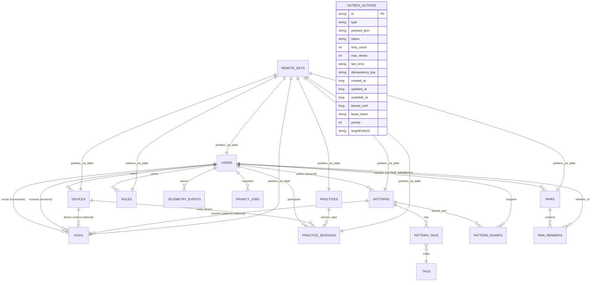

## Локальная база данных (Room) — схема и логика

Этот документ описывает эталонную локальную БД приложения на основе Room: целевую схему, связи, индексы, миграции и политики консистентности для offline‑first. Схема проектировалась исходя из домена и потоков данных из `docs/ARCHITECTURE.md`, `docs/openapi_v1_бэкенда.yaml` и пользовательских сценариев.

### Цели
- Offline‑first: чтение из БД — единственный источник истины для UI.
- Реактивность: все DAO возвращают Flow/PagingSource.
- Идемпотентность: upsert через конфликтные стратегии и уникальные ключи.
- Масштабируемость: стабильные первичные ключи, чёткие внешние ключи и индексы.
- Надёжная доставка исходящих действий через локальную outbox‑очередь.

---

### ER‑диаграмма



Пояснения:
- `REMOTE_KEYS` моделируется как единая таблица с колонкой `table`/`scope` и ключами для пагинации (см. раздел ниже).
- `PATTERN_TAGS` и `TAGS` обеспечивают M:N между `patterns` и текстовыми тегами.
- `PATTERN_SHARES` — «шаринг» пользовательских паттернов с другими пользователями локально (отражение факта, пришедшего с сервера).

---

### Таблицы и поля

Нотация типов: Kotlin/Room (в скобках — SQL тип). Времена — `epochMillis` (INTEGER), ISO‑строки преобразуются на границе сети.

#### 1) `users` — кэш профиля, настроек, согласий
- `id: String (TEXT, PK)` — UID.
- `displayName: String? (TEXT)`
- `avatarUrl: String? (TEXT)`
- `timezone: String? (TEXT)`
- `language: String? (TEXT)`
- `consentsJson: String (TEXT)` — компактное хранение согласий пользователя (JSON, минимальный PII).
- `createdAt: Long? (INTEGER)`
- `updatedAt: Long? (INTEGER)`

Индексы:
- `IDX_users_updatedAt` на `updatedAt` (DESC) — ускорение свежих чтений.

Замечания:
- Профиль единственного «текущего» пользователя может дублироваться в DataStore для быстрых проверок согласий, но Room остаётся источником истины.

#### 2) `devices` — привязанные устройства, имена, кэш статуса
- `id: String (TEXT, PK)`
- `ownerId: String (TEXT, FK → users.id ON DELETE CASCADE)`
- `serial: String (TEXT)`
- `hardwareVersion: Int (INTEGER)`
- `firmwareVersion: String? (TEXT)`
- `name: String? (TEXT)`
- `batteryLevel: Double? (REAL)`
- `status: String? (TEXT)` — enum‑подобное поле: `online|offline|charging|error|banned` (как в API admin, на клиенте — подмножество).
- `settingsJson: String (TEXT)` — яркость/вибро/жесты.
- `pairedAt: Long? (INTEGER)`
- `updatedAt: Long? (INTEGER)`

Индексы:
- `UNQ_devices_serial` уникальный на `serial` (CREATE UNIQUE INDEX IF NOT EXISTS...)
- `IDX_devices_ownerId` на `ownerId`

#### 3) `hugs` — локальная копия истории «объятий» (offline‑доступ)
- `id: String (TEXT, PK)`
- `fromUserId: String (TEXT, FK → users.id ON DELETE SET NULL)`
- `toUserId: String (TEXT, FK → users.id ON DELETE SET NULL)`
- `pairId: String? (TEXT)`
- `emotionColor: String? (TEXT)`
- `emotionPatternId: String? (TEXT, FK → patterns.id ON DELETE SET NULL)`
- `payloadJson: String? (TEXT)`
- `inReplyToHugId: String? (TEXT)`
- `deliveredAt: Long? (INTEGER)`
- `createdAt: Long (INTEGER) NOT NULL`

Индексы и ключи:
- `IDX_hugs_createdAt` на `createdAt DESC` — критично для сортировки ленты.
- `IDX_hugs_direction_from` на `(fromUserId, createdAt DESC)` — «отправленные».
- `IDX_hugs_direction_to` на `(toUserId, createdAt DESC)` — «полученные».
- Уникальность `id` обеспечивает идемпотентное upsert.

Стратегия пагинации:
- Используется cursor‑based API; локально Paging 3 с `RemoteMediator` и таблицей `remote_keys` (см. ниже).

#### 4) `patterns` — кэш системных и пользовательских паттернов
- `id: String (TEXT, PK)`
- `ownerId: String? (TEXT, FK → users.id ON DELETE SET NULL)` — может быть `NULL` для системных паттернов.
- `kind: String (TEXT)` — `light|haptic|combo`.
- `hardwareVersion: Int (INTEGER)` — `100|200`.
- `title: String (TEXT)`
- `description: String? (TEXT)`
- `specJson: String (TEXT)` — сериализованный `PatternSpec`.
- `public: Boolean (INTEGER)` — 0/1.
- `reviewStatus: String? (TEXT)` — `pending|approved|rejected` (для публичных).
- `usageCount: Int? (INTEGER)`
- `createdAt: Long? (INTEGER)`
- `updatedAt: Long? (INTEGER)`

Индексы:
- `IDX_patterns_ownerId` на `ownerId` — «мои паттерны».
- `IDX_patterns_public_hw_kind` на `(public, hardwareVersion, kind)` — каталог/фильтры.
- Полнотекстовый поиск (опционально): `patterns_fts(title, description)` + триггеры синхронизации.

Связанные вспомогательные таблицы:
- `tags` — справочник тегов: `id TEXT PK`, `name TEXT UNIQUE`.
- `pattern_tags` — M:N: `patternId TEXT FK`, `tagId TEXT FK`, PK `(patternId, tagId)`; индекс по `tagId`.
- `pattern_shares` — список UID, с кем «поделен» паттерн: `patternId TEXT FK`, `userId TEXT FK`, PK `(patternId, userId)`.

#### 5) `outbox_actions` — очередь исходящих действий (критично)
Обеспечивает устойчивость команд к офлайну и сбоям. Обрабатывается Dispatcher'ом (WorkManager) с backoff'ом и лизингом для единовременной обработки.

**Enum типов действий (`OutboxActionType`):**

```kotlin
enum class OutboxActionType(val apiEndpoint: String) {
    // Пользователь и профиль
    USER_INIT("/users.me.init"),
    USER_UPDATE("/users.me"),
    USER_DELETE("/privacy/delete"),
    
    // Устройства
    DEVICE_CLAIM("/devices.claim"),
    DEVICE_UPDATE("/devices/{id}"),
    DEVICE_UNCLAIM("/devices/{id}/unclaim"),
    DEVICE_FIRMWARE_REPORT("/devices/{deviceId}/firmware/report"),
    
    // Социальные функции
    HUG_SEND("/hugs.send"),
    PAIR_INVITE("/pairs.invite"),
    PAIR_ACCEPT("/pairs.accept"),
    PAIR_BLOCK("/pairs/{pairId}/block"),
    PAIR_UNBLOCK("/pairs/{pairId}/unblock"),
    
    // Паттерны и контент
    PATTERN_CREATE("/patterns"),
    PATTERN_UPDATE("/patterns/{id}"),
    PATTERN_DELETE("/patterns/{id}"),
    PATTERN_SHARE("/patterns/{patternId}/share"),
    PATTERN_PREVIEW("/patterns/preview"),
    
    // Сессии и практики
    PRACTICE_START("/practices/{practiceId}/start"),
    PRACTICE_STOP("/practices.session/{sessionId}/stop"),
    
    // Уведомления и токены
    FCM_TOKEN_ADD("/notifications.tokens"),
    FCM_TOKEN_DELETE("/notifications.tokens"),
    
    // Правила и автоматизация
    RULE_CREATE("/rules"),
    RULE_UPDATE("/rules/{ruleId}"),
    RULE_DELETE("/rules/{ruleId}"),
    
    // Приватность и GDPR
    PRIVACY_EXPORT("/privacy/export"),
    PRIVACY_DELETE("/privacy/delete"),
    
    // Телеметрия
    TELEMETRY_EVENTS("/telemetry/events"),
    
    // OTA обновления
    OTA_CHECK("/ota/firmware/latest"),
    
    // Статистика и аналитика
    STATS_OVERVIEW("/stats/overview"),
    
    // Вебхуки и интеграции
    WEBHOOK_TRIGGER("/webhooks/{integrationKey}")
}
```

**Приоритеты обработки (по умолчанию):**
- `HIGH (100)`: `HUG_SEND`, `FCM_TOKEN_ADD/DELETE` — критичные для UX
- `NORMAL (50)`: `USER_UPDATE`, `DEVICE_CLAIM/UNCLAIM`, `PRACTICE_START/STOP`
- `LOW (10)`: `TELEMETRY_EVENTS`, `OTA_CHECK` — фоновые операции

Обязательные поля:
- `id: String (TEXT, PK)` — стабильно‑уникальный ID (например, ULID/UUID). Позволяет привязку UI к конкретной операции.
- `type: String (TEXT) NOT NULL` — тип действия из enum выше.
- `payload_json: String (TEXT) NOT NULL` — сериализованный контракт запроса. В payload обязательно включать любой внешний идемпотентный ключ, если применимо.
- `status: String (TEXT) NOT NULL` — `PENDING`, `IN_FLIGHT`, `FAILED`, `COMPLETED`.
- `retry_count: Int (INTEGER) NOT NULL DEFAULT 0`
- `created_at: Long (INTEGER) NOT NULL` — время постановки.

Расширенные поля (рекомендуется для энтерпрайз‑уровня надёжности):
- `updated_at: Long (INTEGER) NOT NULL` — последняя смена статуса.
- `available_at: Long (INTEGER) NOT NULL DEFAULT created_at` — «не ранее чем» (для backoff/отложенных задач).
- `max_retries: Int (INTEGER) NOT NULL DEFAULT 5` — политика повторов на уровне записи.
- `last_error: String? (TEXT)` — машинно‑читабельная ошибка последней неудачи.
- `idempotency_key: String? (TEXT)` — корреляция с сервером для идемпотентных операций HTTP.
- `priority: Int (INTEGER) NOT NULL DEFAULT 0` — выше — раньше (heap‑очередь в запросах DAO).
- `lease_token: String? (TEXT)` — «замок» обработчика (GUID).
- `leased_until: Long? (INTEGER)` — TTL блокировки (обработчик обязан продлевать или отпускать).
- `targetEntityId: String? (TEXT)` — ID целевой сущности для быстрого поиска связанных действий (например, `patternId` для `PATTERN_UPDATE`).

Индексы и ограничения:
- `IDX_outbox_status_available_priority` на `(status, available_at, priority DESC)` — извлечение ближайших к исполнению.
- `IDX_outbox_type_status` на `(type, status)` — выборка по типам для UI.
- `IDX_outbox_targetEntityId` на `targetEntityId` — быстрый поиск действий для конкретной сущности.
- `UNQ_outbox_idempotency` уникальный на `idempotency_key` (WHERE `idempotency_key IS NOT NULL`).

Протокол обработки (рекомендация):
1) Atomically select and lease: выбрать запись `PENDING`/`FAILED` с `available_at <= now()` и выставить `status=IN_FLIGHT`, `lease_token`, `leased_until = now()+T` (одна транзакция).
2) Выполнить действие. На успех — `status=COMPLETED`, очистить `lease_token` и `last_error`.
3) На ретраибельную ошибку — инкремент `retry_count`, рассчитать backoff, поставить `status=PENDING`, `available_at = now()+backoff`, сохранить `last_error`.
4) На не‑ретраибельную — `status=FAILED`, сохранить `last_error`.

DAO должны предоставлять удобные `Flow` для отображения прогресса в UI.

**Примечание о разделении очередей:**
Таблицы `outbox_actions` и `telemetry_events` представляют собой две отдельные очереди исходящих действий, каждая со своей спецификой:

- **`outbox_actions`** — критичные операции пользователя (отправка объятий, обновление паттернов, управление устройствами). Требуют гарантированной доставки, сложной логики ретраев, идемпотентности и приоритизации.

- **`telemetry_events`** — аналитические события (клики, время сессий, ошибки). Обрабатываются по принципу "fire-and-forget", могут быть отброшены при переполнении, не требуют сложной логики ретраев.

Разделение обеспечивает изоляцию ответственности и позволяет оптимизировать каждую очередь под её специфические требования.

**Примечание об FCM токенах:**
Таблица `fcm_tokens` исключена из схемы для упрощения. Логика управления FCM токенами реализуется через `DataStore`:
- При получении нового токена от Firebase SDK — сравнение с сохранённым в `DataStore`
- Отправка на сервер только при изменении токена
- Хранение последнего токена в `EncryptedSharedPreferences` для безопасности

#### 6) `pairs` — пары пользователей для «объятий»
- `id: String (TEXT, PK)`
- `status: String (TEXT)` — `active|pending|blocked`
- `blockedBy: String? (TEXT, FK → users.id ON DELETE SET NULL)` — кто заблокировал
- `blockedAt: Long? (INTEGER)`
- `createdAt: Long (INTEGER) NOT NULL`

Индексы:
- `IDX_pairs_status` на `status`
- `IDX_pairs_createdAt` на `createdAt DESC`

#### 7) `pair_members` — участники пар (M:N)
- `pairId: String (TEXT, FK → pairs.id ON DELETE CASCADE)`
- `userId: String (TEXT, FK → users.id ON DELETE CASCADE)`
- `joinedAt: Long (INTEGER) NOT NULL`

Индексы:
- `PK_pair_members` на `(pairId, userId)` — составной первичный ключ
- `IDX_pair_members_userId` на `userId`

#### 8) `practices` — каталог практик (дыхание, медитации, звуки)
- `id: String (TEXT, PK)`
- `type: String (TEXT)` — `breath|meditation|sound`
- `title: String (TEXT)`
- `description: String? (TEXT)`
- `durationSec: Int? (INTEGER)`
- `patternId: String? (TEXT, FK → patterns.id ON DELETE SET NULL)`
- `audioUrl: String? (TEXT)`
- `localesJson: String (TEXT)` — локализованные версии
- `createdAt: Long? (INTEGER)`
- `updatedAt: Long? (INTEGER)`

Индексы:
- `IDX_practices_type` на `type`
- `IDX_practices_duration` на `durationSec`

#### 9) `practice_sessions` — активные и завершённые сессии практик
- `id: String (TEXT, PK)`
- `userId: String (TEXT, FK → users.id ON DELETE CASCADE)`
- `practiceId: String (TEXT, FK → practices.id ON DELETE CASCADE)`
- `deviceId: String? (TEXT, FK → devices.id ON DELETE SET NULL)`
- `status: String (TEXT)` — `active|completed|cancelled`
- `startedAt: Long (INTEGER) NOT NULL`
- `completedAt: Long? (INTEGER)`
- `durationSec: Int? (INTEGER)` — фактическая длительность
- `completed: Boolean (INTEGER) NOT NULL DEFAULT 0`
- `intensity: Double? (REAL)` — настройки сессии
- `brightness: Double? (REAL)`

Индексы:
- `IDX_practice_sessions_userId` на `userId`
- `IDX_practice_sessions_practiceId` на `practiceId`
- `IDX_practice_sessions_status` на `status`
- `IDX_practice_sessions_startedAt` на `startedAt DESC`

#### 10) `rules` — пользовательские правила автоматизации (IFTTT)
- `id: String (TEXT, PK)`
- `ownerId: String (TEXT, FK → users.id ON DELETE CASCADE)`
- `triggerJson: String (TEXT)` — сериализованный `RuleTrigger`
- `actionJson: String (TEXT)` — сериализованный `RuleAction`
- `enabled: Boolean (INTEGER) NOT NULL DEFAULT 1`
- `scheduleJson: String? (TEXT)` — расписание выполнения
- `createdAt: Long? (INTEGER)`
- `updatedAt: Long? (INTEGER)`

Индексы:
- `IDX_rules_ownerId` на `ownerId`
- `IDX_rules_enabled` на `enabled`

#### 11) `telemetry_events` — локальная очередь событий телеметрии
- `id: String (TEXT, PK)`
- `userId: String (TEXT, FK → users.id ON DELETE CASCADE)`
- `type: String (TEXT) NOT NULL`
- `timestamp: Long (INTEGER) NOT NULL`
- `paramsJson: String? (TEXT)` — параметры события
- `sessionId: String? (TEXT)`
- `practiceId: String? (TEXT)`
- `sentAt: Long? (INTEGER)` — когда отправлено на сервер
- `createdAt: Long (INTEGER) NOT NULL`

Индексы:
- `IDX_telemetry_events_userId` на `userId`
- `IDX_telemetry_events_type` на `type`
- `IDX_telemetry_events_timestamp` на `timestamp DESC`
- `IDX_telemetry_events_sentAt` на `sentAt` (для поиска неотправленных)

#### 12) `privacy_jobs` — задачи экспорта/удаления данных (GDPR)
- `id: String (TEXT, PK)`
- `userId: String (TEXT, FK → users.id ON DELETE CASCADE)`
- `type: String (TEXT)` — `export|delete`
- `status: String (TEXT)` — `pending|processing|completed|failed`
- `jobId: String? (TEXT)` — ID задачи на сервере
- `estimatedCompletionTime: String? (TEXT)`
- `downloadUrl: String? (TEXT)` — для экспорта
- `fileSize: Long? (INTEGER)` — размер файла экспорта
- `errorMessage: String? (TEXT)`
- `expiresAt: Long? (INTEGER)` — срок действия ссылки
- `createdAt: Long (INTEGER) NOT NULL`
- `updatedAt: Long (INTEGER) NOT NULL`

Индексы:
- `IDX_privacy_jobs_userId` на `userId`
- `IDX_privacy_jobs_type` на `type`
- `IDX_privacy_jobs_status` на `status`

#### 13) `firmware_info` — кэш информации о прошивках (OTA)
- `id: String (TEXT, PK)` — составной: `${hardwareVersion}_${version}`
- `hardwareVersion: Int (INTEGER) NOT NULL`
- `version: String (TEXT) NOT NULL`
- `notes: String? (TEXT)`
- `url: String (TEXT)`
- `checksum: String (TEXT)`
- `size: Long (INTEGER)`
- `updateAvailable: Boolean (INTEGER) NOT NULL DEFAULT 0`
- `minFirmwareVersion: String? (TEXT)`
- `maxFirmwareVersion: String? (TEXT)`
- `cachedAt: Long (INTEGER) NOT NULL`

Индексы:
- `IDX_firmware_hardwareVersion` на `hardwareVersion`
- `IDX_firmware_updateAvailable` на `updateAvailable`

#### 14) `remote_keys` — ключи для пагинации (Paging 3)
Единая таблица для разных коллекций с партиционированием по `table`/`scope`.

Структура:
- `id: String (TEXT, PK)` — формат: `${table}:${partitionKey}`. Примеры: `hugs:sent`, `hugs:received`, `patterns:public`, `patterns:mine`, `devices:mine`.
- `table: String (TEXT) NOT NULL` — имя целевой таблицы (`users|devices|hugs|patterns|...`).
- `partition: String (TEXT) NOT NULL` — логический срез (например, `sent|received`, фильтры/параметры).
- `nextCursor: String? (TEXT)` — следующий курсор из API.
- `prevCursor: String? (TEXT)` — если поддерживается.
- `updatedAt: Long (INTEGER) NOT NULL` — когда ключи были обновлены.

Индексы:
- `UNQ_remote_keys_table_partition` уникальный на `(table, partition)`.

Использование:
- `RemoteMediator` для каждой коллекции оперирует своим `id`/`partition`, записывая `nextCursor` после успешной загрузки страницы.

---

### Связи и каскады
- FK `devices.ownerId → users.id ON DELETE CASCADE` — при выходе из аккаунта очистка привязанных устройств.
- FK `hugs.emotionPatternId → patterns.id ON DELETE SET NULL` — удаление паттерна не ломает историю.
- FK `patterns.ownerId → users.id ON DELETE SET NULL` — системные/публичные паттерны остаются доступными.
- Для вспомогательных M:N таблиц — `ON DELETE CASCADE` со стороны `patterns`/`tags`.

---

### Политики консистентности и upsert
- Все сущности с серверными ID — вставляются через `INSERT OR REPLACE` или `upsert()` (Room 2.5+), опираясь на PK.
- В списках («объятия», «паттерны») UI сортируется по `createdAt DESC` локально, консистентность обеспечивается через `remote_keys`.
- Дедупликация входящих событий (FCM) — уникальность по `hugId`/`messageId` на стороне источника события перед записью.

---

### Индексы — сводная таблица
- `users(updatedAt)`
- `devices(ownerId)`, `devices(serial)` UNIQUE
- `hugs(createdAt DESC)`, `(fromUserId, createdAt DESC)`, `(toUserId, createdAt DESC)`
- `patterns(ownerId)`, `(public, hardwareVersion, kind)`
- `pattern_tags(tagId)`, `pattern_tags(patternId, tagId)` UNIQUE
- `pattern_shares(patternId, userId)` UNIQUE
- `pairs(status)`, `pairs(createdAt DESC)`
- `pair_members(pairId, userId)` UNIQUE, `pair_members(userId)`
- `practices(type)`, `practices(durationSec)`
- `practice_sessions(userId)`, `practice_sessions(practiceId)`, `practice_sessions(status)`, `practice_sessions(startedAt DESC)`
- `rules(ownerId)`, `rules(enabled)`
- `telemetry_events(userId)`, `telemetry_events(type)`, `telemetry_events(timestamp DESC)`, `telemetry_events(sentAt)`
- `privacy_jobs(userId)`, `privacy_jobs(type)`, `privacy_jobs(status)`
- `firmware_info(hardwareVersion)`, `firmware_info(updateAvailable)`
- `outbox_actions(status, available_at, priority DESC)`, `(type, status)`, `targetEntityId`, `idempotency_key` UNIQUE (nullable)
- `remote_keys(table, partition)` UNIQUE

Рекомендации по производительности:
- Для «бесконционных лент» используйте покрывающие индексы по сортируемым полям (`createdAt`), чтобы ускорить `ORDER BY ... LIMIT`.
- Старайтесь держать размеры `payload_json` в outbox небольшими; при необходимости храните большие вложения отдельно (например, файлы в кэше) и давайте на них ссылки в payload.

---

### Стратегия миграций
- Используем Room `autoMigrations` с `@AutoMigration` и `spec` там, где возможно безопасное выведение (добавление nullable‑полей, индексов без уникальности, новые таблицы без FK конфликтов).
- Для сложных изменений — ручные миграции с SQL (добавление уникальных индексов, пересоздание таблиц для изменения PK/FK, наполнение новых колонок значениями по умолчанию, миграция FTS и триггеров).
- Версионирование: семантически инкрементируем `version` при любом изменении схемы. В `:core:database` хранить список миграций и тесты «from N to latest» (Room MigrationTestHelper).
- Контракты DAO покрывать интеграционными тестами (in‑memory Room) на апгрейд/даунгрейд‑сценарии (даунгрейд — очистка).

---

### Паттерны доступа и Paging
- Чтение коллекций (`hugs`, `patterns`) — через Paging 3 + `RemoteMediator`, источником данных является БД; ключи — в `remote_keys`.
- Детали (`users.me`, `devices/{id}`, `patterns/{id}`, `hugs/{id}`) — read‑through cache: `get → stale‑while‑revalidate`.
- Параметризованные списки (напр., `hugs?direction=sent|received`) — отдельные `partition` значения в `remote_keys` и отдельные DAO‑квери по соответствующим индексам.

---

### Безопасность и приватность (локально)
- Минимизируем PII в Room. Чувствительные поля (например, произвольные payload'ы) храним в JSON без избыточных персональных данных.
- Поддержать шифрование БД (SQLCipher for Android).
- Очистка при выходе из аккаунта: транзакционное удаление данных пользователя (`users`, каскады `devices`, «частные» `patterns`, локальные `remote_keys` и очереди `outbox_actions`).

---

### Стратегия шифрования

Для защиты чувствительных данных пользователя (профили, история «объятий», паттерны, телеметрия) используется полное шифрование базы данных на уровне SQLite.

#### Инструмент: SQLCipher

**Зависимости:**
- `androidx.sqlite:sqlite-ktx` — позволяет "подсунуть" Room фабрику для создания зашифрованных БД
- `net.zetetic:android-database-sqlcipher` — официальная библиотека SQLCipher
- `androidx.security:security-crypto` — предоставляет `EncryptedSharedPreferences` для безопасного хранения ключей

**Интеграция через Room:**
- Создание `DatabasePassphraseProvider` для управления ключами шифрования
- Использование `SupportSQLiteOpenHelperFactory(passphrase)` для SQLCipher
- Передача фабрики в `Room.databaseBuilder().openHelperFactory()`
- Автоматическое создание зашифрованной БД с именем `"amulet_app.db"`

#### Управление ключом шифрования

**Архитектура ключей:**
1. **MasterKey** — автоматически создается `MasterKey.Builder` с схемой `AES256_GCM`
2. **Passphrase** — 256-битный ключ шифрования БД, генерируется через `SecureRandom`
3. **EncryptedSharedPreferences** — хранит зашифрованный passphrase с двойным шифрованием (AES256_SIV + AES256_GCM)

**Жизненный цикл ключей:**
- При первом запуске: генерация 32-байтного passphrase через `SecureRandom`
- Автоматическое создание `MasterKey` через `MasterKey.Builder` с `AES256_GCM`
- Двойное шифрование passphrase: `AES256_SIV` для ключей + `AES256_GCM` для значений
- Сохранение в `EncryptedSharedPreferences` с именем `"db_secure_prefs"`
- При инициализации БД: получение зашифрованного passphrase, автоматическая расшифровка, использование для SQLCipher

#### Обработка ошибок и восстановление

**Сценарии потери доступа к БД:**

1. **Невалидный MasterKey:**
   - Причина: сброс блокировки экрана, смена PIN/пароля, сброс к заводским настройкам
   - Симптомы: `KeyStoreException`, `UnrecoverableKeyException`
   - Решение: принудительный logout с предупреждением пользователя

2. **Повреждение зашифрованного passphrase:**
   - Причина: повреждение `EncryptedSharedPreferences`
   - Симптомы: `DecryptionException` при расшифровке
   - Решение: очистка данных и повторная инициализация

3. **Повреждение самой БД:**
   - Причина: некорректное завершение работы, повреждение файла
   - Симптомы: `SQLiteException` при открытии БД
   - Решение: попытка восстановления, fallback на чистую БД

**Стратегия восстановления:**
- Классификация ошибок по типам (потеря ключей, повреждение данных, системные ошибки)
- Различные стратегии восстановления для каждого типа
- Пользовательские диалоги с понятными объяснениями и вариантами действий
- Принудительный logout при критических ошибках с сохранением данных на сервере

#### Производительность и оптимизация

**Влияние шифрования на производительность:**
- **Чтение:** +15-25% overhead на CPU
- **Запись:** +20-30% overhead на CPU  
- **Размер БД:** +5-10% из-за метаданных шифрования

**Рекомендации:**
- Использовать `PRAGMA cipher_page_size = 4096` для оптимизации
- Включить `PRAGMA cipher_memory_security = OFF` только для тестов
- Мониторить производительность через `:core:telemetry`
- Тестирование производительности с бенчмарками зашифрованной vs незашифрованной БД

#### Конфигурация для разных сборок

**Debug сборка:**
- Отключение шифрования для быстрой разработки
- Использование обычного `SQLiteDatabase.openDatabase()` без пароля

**Release сборка:**
- Обязательное шифрование
- Строгая проверка целостности ключей
- Логирование попыток доступа (без PII)
- Конфигурация через `BuildConfig` для управления включением/отключением

---

### Примеры контрактов DAO (логический уровень)
Ниже — ориентиры для API DAO; точные сигнатуры зависят от версии Room/Paging.

```kotlin
// HugsDao — выборки по двум направлениям
@Query("SELECT * FROM hugs WHERE fromUserId = :uid ORDER BY createdAt DESC")
fun pagingSourceSent(uid: String): PagingSource<Int, HugEntity>

@Query("SELECT * FROM hugs WHERE toUserId = :uid ORDER BY createdAt DESC")
fun pagingSourceReceived(uid: String): PagingSource<Int, HugEntity>

// OutboxDao — извлечение ближайших к исполнению (без гонок в одной транзакции)
@Query(
  "SELECT * FROM outbox_actions " +
  "WHERE status IN ('PENDING','FAILED') AND available_at <= :now " +
  "ORDER BY priority DESC, available_at ASC, created_at ASC " +
  "LIMIT :limit"
)
suspend fun findDue(now: Long, limit: Int): List<OutboxActionEntity>

// Поиск действий для конкретной сущности (например, для отображения статуса синхронизации)
@Query("SELECT * FROM outbox_actions WHERE targetEntityId = :entityId AND status != 'COMPLETED'")
fun getActionsForEntity(entityId: String): Flow<List<OutboxActionEntity>>

// Очистка завершённых действий (старше 7 дней)
@Query("DELETE FROM outbox_actions WHERE status = 'COMPLETED' AND created_at < :cutoffTime")
suspend fun cleanupCompletedActions(cutoffTime: Long): Int

// Очистка неудачных действий (старше 30 дней, исчерпали попытки)
@Query("DELETE FROM outbox_actions WHERE status = 'FAILED' AND retry_count >= max_retries AND updated_at < :cutoffTime")
suspend fun cleanupFailedActions(cutoffTime: Long): Int

// Очистка отправленных телеметрических событий (старше 3 дней)
@Query("DELETE FROM telemetry_events WHERE sentAt IS NOT NULL AND createdAt < :cutoffTime")
suspend fun cleanupSentTelemetryEvents(cutoffTime: Long): Int

// Очистка устаревшего кэша прошивок (старше 30 дней)
@Query("DELETE FROM firmware_info WHERE cachedAt < :cutoffTime")
suspend fun cleanupFirmwareCache(cutoffTime: Long): Int

// Очистка устаревших ключей пагинации (старше 90 дней)
@Query("DELETE FROM remote_keys WHERE updatedAt < :cutoffTime")
suspend fun cleanupRemoteKeys(cutoffTime: Long): Int
```

---

### Политики ретраев и бэкофа (для `outbox_actions`)
- Экспоненциальный бэкоф с джиттером: `nextDelayMs = min(base * 2^retry_count, MAX) * random(0.5..1.5)`.
- Разные классы ошибок: 4xx (кроме 429/409) — обычно не ретраим → `FAILED`; 5xx/сеть/timeout — ретраим; 409 — в зависимости от домена (напр., конфликт версий паттернов — требует UI‑разрешения).
- `max_retries` может настраиваться по типу действия; после исчерпания — остаётся `FAILED` с `last_error` и CTA на «Повторить» (сброс retry_count и available_at).

---

### Готовность к эволюции схемы
- Добавление таблиц: `achievements`, `sessions` и др. — без влияния на существующие FK.
- Расширение `patterns` для новых `PatternElement*` — прозрачно, так как `specJson` хранит сериализованную схему.
- Перенос FTS/индексов — через ручные миграции с бэкапом данных во временные таблицы.

---

### Стратегии очистки и синхронизации

#### Очистка очередей исходящих действий (WorkManager)

**`outbox_actions` — очистка завершённых и неудачных операций:**
- **COMPLETED записи:** Удаляются записи со статусом `COMPLETED`, созданные более 7 дней назад
- **FAILED записи:** Удаляются записи со статусом `FAILED`, которые исчерпали все попытки (`retry_count >= max_retries`) и были обновлены более 30 дней назад
- **Периодичность:** Ежедневно через `WorkManager` с `OneTimeWorkRequest` и `setBackoffCriteria`

**`telemetry_events` — очистка отправленных событий:**
- **Отправленные события:** Удаляются события с `sentAt IS NOT NULL`, созданные более 3 дней назад
- **Периодичность:** Ежедневно через `WorkManager`
- **Приоритет:** Низкий приоритет, выполняется в фоне

#### Синхронизация удалений с сервера

**Стратегия "полной очистки при ручном обновлении":**
- **Применяется к:** Коллекциям, принадлежащим пользователю (`patterns` где `ownerId = currentUserId`, `rules`, `practice_sessions`)
- **Триггер:** Действие пользователя "pull-to-refresh" в соответствующем списке
- **Процесс:**
  1. Полное удаление локальных данных для целевой коллекции
  2. Очистка соответствующих `remote_keys` для этой коллекции
  3. Загрузка свежих данных с первой страницы пагинации
  4. Вставка новых данных в локальную БД
- **Преимущества:** Гарантирует удаление записей, удалённых на других устройствах
- **Ограничения:** Не применяется к системным/публичным данным (`patterns` где `ownerId IS NULL`)

#### Очистка устаревшего кэша (TTL)

**`firmware_info` — принудительное обновление прошивок:**
- **TTL:** 30 дней с момента `cachedAt`
- **Действие:** Удаление записей для принудительного обновления информации о прошивках
- **Периодичность:** Еженедельно через `WorkManager`

**`remote_keys` — очистка устаревших ключей пагинации:**
- **TTL:** 90 дней с момента `updatedAt`
- **Действие:** Удаление ключей, что вызовет полную перезагрузку соответствующей ленты при следующем доступе
- **Периодичность:** Еженедельно через `WorkManager`
- **Исключения:** Ключи для активных пользовательских коллекций не удаляются

#### Реализация через WorkManager

**Конфигурация задач очистки:**
```kotlin
// Пример конфигурации (концептуально)
class DatabaseCleanupWorker : CoroutineWorker(context, params) {
    // Очистка outbox_actions
    suspend fun cleanupOutboxActions() { /* ... */ }
    
    // Очистка telemetry_events  
    suspend fun cleanupTelemetryEvents() { /* ... */ }
    
    // Очистка firmware_info
    suspend fun cleanupFirmwareCache() { /* ... */ }
    
    // Очистка remote_keys
    suspend fun cleanupRemoteKeys() { /* ... */ }
}
```

**Планирование задач:**
- **Ежедневно:** Очистка `outbox_actions` и `telemetry_events`
- **Еженедельно:** Очистка `firmware_info` и `remote_keys`
- **Условия выполнения:** Только при наличии Wi-Fi и зарядке устройства (опционально)

**Мониторинг и метрики:**
- **Логирование:** Количество удалённых записей по каждой таблице
- **Телеметрия:** Отправка метрик очистки в `telemetry_events` для мониторинга
- **Ошибки:** Обработка исключений при очистке с записью в `last_error`
- **Производительность:** Измерение времени выполнения операций очистки

---

### Краткий чек‑лист реализации в `:core:database`
- Определить `@Database(version = N, autoMigrations = [...])` и `@TypeConverters` (например, для Boolean/enum, ULID).
- `@Entity` для всех таблиц; для outbox — дополнительные `CHECK` (через `@Entity(tableName = ..., ignoredColumns = ...)` + миграционный SQL, если нужны сложные CHECK).
- DAO: потоковые методы (`Flow`/`PagingSource`), транзакции для lease‑протокола outbox.
- Интеграционные тесты миграций (MigrationTestHelper), тесты идемпотентного upsert и порядка сортировки.


