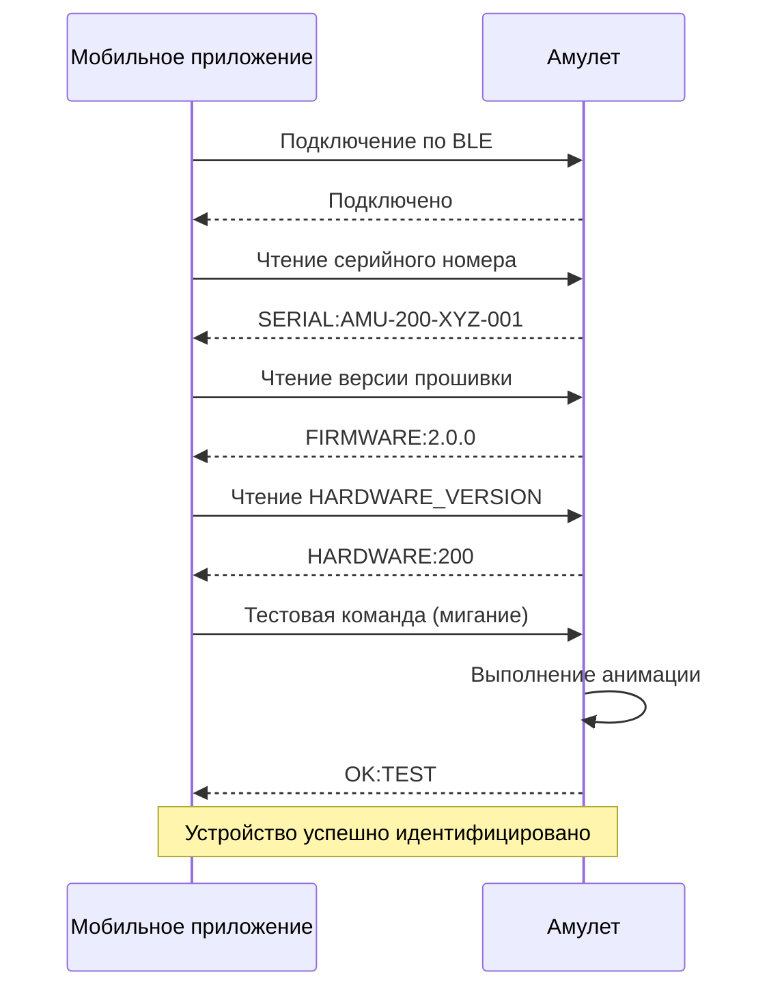
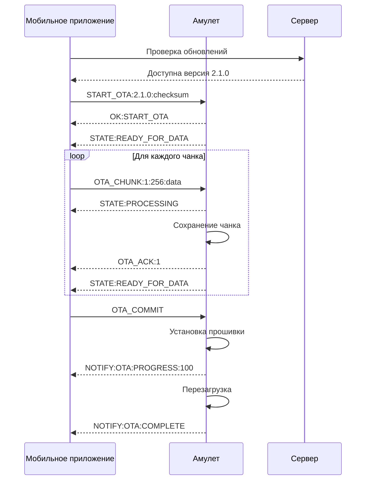
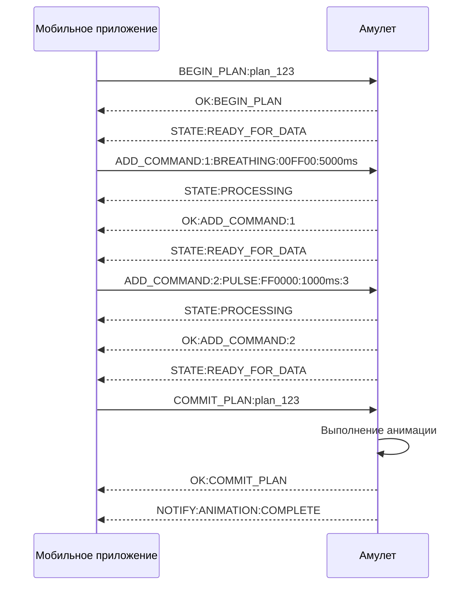
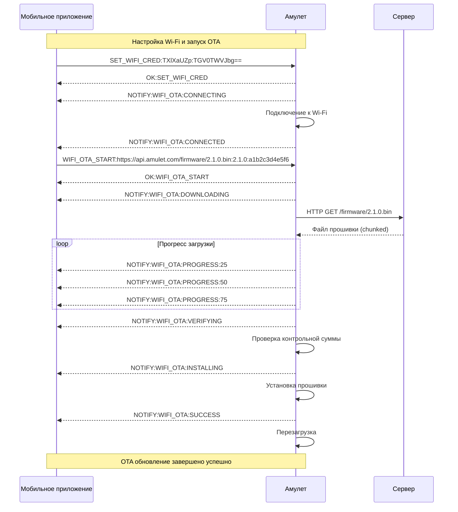

# BLE Протокол для Amulet

Данный документ описывает Bluetooth Low Energy (BLE) протокол для взаимодействия между мобильным приложением Amulet и физическим устройством амулета. Протокол спроектирован как масштабируемый и эффективный, обеспечивающий надежную связь для всех функций приложения.

## Содержание

1. [Часть 1: Низкоуровневый протокол (Контракт с прошивкой)](#часть-1-низкоуровневый-протокол-контракт-с-прошивкой)
2. [Часть 2: Высокоуровневый API (Контракт для остального приложения)](#часть-2-высокоуровневый-api-контракт-для-остального-приложения)

---

## Часть 1: Низкоуровневый протокол (Контракт с прошивкой)

### QR/NFC Паринг устройства

Для первичной привязки устройства к аккаунту пользователя используются QR-код или NFC метка, содержащие данные паринга.

#### Структура данных паринга

**Обязательные поля:**
- `serial` — серийный номер устройства (формат: `AMU-{HW}-{BATCH}-{SEQ}`, например `AMU-200-XYZ-001`)
- `token` — одноразовый токен для claim на сервере (JWT или UUID, выдается при производстве)

**Опциональные поля:**
- `hw` — hardware version (100/200), если не указан — определяется из серийного номера
- `name` — предзаполненное имя устройства для UX

#### Формат QR-кода

**URI схема:** `amulet://pair?serial={SERIAL}&token={TOKEN}`

**Пример:**
```
amulet://pair?serial=AMU-200-XYZ-001&token=eyJhbGciOiJIUzI1NiIsInR5cCI6IkpXVCJ9
```

**Дополнительные параметры (опционально):**
```
amulet://pair?serial=AMU-200-XYZ-001&token=eyJ...&hw=200&name=My+Amulet
```

#### Формат NFC (NDEF Text Record)

**JSON структура:**
```json
{
  "serial": "AMU-200-XYZ-001",
  "token": "eyJhbGciOiJIUzI1NiIsInR5cCI6IkpXVCJ9",
  "hw": 200,
  "name": "My Amulet"
}
```

**Технические требования:**
- Тип записи: NDEF Text Record с MIME type `application/json`
- Кодировка: UTF-8
- Максимальный размер payload: 512 байт
- Deep link альтернатива: NDEF URI Record с той же схемой `amulet://pair?...`

#### Процесс паринга

1. **Сканирование QR/чтение NFC** → извлечение `PairingData(serial, token)`
2. **BLE сканирование** → поиск устройства с advertised name содержащим `serial`
3. **BLE подключение** → чтение Device Info характеристики для верификации `serial`
4. **API claim** → `POST /devices.claim` с `{serial, token}` → получение `deviceId`
5. **Сохранение в БД** → привязка `deviceId` к BLE MAC адресу для последующих подключений

**Безопасность:**
- `claimToken` одноразовый, инвалидируется после успешного claim
- Повторный claim с тем же токеном вернет 409 Conflict
- Токен имеет срок действия (например, 30 дней с момента производства)

### GATT Profile

Таблица сервисов и характеристик для амулета:

| Service UUID | Characteristic UUID | Свойства | Назначение |
|--------------|---------------------|----------|------------|
| `180F` (Battery Service) | `2A19` | Read, Notify | Уровень батареи (0-100%) |
| `6E400001-B5A3-F393-E0A9-E50E24DCCA9E` (Nordic UART Service) | `6E400002-B5A3-F393-E0A9-E50E24DCCA9E` | Write | Командная характеристика (отправка команд) |
| `6E400001-B5A3-F393-E0A9-E50E24DCCA9E` (Nordic UART Service) | `6E400003-B5A3-F393-E0A9-E50E24DCCA9E` | Notify | Уведомления от устройства |
| `12345678-1234-1234-1234-123456789ABC` (Amulet Device Service) | `12345678-1234-1234-1234-123456789ABD` | Read, Write | Информация об устройстве (серийный номер, версия) |
| `12345678-1234-1234-1234-123456789ABC` (Amulet Device Service) | `12345678-1234-1234-1234-123456789ABE` | Read, Notify | Статус устройства |
| `12345678-1234-1234-1234-123456789ABC` (Amulet Device Service) | `12345678-1234-1234-1234-123456789ABF` | Write | OTA команды |
| `12345678-1234-1234-1234-123456789ABC` (Amulet Device Service) | `12345678-1234-1234-1234-123456789AC0` | Write, Notify | Загрузка анимаций |

### Формат команд

#### Базовые команды

**Формат:** `COMMAND:PARAMETERS`

**Примечание о формате v2.0:**
Протокол v2.0 использует гибридный подход: строковые управляющие команды (подключение, статус, OTA, `PLAY`, базовые настройки) и бинарный формат анимационных сегментов, инкапсулированный в base64‑payload внутри специальных команд загрузки планов. Первая версия протокола (чисто строковая передача кадров анимации) считается устаревшей и не используется.

**Примеры команд:**

1. **Дыхательная практика:**
   ```
   BREATHING:00FF00:8000ms
   ```
   - `00FF00` - цвет в HEX (зеленый)
   - `8000ms` - длительность в миллисекундах

2. **Пульсация:**
   ```
   PULSE:FF0000:500ms:10
   ```
   - `FF0000` - цвет (красный)
   - `500ms` - интервал между пульсами
   - `10` - количество повторений

3. **Бегущие огни:**
   ```
   CHASE:00FF00:CW:500
   ```
   - `00FF00` - цвет
   - `CW` - направление (по часовой стрелке)
   - `500` - скорость (мс между шагами)

4. **Заполнение кольца:**
   ```
   FILL:FF0000:2000
   ```
   - `FF0000` - цвет
   - `2000` - длительность заполнения

5. **Спиннер:**
   ```
   SPINNER:00FF00,FF0000:100
   ```
   - `00FF00,FF0000` - два цвета
   - `100` - скорость вращения

6. **Прогресс-бар:**
   ```
   PROGRESS:00FF00:5
   ```
   - `00FF00` - цвет
   - `5` - количество активных диодов (из 8)

#### Команды управления светодиодами

7. **Установка кольца (SET_RING):**
   ```
   SET_RING:#FF0000:#000000:#000000:#000000:#000000:#000000:#000000:#000000
   ```
   - Устанавливает цвет для всех 8 светодиодов
   - Формат: `#RRGGBB` для каждого диода (0-7)

8. **Установка отдельного светодиода (SET_LED):**
   ```
   SET_LED:0:#FF0000
   ```
   - `0` - индекс светодиода (0-7)
   - `#FF0000` - цвет в HEX формате
   - **Эффективно** для управления одним диодом

9. **Очистка всех светодиодов (CLEAR_ALL):**
    ```
    CLEAR_ALL
    ```
    - Выключает все светодиоды

10. **Задержка (DELAY):**
    ```
    DELAY:1000
    ```
    - `1000` - задержка в миллисекундах
    - **Критически важно** для создания временных пауз в анимациях

11. **Установка яркости (SET_BRIGHTNESS):**
    ```
    SET_BRIGHTNESS:200
    ```
    - `200` - яркость светодиодов (0-255)
    - Значение сохраняется в энергонезависимом хранилище и применяется при следующем старте устройства

12. **Сила вибрации (SET_VIB_STRENGTH):**
    ```
    SET_VIB_STRENGTH:180
    ```
    - `180` - сила вибрации (0-255)
    - Значение сохраняется в энергонезависимом хранилище и применяется при следующем старте устройства

#### Команды определения версии протокола

13. **Получить версию протокола (GET_PROTOCOL_VERSION):**
    ```
    GET_PROTOCOL_VERSION
    ```
    - Возвращает текущую версию протокола: `v2.0`
    - **Назначение**: Диагностика и проверка, что устройство работает на ожидаемой версии протокола (v2.0)

#### OTA команды

14. **Начать OTA обновление:**
   ```
   START_OTA:2.1.0:1234567890abcdef
   ```
   - `2.1.0` - версия прошивки
   - `1234567890abcdef` - контрольная сумма

15. **Отправить чанк (с ожиданием подтверждения):**
   ```
   OTA_CHUNK:1:256:data...
   ```
   - `1` - номер чанка
   - `256` - размер чанка
   - `data...` - данные чанка
   - **ВАЖНО:** Отправляется только после получения `STATE:READY_FOR_DATA`

16. **Подтвердить чанк:**
   ```
   OTA_ACK:1
   ```

17. **Завершить OTA:**
   ```
   OTA_COMMIT
   ```

#### Команды анимации и хранения практик (v2.0)

В протоколе v2.0 **все практики (паттерны) описываются единым таймлайном**, который на стороне устройства представлен как набор бинарных сегментов. На BLE‑уровне это выглядит как «план анимации», загружаемый и запускаемый по `pattern_id`.

- загрузка/обновление практики выполняется через связку `BEGIN_PLAN` / `ADD_SEGMENTS` / `COMMIT_PLAN` с указанием `pattern_id`;
- запуск практики выполняется через `PLAY:pattern_id` и всегда отталкивается от энергонезависимого хранилища устройства.

Устройство хранит **до 10 практик** во внутренней NVS‑памяти. Идентификатор практики:

- строка до **64 символов** (рекомендуется UUID);
- используется как ключ для поиска, обновления и удаления по LRU.

Если все 10 слотов заняты и загружается новая практика с новым `pattern_id`,
наиболее давно использованная практика автоматически вытесняется (LRU).
Если практика приходит с уже существующим `pattern_id`, она **перезаписывает** предыдущую версию.

##### Бинарный формат таймлайна (Timeline Segment v2)

Таймлайн практики на устройстве представлен как набор **сегментов**. Каждый сегмент описывает, как во времени меняется интенсивность/цвет для конкретной группы светодиодов (или вибро‑канала).

Базовый формат сегмента v2.0 (младший байт первым, little‑endian):

```text
struct SegmentLinearRgbV2 {
    uint8  opcode;        // Тип сегмента: 0x01 = LINEAR_RGB
    uint8  targetMask;    // Битовая маска: биты 0-7 = светодиоды 0-7, бит 7/8+ — доп. каналы (вибро и т.п.)
    uint8  priority;      // Приоритет дорожки (меньше = раньше применяется)
    uint8  mixMode;       // 0 = OVERRIDE, 1 = ADDITIVE
    uint32 startMs;       // Время начала сегмента (мс с начала практики)
    uint32 durationMs;    // Длительность сегмента (мс)
    uint16 fadeInMs;      // Время разгона яркости с 0 до полной (мс)
    uint16 fadeOutMs;     // Время затухания с полной яркости до 0 (мс)
    uint8  easingIn;      // Тип кривой для fade-in (0 = LINEAR)
    uint8  easingOut;     // Тип кривой для fade-out (0 = LINEAR)
    uint8  red;           // Базовый цвет сегмента (0-255)
    uint8  green;         // Базовый цвет сегмента (0-255)
    uint8  blue;          // Базовый цвет сегмента (0-255)
}
```

Сегменты одного таймлайна просто конкатенируются подряд в бинарном потоке. Устройство само:

- сортирует сегменты по `startMs`/`priority`;
- на каждом тике своего таймера (например, 10–20 мс) вычисляет вклад всех активных сегментов для каждого светодиода;
- применяет `fadeInMs`/`fadeOutMs` и `easing*` для плавных переходов.

##### Загрузка/обновление практики (PLAN)

18. **Начать план анимации (заголовок таймлайна):**

   ```
   BEGIN_PLAN:pattern_id:total_duration_ms
   ```

   - `pattern_id` — строковый ID практики (до 64 символов);
   - `total_duration_ms` — ожидаемая общая длительность практики (для таймаутов и UX).

19. **Отправка сегментов таймлайна (в чанках, с Flow Control):**

   Бинарные сегменты кодируются в Base64 и передаются кусками через управляющую команду:

   ```
   ADD_SEGMENTS:pattern_id:chunk_index:base64_payload
   ```

   - `pattern_id` — тот же ID, что и в `BEGIN_PLAN`;
   - `chunk_index` — порядковый номер чанка (1..N), используется для отладки и повторных попыток;
   - `base64_payload` — Base64‑строка, внутри которой содержится последовательность `SegmentLinearRgbV2` (без доп. заголовков).

   **ВАЖНО:** каждый чанк отправляется **только после** получения от устройства `STATE:READY_FOR_DATA`. При ошибках устройство может прислать `STATE:ERROR` и клиент обязан либо повторить текущий чанк, либо прервать загрузку (`ROLLBACK_PLAN`).

20. **Зафиксировать план и сохранить практику:**

   ```
   COMMIT_PLAN:pattern_id
   ```

   - При успешной фиксации все ранее полученные сегменты таймлайна сохраняются как практика с ID `pattern_id` во внутреннем хранилище устройства;
   - Устройство может дополнительно проверять целостность данных (контрольная сумма, количество сегментов) и выдавать `ERROR:COMMIT_PLAN:...` при несоответствиях.

21. **Отменить план:**

   ```
   ROLLBACK_PLAN:pattern_id
   ```

   - Удаляет временное состояние плана, если загрузка была прервана до `COMMIT_PLAN`.

##### Запуск практики (PLAY)

1. **Воспроизведение практики по ID:**

   ```
   PLAY:pattern_id
   ```

   - `pattern_id` — строковый ID (до 64 символов), под которым практика была загружена через `BEGIN_PLAN/ADD_SEGMENTS/COMMIT_PLAN`;
   - устройство ищет практику в энергонезависимом хранилище и запускает её таймлайн;
   - при каждом успешном запуске обновляется признак «последней использованной практики» (используется для жестов и LRU);
   - устройство может отправить уведомления `NOTIFY:PATTERN:STARTED:pattern_id` и `NOTIFY:ANIMATION:COMPLETE:pattern_id` для синхронизации с приложением.

##### Рекомендации по формированию планов анимации (v2.0)

- **Разрешение по времени.** Таймлайн описывается в миллисекундах, но реальное разрешение таймера устройства ограничено (обычно 10–20 мс). Не имеет смысла создавать сегменты короче 20 мс — они могут быть слиты или квантизированы прошивкой.
- **Плавность переходов.** Для дыхания и fade‑эффектов рекомендуется использовать `fadeInMs`/`fadeOutMs` с длительностью не менее 300–500 мс. Плавность обеспечивается прошивкой, а не искусственной дискретизацией на клиенте.
- **Приоритеты и смешивание.** Для независимых дорожек (фон + поверх иконка/код) используйте разные `priority` и корректный `mixMode` (`OVERRIDE` для «жёсткой маски», `ADDITIVE` для подсветки).
- **Ограничение размера плана.** Рекомендуется держать общее число сегментов в пределах сотен, а не тысяч. Одна хорошо спроектированная практика обычно укладывается в 50–200 сегментов.
- **Инвариантность клиента.** Клиент формирует только таймлайн (сегменты). Квантование по тикам и оптимизация кадров выполняются **внутри устройства**, что гарантирует одинаковую анимацию для приложения и амулета.

#### Команды управления Wi-Fi и OTA

1. **Настройка Wi-Fi (SET_WIFI_CRED):**
   ```
   SET_WIFI_CRED:SSID_BASE64:PASSWORD_BASE64
   ```
   - `SSID_BASE64` - SSID сети в кодировке Base64
   - `PASSWORD_BASE64` - пароль сети в кодировке Base64
   - **Обязательно:** Все параметры должны быть закодированы в Base64
   - **Пример:** `SET_WIFI_CRED:TXlXaUZp:TGV0TWVJbg==`

2. **Запуск Wi-Fi OTA обновления (WIFI_OTA_START):**
   ```
   WIFI_OTA_START:URL:VERSION:CHECKSUM
   ```
   - `URL` - URL для загрузки прошивки
   - `VERSION` - версия прошивки (например, 2.1.0)
   - `CHECKSUM` - контрольная сумма файла прошивки
   - **Пример:** `WIFI_OTA_START:https://api.amulet.com/firmware/2.1.0.bin:2.1.0:a1b2c3d4e5f6`

#### Формат ответов

**Успешные ответы:**
```
OK:COMMAND_ID
```

**Ошибки:**
```
ERROR:COMMAND_ID:ERROR_CODE:DESCRIPTION
```

**Уведомления:**
```
NOTIFY:TYPE:DATA
```

**Примеры уведомлений:**
- `NOTIFY:BATTERY:85` - уровень батареи 85%
- `NOTIFY:STATUS:CHARGING` - устройство заряжается
- `NOTIFY:OTA:PROGRESS:50` - прогресс OTA 50%
- `NOTIFY:ANIMATION:COMPLETE` - анимация завершена

**Wi-Fi OTA уведомления:**
- `NOTIFY:WIFI_OTA:CONNECTING` - подключение к Wi-Fi сети
- `NOTIFY:WIFI_OTA:CONNECTED` - успешное подключение к Wi-Fi
- `NOTIFY:WIFI_OTA:DOWNLOADING` - начало загрузки прошивки
- `NOTIFY:WIFI_OTA:PROGRESS:25` - прогресс загрузки 25%
- `NOTIFY:WIFI_OTA:VERIFYING` - проверка контрольной суммы
- `NOTIFY:WIFI_OTA:INSTALLING` - установка прошивки
- `NOTIFY:WIFI_OTA:SUCCESS` - успешное обновление
- `NOTIFY:WIFI_OTA:ERROR:NETWORK` - ошибка сети
- `NOTIFY:WIFI_OTA:ERROR:CHECKSUM` - ошибка контрольной суммы
- `NOTIFY:WIFI_OTA:ERROR:INSTALL` - ошибка установки

#### Управление потоком данных (Flow Control)

**Критически важно:** Для предотвращения переполнения буфера устройства и потери данных необходимо использовать механизм подтверждения готовности.

**Состояния устройства:**
- `STATE:READY_FOR_DATA` - устройство готово принять следующий пакет данных
- `STATE:PROCESSING` - устройство обрабатывает полученные данные
- `STATE:BUSY` - устройство занято, ожидание завершения операции
- `STATE:ERROR` - ошибка обработки, требуется повторная отправка

**Протокол Flow Control:**
1. Приложение отправляет пакет данных (OTA_CHUNK или ADD_COMMAND)
2. Устройство переходит в состояние `PROCESSING` и начинает обработку
3. После завершения обработки устройство отправляет `STATE:READY_FOR_DATA`
4. Приложение получает подтверждение и отправляет следующий пакет
5. При ошибке устройство отправляет `STATE:ERROR` с кодом ошибки

### Ключевые сценарии (Sequence Diagrams)

#### Подключение и "рукопожатие"



#### OTA-обновление с Flow Control



#### Загрузка анимации с Flow Control



#### Wi-Fi OTA Update Flow



---

## Часть 2: Высокоуровневый API (Контракт для остального приложения)

### Интерфейс `AmuletBleManager`

```kotlin
interface AmuletBleManager {
    // Состояние подключения
    val connectionState: StateFlow<ConnectionState>
    
    // Уровень батареи
    val batteryLevel: Flow<Int>
    
    // Статус устройства
    val deviceStatus: Flow<DeviceStatus>
    
    // Состояние готовности устройства (Flow Control)
    val deviceReadyState: Flow<DeviceReadyState>
    
    // Подключение/отключение
    suspend fun connect(deviceId: String, autoReconnect: Boolean = true)
    suspend fun disconnect()
    
    // Отправка команд
    suspend fun sendCommand(command: AmuletCommand): BleResult
    
    // Загрузка анимации (с Flow Control)
    suspend fun uploadAnimation(plan: AnimationPlan): Flow<UploadProgress>
    
    // OTA обновления (с Flow Control)
    suspend fun startOtaUpdate(firmwareInfo: FirmwareInfo): Flow<OtaProgress>
    
    // Наблюдение за уведомлениями
    fun observeNotifications(type: NotificationType): Flow<ByteArray>
}
```

### Доменные модели

#### ConnectionState

```kotlin
sealed interface ConnectionState {
    data object Disconnected : ConnectionState
    data object Connecting : ConnectionState
    data object Connected : ConnectionState
    data object ServicesDiscovered : ConnectionState
    data class Reconnecting(val attempt: Int) : ConnectionState
    data class Failed(val cause: Throwable?) : ConnectionState
}
```

#### AmuletCommand

```kotlin
sealed interface AmuletCommand {
    data class SetRing(
        val colors: List<Rgb>
    ) : AmuletCommand
    
    data class SetLed(
        val index: Int,
        val color: Rgb
    ) : AmuletCommand
    
    data object ClearAll : AmuletCommand
    
    data class Delay(
        val durationMs: Int
    ) : AmuletCommand
    
    data class Play(
        val patternId: String
    ) : AmuletCommand
    
    data class SetWifiCred(
        val ssidBase64: String,
        val passwordBase64: String
    ) : AmuletCommand
    
    data class WifiOtaStart(
        val url: String,
        val version: String,
        val checksum: String
    ) : AmuletCommand
    
    data class Custom(
        val command: String,
        val parameters: Map<String, String>
    ) : AmuletCommand
}

data class Rgb(
    val red: Int,
    val green: Int,
    val blue: Int
) {
    fun toHex(): String = "#%02X%02X%02X".format(red, green, blue)
}
```

#### UploadProgress

```kotlin
data class UploadProgress(
    val totalChunks: Int,
    val sentChunks: Int,
    val percent: Int,
    val state: UploadState
)

sealed interface UploadState {
    data object Preparing : UploadState
    data object Uploading : UploadState
    data object Committing : UploadState
    data object Completed : UploadState
    data class Failed(val cause: Throwable?) : UploadState
}
```

#### DeviceStatus

```kotlin
data class DeviceStatus(
    val serialNumber: String,
    val firmwareVersion: String,
    val hardwareVersion: Int,
    val batteryLevel: Int,
    val isCharging: Boolean,
    val isOnline: Boolean,
    val lastSeen: Long
)
```

#### AnimationPlan

```kotlin
data class AnimationPlan(
    val id: String,
    val payload: ByteArray,      // конкатенация SegmentLinearRgbV2
    val totalDurationMs: Long,   // ожидаемая длительность таймлайна (для таймаутов)
    val hardwareVersion: Int
)
```

#### BleResult

```kotlin
sealed interface BleResult {
    data object Success : BleResult
    data class Error(val code: String, val message: String) : BleResult
}
```

#### DeviceReadyState (Flow Control)

```kotlin
sealed interface DeviceReadyState {
    data object ReadyForData : DeviceReadyState
    data object Processing : DeviceReadyState
    data object Busy : DeviceReadyState
    data class Error(val code: String, val message: String) : DeviceReadyState
}
```

#### FlowControlManager

```kotlin
class FlowControlManager {
    private val _readyState = MutableStateFlow<DeviceReadyState>(DeviceReadyState.Busy)
    val readyState: StateFlow<DeviceReadyState> = _readyState.asStateFlow()
    
    private val pendingOperations = mutableListOf<() -> Unit>()
    private var isProcessing = false
    
    suspend fun waitForReady(): DeviceReadyState {
        return readyState.first { it is DeviceReadyState.ReadyForData }
    }
    
    suspend fun executeWithFlowControl(operation: suspend () -> Unit) {
        waitForReady()
        _readyState.value = DeviceReadyState.Processing
        
        try {
            operation()
        } finally {
            _readyState.value = DeviceReadyState.ReadyForData
        }
    }
    
    fun handleDeviceState(state: String) {
        when (state) {
            "STATE:READY_FOR_DATA" -> _readyState.value = DeviceReadyState.ReadyForData
            "STATE:PROCESSING" -> _readyState.value = DeviceReadyState.Processing
            "STATE:BUSY" -> _readyState.value = DeviceReadyState.Busy
            "STATE:ERROR" -> _readyState.value = DeviceReadyState.Error("DEVICE_ERROR", "Device reported error")
        }
    }
}
```

### Политики отказоустойчивости

#### Автоматическое переподключение

```kotlin
class AmuletBleManagerImpl : AmuletBleManager {
    private val reconnectPolicy = ReconnectPolicy(
        maxAttempts = 5,
        baseDelayMs = 1000,
        maxDelayMs = 30000,
        backoffMultiplier = 2.0
    )
    
    private suspend fun attemptReconnection() {
        var attempt = 0
        var delay = reconnectPolicy.baseDelayMs
        
        while (attempt < reconnectPolicy.maxAttempts) {
            try {
                connect(deviceId, autoReconnect = false)
                return // Успешное подключение
            } catch (e: Exception) {
                attempt++
                if (attempt < reconnectPolicy.maxAttempts) {
                    delay = minOf(
                        delay * reconnectPolicy.backoffMultiplier,
                        reconnectPolicy.maxDelayMs
                    )
                    delay(delay)
                }
            }
        }
        
        // Все попытки исчерпаны
        _connectionState.value = ConnectionState.Failed(
            cause = Exception("Failed to reconnect after ${reconnectPolicy.maxAttempts} attempts")
        )
    }
}
```

#### Таймауты команд

```kotlin
class CommandTimeoutPolicy {
    companion object {
        const val DEFAULT_TIMEOUT_MS = 10000L
        const val OTA_TIMEOUT_MS = 30000L
        const val ANIMATION_TIMEOUT_MS = 60000L
    }
    
    fun getTimeoutForCommand(command: AmuletCommand): Long {
        return when (command) {
            is AmuletCommand.SetRing -> DEFAULT_TIMEOUT_MS
            is AmuletCommand.SetLed -> DEFAULT_TIMEOUT_MS
            is AmuletCommand.ClearAll -> DEFAULT_TIMEOUT_MS
            is AmuletCommand.Delay -> command.durationMs.toLong() + 1000L // Время задержки + буфер
            is AmuletCommand.Play -> DEFAULT_TIMEOUT_MS
            is AmuletCommand.SetWifiCred -> DEFAULT_TIMEOUT_MS
            is AmuletCommand.WifiOtaStart -> OTA_TIMEOUT_MS // Длительная операция
            is AmuletCommand.Custom -> DEFAULT_TIMEOUT_MS
        }
    }
}
```

#### Обработка ошибок

```kotlin
sealed interface BleError : AppError {
    data object DeviceNotFound : BleError
    data object ConnectionFailed : BleError
    data object ServiceDiscoveryFailed : BleError
    data object WriteFailed : BleError
    data object ReadFailed : BleError
    data class CommandTimeout(val command: String) : BleError
    data object DeviceDisconnected : BleError
    data object InsufficientSpace : BleError
    data object InvalidCommand : BleError
}
```

#### Политики повторов

```kotlin
class RetryPolicy {
    companion object {
        const val MAX_RETRIES = 3
        const val BASE_DELAY_MS = 1000L
        const val MAX_DELAY_MS = 5000L
    }
    
    suspend fun <T> executeWithRetry(
        operation: suspend () -> T,
        maxRetries: Int = MAX_RETRIES
    ): T {
        var lastException: Exception? = null
        var delay = BASE_DELAY_MS
        
        repeat(maxRetries) { attempt ->
            try {
                return operation()
            } catch (e: Exception) {
                lastException = e
                if (attempt < maxRetries - 1) {
                    delay = minOf(
                        delay * 2.0,
                        MAX_DELAY_MS
                    )
                    delay(delay)
                }
            }
        }
        
        throw lastException ?: Exception("Operation failed after $maxRetries attempts")
    }
}
```

#### Flow Control с повторными попытками

```kotlin
class FlowControlRetryPolicy(
    private val flowControlManager: FlowControlManager,
    private val retryPolicy: RetryPolicy
) {
    suspend fun <T> executeWithFlowControlAndRetry(
        operation: suspend () -> T,
        maxRetries: Int = 3
    ): T {
        return retryPolicy.executeWithRetry(
            operation = {
                flowControlManager.executeWithFlowControl {
                    operation()
                }
            },
            maxRetries = maxRetries
        )
    }
    
    suspend fun sendDataWithFlowControl(
        data: ByteArray,
        sendOperation: suspend (ByteArray) -> Unit
    ) {
        flowControlManager.executeWithFlowControl {
            sendOperation(data)
        }
    }
}
```

#### Примеры использования PLAY команд

```kotlin
// Быстрый запуск встроенной анимации дыхания
val breathingCommand = AmuletCommand.Play("breath_square")
bleManager.sendCommand(breathingCommand)

// Запуск встроенной пульсации
val pulseCommand = AmuletCommand.Play("pulse_red")
bleManager.sendCommand(pulseCommand)

// Запуск встроенного спиннера
val spinnerCommand = AmuletCommand.Play("spinner_rainbow")
bleManager.sendCommand(spinnerCommand)
```

#### Последовательность и таймлайн практик на уровне протокола v2.0

Высокоуровневые доменные сущности (`PatternElementSequence`, `PatternElementTimeline` и др.) **не отображаются напрямую** в BLE‑команды. Вместо этого компилятор паттернов на стороне клиента всегда преобразует их в единый **канонический таймлайн**, который далее сериализуется в набор сегментов `SegmentLinearRgbV2`.

Это означает, что на уровне протокола v2.0 нет отдельных команд вида `SET_LED`/`DELAY` для описания сложных паттернов или "секретных кодов". Всё сводится к последовательности сегментов с явным `startMs`/`durationMs` и параметрами fade/easing.

**Пример "секретного кода" "Я скучаю" на таймлайне:**

- два коротких сегмента для верхнего диода (LED0) с пурпурным цветом и быстрыми fade‑in/fade‑out;
- пауза;
- один сегмент для нижнего диода (LED4) с жёлтым цветом.

На BLE‑уровне это будет выглядеть как несколько `SegmentLinearRgbV2` с разными `startMs`, `targetMask` и `color`, упакованных в один или несколько `ADD_SEGMENTS` чанков. Конкретные `SequenceStep` и `TimelineTrack` остаются внутренними деталями доменной модели и не влияют на протокол.

**Преимущества такого подхода:**

- **Унификация**: любые типы паттернов (дыхание, пульсация, бегущие огни, "секретные коды") описываются одним и тем же набором сегментов.
- **Плавность**: устройство само квантует таймлайн по своему таймеру, обеспечивая стабильные fade‑эффекты без дерготни.
- **Простота прошивки**: прошивка работает только с сегментами и не должна знать о высокоуровневых паттернах.
- **Совпадение с приложением**: превью в приложении использует тот же таймлайн, что и прошивка, поэтому анимация выглядит одинаково.

#### Энд‑ту‑энд пример: от паттерна до BLE команд v2.0

Далее приведён полный путь от доменного описания паттерна до конкретных BLE‑команд протокола v2.0.

##### 1. Доменная модель паттерна (упрощённое дыхание)

Пример: паттерн «медленное зелёное дыхание» на всём кольце, 8 секунд, плавный разгон и затухание.

```kotlin
// Упрощённый DSL/модель в домене (Kotlin, shared/):
val patternId = "breath_slow_green"

val timeline = PatternTimeline(
    durationMs = 8000,
    tracks = listOf(
        TimelineTrack(
            target = TimelineTarget.Ring, // все 8 LED
            priority = 0,
            mixMode = MixMode.OVERRIDE,
            clips = listOf(
                TimelineClip(
                    startMs = 0,
                    durationMs = 8000,
                    color = "#00FF00", // зелёный
                    fadeInMs = 3000,
                    fadeOutMs = 3000,
                    easing = Easing.LINEAR
                )
            )
        )
    )
)
```

Компилятор паттернов преобразует такой `PatternTimeline` в один или несколько сегментов `SegmentLinearRgbV2`. В данном простом случае это будет **один сегмент** на всё кольцо.

##### 2. Соответствующий SegmentLinearRgbV2

Логическое наполнение сегмента:

- `opcode = 0x01` (LINEAR_RGB);
- `targetMask = 0xFF` (все 8 диодов активны);
- `priority = 0` (фон);
- `mixMode = 0` (OVERRIDE);
- `startMs = 0`;
- `durationMs = 8000`;
- `fadeInMs = 3000`;
- `fadeOutMs = 3000`;
- `easingIn = 0` (LINEAR);
- `easingOut = 0` (LINEAR);
- `red = 0`, `green = 255`, `blue = 0`.

В байтах (little‑endian, комментарии справа):

```text
01          // opcode = 0x01 (LINEAR_RGB)
FF          // targetMask = 0xFF (LED0-7)
00          // priority = 0
00          // mixMode = 0 (OVERRIDE)
00 00 00 00 // startMs = 0
40 1F 00 00 // durationMs = 8000 (0x00001F40)
B8 0B       // fadeInMs = 3000 (0x0BB8)
B8 0B       // fadeOutMs = 3000 (0x0BB8)
00          // easingIn = 0 (LINEAR)
00          // easingOut = 0 (LINEAR)
00          // red = 0
FF          // green = 255
00          // blue = 0
```

Итого длина сегмента: 1 + 1 + 1 + 1 + 4 + 4 + 2 + 2 + 1 + 1 + 1 + 1 + 1 = 21 байт.

##### 3. Base64‑payload для ADD_SEGMENTS

Сегмент (21 байт) кодируется в Base64. Для краткости приведём условный пример строки:

```text
// Пример. Реальное значение будет рассчитано компилятором:
base64_payload = "Af8AAB8fA7gLuAAAAAD//wA="
```

На практике компилятор формирует бинарный `ByteArray` и кодирует его стандартными средствами (`Base64` на Android/Kotlin).

##### 4. Полная последовательность BLE‑команд для загрузки и запуска

1. Клиент (мобильное приложение) убеждается, что устройство на v2.0:

   ```
   GET_PROTOCOL_VERSION
   ```

   Ожидаемый ответ (по UART/notification):

   ```
   OK:GET_PROTOCOL_VERSION:v2.0
   ```

2. Загрузка плана анимации:

   ```
   // 1) Начало плана
   BEGIN_PLAN:breath_slow_green:8000
   // Ответы устройства:
   OK:BEGIN_PLAN
   STATE:READY_FOR_DATA

   // 2) Отправка сегмента (все 21 байт внутри одного чанка)
   ADD_SEGMENTS:breath_slow_green:1:Af8AAB8fA7gLuAAAAAD//wA=
   // Ответы устройства:
   STATE:PROCESSING
   OK:ADD_SEGMENTS:1
   STATE:READY_FOR_DATA

   // 3) Фиксация плана
   COMMIT_PLAN:breath_slow_green
   // Ответы устройства:
   OK:COMMIT_PLAN
   ```

3. Запуск практики и нотификации:

   ```
   // Команда запуска
   PLAY:breath_slow_green

   // Уведомления от устройства:
   NOTIFY:PATTERN:STARTED:breath_slow_green
   ... (устройство выполняет таймлайн, плавно дыша зелёным светом ~8 секунд) ...
   NOTIFY:ANIMATION:COMPLETE:breath_slow_green
   ```

Таким образом, один доменный таймлайн с дыханием транслируется в один `SegmentLinearRgbV2`, один `ADD_SEGMENTS` чанк и минимальный набор управляющих команд. Визуально анимация на устройстве будет совпадать с превью в приложении, так как обе стороны используют одну и ту же модель таймлайна.

### Интеграция с архитектурой

#### Правильная архитектура с Clean Architecture

**1. Интерфейс репозитория в Domain Layer (не знает о Flow Control):**

```kotlin
// в :shared/domain/repository/AmuletRepository.kt
interface AmuletRepository {
    /**
     * Загружает анимационный план на устройство.
     * Метод завершится, когда план будет полностью и надежно доставлен.
     * Прогресс можно отслеживать через возвращаемый Flow.
     */
    fun uploadAnimation(plan: AnimationPlan): Flow<UploadProgress>
    
    /**
     * Отправляет команду на устройство.
     * Все детали BLE протокола скрыты внутри.
     */
    suspend fun sendCommand(command: AmuletCommand): Result<Unit, AppError>
    
    /**
     * Настраивает Wi-Fi и запускает OTA обновление.
     */
    suspend fun startWifiOta(
        ssid: String, 
        password: String, 
        firmwareUrl: String, 
        version: String, 
        checksum: String
    ): Flow<OtaProgress>
}
```

**2. Реализация репозитория в Data Layer (вся магия BLE здесь):**

```kotlin
// в :data:amulet/AmuletRepositoryImpl.kt
class AmuletRepositoryImpl @Inject constructor(
    private val bleManager: AmuletBleManager // У которого внутри есть FlowControlManager
) : AmuletRepository {

    override fun uploadAnimation(plan: AnimationPlan): Flow<UploadProgress> {
        // bleManager возвращает Flow, который УЖЕ инкапсулирует
        // всю логику Flow Control, ретраев и таймаутов.
        // Репозиторий просто делегирует вызов.
        return bleManager.uploadAnimation(plan)
    }
    
    override suspend fun sendCommand(command: AmuletCommand): Result<Unit, AppError> {
        return when (bleManager.sendCommand(command)) {
            is BleResult.Success -> Result.success(Unit)
            is BleResult.Error -> Result.failure(mapBleErrorToAppError(bleResult))
        }
    }
    
    override suspend fun startWifiOta(
        ssid: String, 
        password: String, 
        url: String, 
        version: String, 
        checksum: String
    ): Flow<OtaProgress> {
        // Base64 кодирование
        val ssidBase64 = Base64.getEncoder().encodeToString(ssid.toByteArray())
        val passwordBase64 = Base64.getEncoder().encodeToString(password.toByteArray())
        
        // Настройка Wi-Fi
        val wifiCommand = AmuletCommand.SetWifiCred(ssidBase64, passwordBase64)
        bleManager.sendCommand(wifiCommand)
        
        // Запуск OTA
        val otaCommand = AmuletCommand.WifiOtaStart(url, version, checksum)
        bleManager.sendCommand(otaCommand)
        
        return bleManager.startOtaUpdate(FirmwareInfo(url, version, checksum))
    }
}
```

**3. UseCase в Domain Layer (чистота и простота):**

```kotlin
// в :shared/domain/usecase/UploadAnimationUseCase.kt
class UploadAnimationUseCase @Inject constructor(
    private val amuletRepository: AmuletRepository,
    private val patternCompiler: PatternCompiler
) {
    // Возвращает Flow с прогрессом, но не знает, как этот прогресс достигается.
    fun invoke(pattern: PatternSpec): Flow<Result<UploadProgress, AppError>> {
        return flow {
            // 1. Бизнес-логика: скомпилировать паттерн
            val plan = patternCompiler.compile(pattern)
            
            // 2. Делегирование репозиторию
            amuletRepository.uploadAnimation(plan).collect { progress ->
                emit(Result.success(progress))
            }
        }.asResult() // Стандартная обертка для обработки ошибок
    }
}

// в :shared/domain/usecase/StartWifiOtaUseCase.kt
class StartWifiOtaUseCase @Inject constructor(
    private val amuletRepository: AmuletRepository
) {
    fun invoke(
        ssid: String, 
        password: String, 
        firmwareUrl: String, 
        version: String, 
        checksum: String
    ): Flow<Result<OtaProgress, AppError>> {
        return flow {
            amuletRepository.startWifiOta(ssid, password, firmwareUrl, version, checksum)
                .collect { progress ->
                    emit(Result.success(progress))
                }
        }.asResult()
    }
}
```

### Диаграмма архитектуры

```mermaid
graph TB
    subgraph "Presentation Layer"
        UI[UI Components]
        ViewModel[ViewModels]
    end
    
    subgraph "Domain Layer"
        UseCase1[UploadAnimationUseCase]
        UseCase2[StartWifiOtaUseCase]
        Repository[AmuletRepository Interface]
        Domain[Domain Models]
    end
    
    subgraph "Data Layer"
        RepoImpl[AmuletRepositoryImpl]
        BLEManager[AmuletBleManager]
        BLEImpl[AmuletBleManagerImpl]
        FlowControl[FlowControlManager]
        RetryPolicy[RetryPolicy]
    end
    
    subgraph "Device"
        Device[Amulet Device]
    end
    
    UI --> ViewModel
    ViewModel --> UseCase1
    ViewModel --> UseCase2
    UseCase1 --> Repository
    UseCase2 --> Repository
    Repository --> RepoImpl
    RepoImpl --> BLEManager
    BLEManager --> BLEImpl
    BLEImpl --> FlowControl
    BLEImpl --> RetryPolicy
    BLEImpl --> Device
    
    classDef domain fill:#e1f5fe
    classDef data fill:#f3e5f5
    classDef presentation fill:#e8f5e8
    
    class UseCase1,UseCase2,Repository,Domain domain
    class RepoImpl,BLEManager,BLEImpl,FlowControl,RetryPolicy data
    class UI,ViewModel presentation
```

**Ключевые принципы:**
- **Domain Layer** не знает о BLE, Flow Control или технических деталях
- **Data Layer** инкапсулирует всю сложность BLE протокола
- **UseCase** работает только с бизнес-логикой
- **Flow Control** полностью скрыт в Data Layer

### Конфигурация и настройки

#### Настройки BLE

```kotlin
data class BleConfiguration(
    val connectionTimeoutMs: Long = 10000,
    val serviceDiscoveryTimeoutMs: Long = 5000,
    val commandTimeoutMs: Long = 10000,
    val maxRetries: Int = 3,
    val autoReconnect: Boolean = true,
    val reconnectDelayMs: Long = 1000,
    val maxReconnectAttempts: Int = 5
)
```

#### Логирование и мониторинг

```kotlin
class BleLogger {
    fun logConnection(deviceId: String, success: Boolean) {
        Log.d("BLE", "Connection to $deviceId: ${if (success) "success" else "failed"}")
    }
    
    fun logCommand(command: AmuletCommand, result: BleResult) {
        Log.d("BLE", "Command ${command::class.simpleName}: $result")
    }
    
    fun logError(error: BleError, context: String) {
        Log.e("BLE", "Error in $context: $error")
    }
}
```

---

## Безопасность BLE-соединения

### Обзор безопасности

Безопасность BLE-соединения является критически важным аспектом для устройства Amulet, поскольку оно передает персональные данные, управляет эмоциональными "объятиями" и выполняет команды, влияющие на физическое состояние пользователя. Данный раздел описывает комплексную стратегию безопасности, реализованную в протоколе Amulet.

### Уровни безопасности

#### 1. Аутентификация и авторизация

**Процесс сопряжения (Pairing):**

Amulet использует многоуровневую систему аутентификации:

1. **NFC-инициализация (v2.0):**
   - Мгновенное сопряжение через NFC-чип
   - Обмен криптографическими ключами через защищенный канал
   - Валидация серийного номера устройства

2. **Bluetooth-сопряжение:**
   - Использование LE Secure Connections (Bluetooth 4.2+)
   - Эллиптическая криптография P-256 для обмена ключами
   - Защита от атак "человек посередине" (MITM)

**Процесс связывания (Bonding):**

- Сохранение ключей шифрования в защищенном хранилище
- Автоматическое восстановление соединения без повторного сопряжения
- Ротация ключей при каждом новом сопряжении

#### 2. Шифрование канала

**LE Secure Connections:**

- **Алгоритм:** AES-128-CCM для шифрования данных
- **Ключи:** Генерация через ECDH (Elliptic Curve Diffie-Hellman)
- **Аутентификация:** HMAC-SHA256 для проверки целостности
- **Защита от replay-атак:** Временные метки и одноразовые номера (nonce)

**Структура защищенного пакета:**
```
[Header: 1 byte] [Nonce: 4 bytes] [Encrypted Data: N bytes] [MAC: 4 bytes]
```

#### 3. Уровни защиты соединения

**Security Mode 1 Level 4 (рекомендуемый):**

- **Аутентификация:** Обязательная для всех операций
- **Шифрование:** AES-128 для всех данных
- **Связывание:** Сохранение ключей для последующих соединений
- **Защита от MITM:** Полная защита через криптографические протоколы

**Методы сопряжения:**

1. **Out of Band (OOB) - Приоритетный для Amulet v2.0:**
   - Использование NFC для обмена ключами
   - Максимальная защита от MITM-атак
   - Удобство для пользователя (мгновенное сопряжение)

2. **Passkey Entry - Резервный метод:**
   - 6-значный код, отображаемый на устройстве
   - Ввод кода в мобильном приложении
   - Защита от MITM при правильной реализации

3. **Just Works - Только для тестирования:**
   - Не рекомендуется для продакшена
   - Уязвим к MITM-атакам
   - Используется только в debug-режиме

### Защита GATT-сервисов

#### 1. Уровни доступа к характеристикам

**Критически важные характеристики (требуют аутентификации):**

| Характеристика | Доступ | Уровень безопасности |
|----------------|--------|---------------------|
| `6E400002-B5A3-F393-E0A9-E50E24DCCA9E` (Write) | Аутентификация + Шифрование | Level 4 |
| `12345678-1234-1234-1234-123456789ABD` (Device Info) | Аутентификация + Шифрование | Level 4 |
| `12345678-1234-1234-1234-123456789ABF` (OTA Commands) | Аутентификация + Шифрование | Level 4 |
| `12345678-1234-1234-1234-123456789AC0` (Animation Upload) | Аутентификация + Шифрование | Level 4 |

**Публичные характеристики (только чтение):**

| Характеристика | Доступ | Уровень безопасности |
|----------------|--------|---------------------|
| `2A19` (Battery Level) | Без аутентификации | Level 1 |
| `6E400003-B5A3-F393-E0A9-E50E24DCCA9E` (Notifications) | Шифрование | Level 2 |

#### 2. Валидация команд

**Проверка подлинности команд:**

```kotlin
// Пример структуры защищенной команды
data class SecureCommand(
    val commandId: String,           // Уникальный идентификатор команды
    val timestamp: Long,             // Временная метка (защита от replay)
    val nonce: ByteArray,           // Одноразовый номер
    val command: String,            // Сама команда
    val signature: ByteArray        // Цифровая подпись
)
```

**Защита от replay-атак:**

- Временные окна для команд (5 минут)
- Одноразовые номера (nonce) для каждой команды
- Проверка последовательности команд
- Автоматическая блокировка при подозрительной активности

### Управление ключами

#### 1. Генерация и хранение ключей

**Мастер-ключ (Master Key):**
- Генерируется при первом сопряжении
- Хранится в защищенном хранилище Android (Android Keystore)
- Используется для деривации сессионных ключей

**Сессионные ключи:**
- Генерируются для каждой сессии
- Автоматически ротируются каждые 24 часа
- Удаляются при отключении устройства

#### 2. Ротация ключей

**Автоматическая ротация:**
- Ежедневная смена сессионных ключей
- Принудительная ротация при подозрительной активности
- Уведомление пользователя о смене ключей

**Ручная ротация:**
- Возможность принудительной смены ключей через приложение
- Полное пересопряжение устройства
- Очистка всех сохраненных ключей

### Защита от атак

#### 1. MITM (Man-in-the-Middle) атаки

**Защита:**
- Использование LE Secure Connections
- Криптографическая аутентификация
- Визуальная проверка кодов сопряжения (v1.0)
- NFC-сопряжение (v2.0) - максимальная защита

#### 2. Replay-атаки

**Защита:**
- Временные метки в командах
- Одноразовые номера (nonce)
- Проверка последовательности команд
- Ограничение времени жизни команд

#### 3. Атаки на переполнение буфера

**Защита:**
- Валидация размера команд
- Ограничение длины параметров
- Проверка целостности данных
- Flow Control для предотвращения переполнения

#### 4. Несанкционированное подключение

**Защита:**
- Whitelist доверенных устройств
- Автоматическое отключение неизвестных устройств
- Уведомления о новых подключениях
- Возможность блокировки устройства

### Мониторинг безопасности

#### 1. Логирование событий безопасности

**Отслеживаемые события:**
- Попытки подключения
- Неудачные попытки аутентификации
- Подозрительная активность
- Изменения в конфигурации безопасности

#### 2. Алерты безопасности

**Уведомления пользователя:**
- Новые подключения к устройству
- Неудачные попытки взлома
- Изменения в настройках безопасности
- Рекомендации по улучшению безопасности

### Конфигурация безопасности

#### 1. Настройки по умолчанию

**Amulet v1.0 (Базовая версия):**
- Security Mode 1 Level 3 (аутентификация + шифрование)
- Passkey Entry для сопряжения
- Автоматическое отключение через 30 минут неактивности

**Amulet v2.0 (Премиум версия):**
- Security Mode 1 Level 4 (максимальная защита)
- NFC OOB для сопряжения
- Автоматическое отключение через 60 минут неактивности
- Расширенный мониторинг безопасности

#### 2. Пользовательские настройки

**Доступные опции:**
- Включение/отключение автоматического сопряжения
- Настройка времени неактивности
- Выбор метода сопряжения
- Управление уведомлениями безопасности

### Соответствие стандартам

#### 1. Bluetooth SIG требования

- **Bluetooth 4.2+** - LE Secure Connections
- **Bluetooth 5.0+** - Расширенные возможности безопасности
- **FIPS 140-2** - Криптографические модули (планируется)

#### 2. Регуляторные требования

- **GDPR** - Защита персональных данных
- **CCPA** - Конфиденциальность пользователей
- **FDA** - Безопасность медицинских устройств (применимо)

### Рекомендации по внедрению

#### 1. Для разработчиков

**Обязательные проверки:**
- Валидация всех входящих команд
- Проверка временных меток
- Верификация цифровых подписей
- Логирование всех операций безопасности

#### 2. Для пользователей

**Рекомендации:**
- Регулярное обновление приложения
- Использование надежных паролей
- Включение уведомлений безопасности
- Периодическая проверка подключенных устройств

### Будущие улучшения

#### 1. Планируемые функции

- **Биометрическая аутентификация** - использование отпечатков пальцев
- **Квантово-устойчивая криптография** - защита от квантовых атак
- **Машинное обучение** - обнаружение аномалий в поведении
- **Blockchain-идентификация** - децентрализованная аутентификация

#### 2. Исследования безопасности

- **Пентестинг** - регулярные проверки уязвимостей
- **Аудит кода** - анализ безопасности исходного кода
- **Сертификация** - получение сертификатов безопасности
- **Открытые исследования** - сотрудничество с сообществом безопасности

---

## Заключение

Данный BLE протокол обеспечивает:

1. **Масштабируемость** - поддержка различных версий оборудования и прошивок
2. **Эффективность** - оптимизированные команды и минимальный трафик
3. **Надежность** - автоматические повторы, таймауты и обработка ошибок
4. **Гибкость** - поддержка как простых команд, так и сложных анимаций
5. **Безопасность** - комплексная защита от всех известных угроз BLE
6. **Критически важно: Flow Control** - механизм управления потоком данных предотвращает переполнение буфера устройства и потерю данных при OTA-обновлениях и загрузке анимационных сегментов таймлайна
7. **Унифицированный таймлайн** - единая модель сегментов (`SegmentLinearRgbV2`) для всех типов анимаций, включая "секретные коды" и дыхательные практики
8. **Временной контроль** - точное управление паузами и фазами практики за счёт явных `startMs`/`durationMs` в сегментах и уведомлений об окончании анимации
9. **Wi-Fi OTA обновления** - команды `SET_WIFI_CRED` и `WIFI_OTA_START` для автономных обновлений прошивки
10. **Комплексная безопасность** - многоуровневая защита от MITM, replay-атак и несанкционированного доступа

### Ключевые особенности Flow Control:

- **Предотвращение потери данных** - устройство подтверждает готовность перед получением следующего пакета
- **Стабильная работа в реальных условиях** - протокол работает не только в идеальных лабораторных условиях
- **Автоматическое восстановление** - при ошибках устройство может запросить повторную отправку данных
- **Мониторинг состояния** - приложение всегда знает текущее состояние устройства

### Возможности для сложных анимаций:

- **Индивидуальное управление светодиодами** реализуется через сегменты с нужной маской `targetMask`
- **Точные временные паузы** достигаются за счёт разнесения `startMs`/`durationMs` сегментов и внутреннего таймера устройства
- **Эффективная загрузка анимаций** через механизм `BEGIN_PLAN/ADD_SEGMENTS/COMMIT_PLAN`
- **Реализация "секретных кодов"** — набор коротких сегментов с разными `startMs` и LED‑масками
- **Единый формат таймлайна** — все высокоуровневые элементы паттернов компилируются в один и тот же набор бинарных сегментов
- **Оптимизация производительности** — бинарный формат v2.0 сокращает трафик по сравнению с покадровой передачей на 60–70%

### Wi-Fi OTA возможности:

- **Автономные обновления** - устройство может обновляться без подключения к телефону
- **Base64 кодирование** - безопасная передача Wi-Fi credentials
- **Детальный мониторинг** - полный контроль над процессом обновления через уведомления
- **Обработка ошибок** - специфичные уведомления для разных типов ошибок

### Два типа анимаций:

- **Встроенные анимации (PLAY)** - быстрый доступ к предустановленным анимациям через `PLAY:pattern_id`
- **Пользовательские анимации (PLAN_)** - динамическое создание сложных анимаций через `BEGIN_PLAN/ADD_COMMAND/COMMIT_PLAN`

### Архитектурные принципы:

- **Инкапсуляция сложности** - `FlowControlManager` является внутренней деталью `AmuletBleManagerImpl`
- **Правильное разделение слоев** - UseCase работает только с `AmuletRepository`, не зная о BLE деталях
- **Скрытие реализации** - Flow Control автоматически управляется внутри Data Layer
- **Четкое разделение ответственности**:
  - **Domain Layer** - бизнес-логика, не знает о BLE
  - **Data Layer** - вся магия BLE, Flow Control, ретраи
  - **Presentation Layer** - UI, использует UseCase

Протокол спроектирован с учетом требований архитектуры Clean Architecture и обеспечивает четкое разделение между низкоуровневым взаимодействием с устройством и высокоуровневой бизнес-логикой приложения. 

**Ключевые архитектурные преимущества:**
- **UseCase не знает о BLE** - работает только с `AmuletRepository`
- **Flow Control скрыт в Data Layer** - вся сложность инкапсулирована в `AmuletBleManagerImpl`
- **Правильное разделение ответственности** - каждый слой имеет свою роль
- **Тестируемость** - Domain Layer можно тестировать без BLE зависимостей
- **Масштабируемость** - легко добавлять новые источники данных

**Flow Control является критически важным компонентом для стабильной работы протокола в продакшене, но его сложность полностью скрыта от UseCase-ов и Domain Layer.**

---

## Эволюция протокола и оптимизации

### Проблемы производительности v1.0

**Строковый формат команд:**
Текущий строковый формат (`COMMAND:PARAMETERS`) обеспечивает отличную читаемость и простоту отладки, но имеет ограничения производительности:

- **Избыточность данных**: Команда `SET_LED:0:#FF0000` занимает 18 байт vs потенциальные 4-5 байт в бинарном формате
- **Накладные расходы на парсинг**: Устройство должно парсить строки во время выполнения
- **Задержки передачи**: Для "секретных кодов" с 20+ командами суммарный трафик может достигать 400+ байт
- **Flow Control overhead**: Каждая команда требует подтверждения `STATE:READY_FOR_DATA`

**Пример проблемы:**
"Секретный код" из 20 команд `SET_LED` + `DELAY`:
- Строковый формат: ~360 байт + Flow Control overhead
- Потенциальный бинарный формат: ~80 байт + Flow Control overhead

### Предлагаемые оптимизации v2.0+

#### Бинарный формат команд

**Структура бинарной команды:**
```
[Command Type: 1 byte] [Parameters: N bytes] [Checksum: 1 byte]
```

**Примеры бинарных команд:**

1. **SET_LED (0x01):**
   ```
   0x01 0x05 0xFF 0x00 0x00 0x96 0xAB
   ```
   - `0x01` - команда SET_LED
   - `0x05` - индекс светодиода (5)
   - `0xFF 0x00 0x00` - цвет RGB (красный)
   - `0x96` - длительность (150ms)
   - `0xAB` - контрольная сумма

2. **DELAY (0x02):**
   ```
   0x02 0x03 0xE8 0xCD
   ```
   - `0x02` - команда DELAY
   - `0x03 0xE8` - длительность (1000ms)
   - `0xCD` - контрольная сумма

3. **Комбинированная команда (0x10):**
   ```
   0x10 0x05 0xFF 0x00 0x00 0x96 0x00 0x64 0xEF
   ```
   - `0x10` - SET_LED + DELAY в одной команде
   - `0x05` - индекс светодиода
   - `0xFF 0x00 0x00` - цвет
   - `0x96` - длительность свечения (150ms)
   - `0x00` - разделитель
   - `0x64` - задержка (100ms)
   - `0xEF` - контрольная сумма

#### Батчинг команд

**Команда BATCH_START (0x20):**
```
0x20 0x14 0x00 0x34
```
- `0x20` - начало батча
- `0x14` - количество команд в батче (20)
- `0x00` - флаги (0 = последовательное выполнение)
- `0x34` - контрольная сумма

**Команды батча:**
```
[Command 1] [Command 2] ... [Command N] [BATCH_END]
```

**Команда BATCH_END (0x21):**
```
0x21 0x78
```
- `0x21` - конец батча
- `0x78` - контрольная сумма

#### Сжатие последовательностей

**Команда SEQUENCE (0x30):**
```
0x30 0x0A 0x05 0xFF 0x00 0x00 0x96 0x64 0x05 0x00 0x00 0x00 0x64 0xAB
```
- `0x30` - команда SEQUENCE
- `0x0A` - количество шагов (10)
- `[Step 1: LED]` - SET_LED:5:#FF0000:150ms
- `[Step 2: DELAY]` - DELAY:100ms
- `[Step 3: LED]` - SET_LED:5:#000000:100ms
- `0xAB` - контрольная сумма

### Миграционная стратегия

#### Обратная совместимость
- **v1.0 устройства**: Продолжают поддерживать строковый формат
- **v2.0+ устройства**: Поддерживают оба формата с автоматическим определением
- **Fallback механизм**: При ошибке бинарного формата автоматический переход к строковому

#### Определение версии протокола
```
GET_PROTOCOL_VERSION → "v1.0" | "v2.0"
```

#### Постепенная миграция
1. **Фаза 1**: Добавление поддержки бинарного формата в прошивку
2. **Фаза 2**: Обновление клиентов для использования бинарного формата
3. **Фаза 3**: Оптимизация Flow Control для батчей
4. **Фаза 4**: Полный переход на бинарный формат (опционально)

### Ожидаемые улучшения

**Производительность:**
- **Размер данных**: Сокращение на 60-70% для "секретных кодов"
- **Скорость передачи**: Уменьшение времени загрузки в 2-3 раза
- **Flow Control**: Батчинг команд снижает overhead подтверждений

**Надежность:**
- **Контрольные суммы**: Встроенная проверка целостности данных
- **Компактность**: Меньше данных = меньше вероятность ошибок передачи
- **Атомарность**: Батчи команд выполняются как единое целое

**Масштабируемость:**
- **Сложные анимации**: Поддержка анимаций с сотнями команд
- **Реальное время**: Минимальные задержки для интерактивных эффектов
- **Энергоэффективность**: Сокращение времени работы радио

### Реализация в архитектуре

**PatternCompiler / DeviceTimelineCompiler:**
```kotlin
interface PatternCompiler {
    fun compile(spec: PatternSpec): PatternTimeline
}

interface DeviceTimelineCompiler {
    fun compile(
        timeline: PatternTimeline,
        hardwareVersion: Int,
        firmwareVersion: String,
        intensity: Double = 1.0
    ): List<DeviceTimelineSegment>
}
```

На стороне BLE‑слоя список `DeviceTimelineSegment` сериализуется в бинарные сегменты
`SegmentLinearRgbV2`, конкатенируется в `AnimationPlan.payload` и отправляется как
`BEGIN_PLAN / ADD_SEGMENTS / COMMIT_PLAN`.

### Заключение

Бинарный формат команд представляет собой естественную эволюцию протокола для решения проблем производительности, возникающих при передаче сложных "секретных кодов" и анимаций. Предложенная миграционная стратегия обеспечивает плавный переход без нарушения обратной совместимости.

