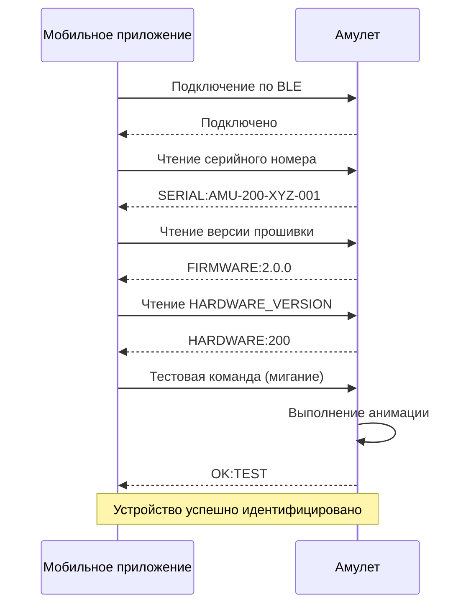
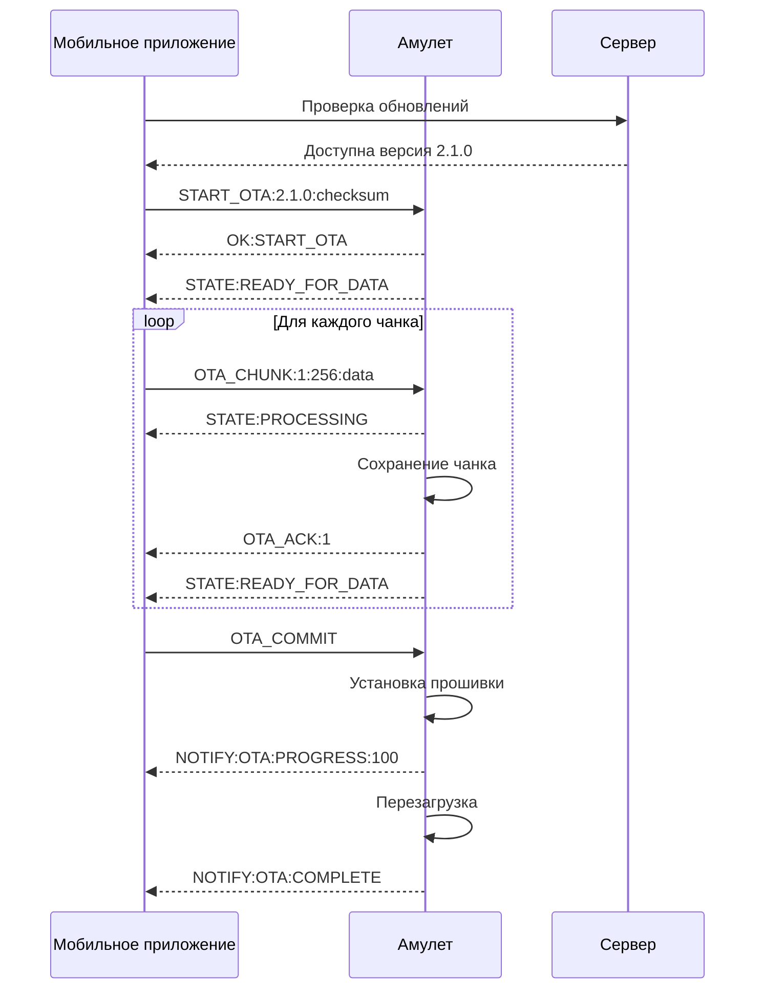
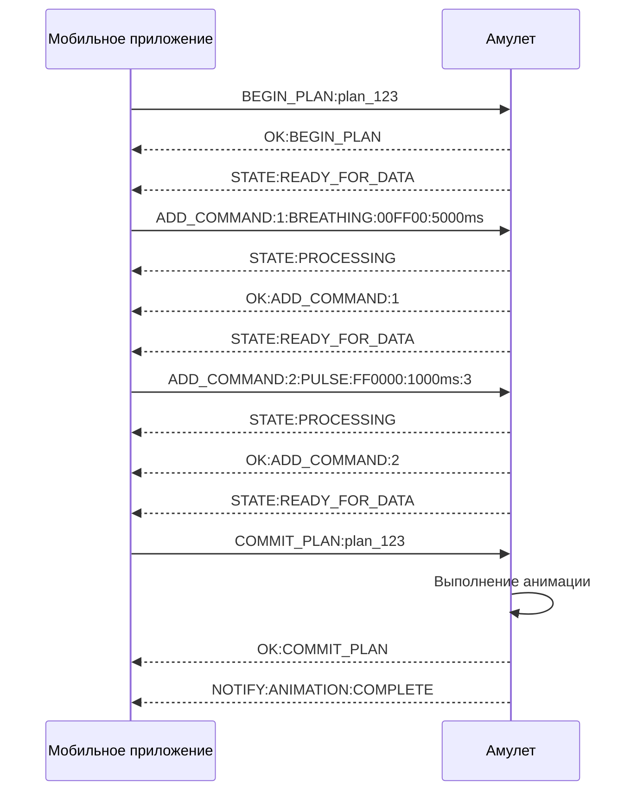
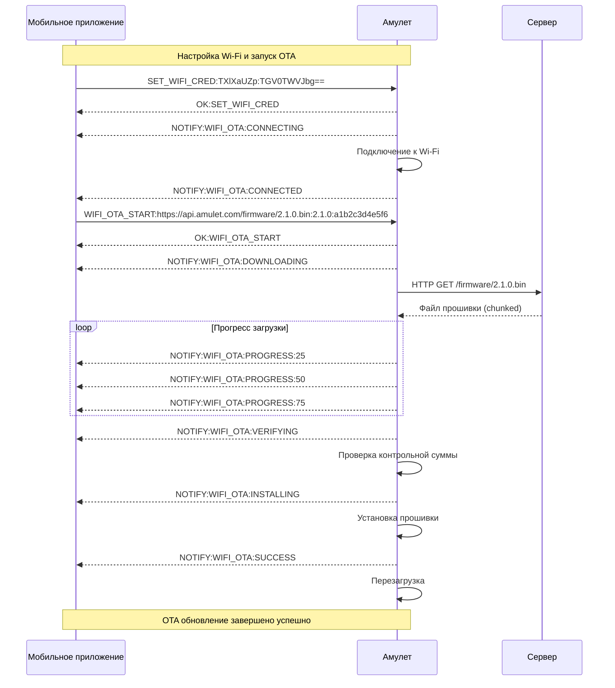

# BLE Протокол для Amulet

Данный документ описывает Bluetooth Low Energy (BLE) протокол для взаимодействия между мобильным приложением Amulet и физическим устройством амулета. Протокол спроектирован как масштабируемый и эффективный, обеспечивающий надежную связь для всех функций приложения.

## Содержание

1. [Часть 1: Низкоуровневый протокол (Контракт с прошивкой)](#часть-1-низкоуровневый-протокол-контракт-с-прошивкой)
2. [Часть 2: Высокоуровневый API (Контракт для остального приложения)](#часть-2-высокоуровневый-api-контракт-для-остального-приложения)

---

## Часть 1: Низкоуровневый протокол (Контракт с прошивкой)

### GATT Profile

Таблица сервисов и характеристик для амулета:

| Service UUID | Characteristic UUID | Свойства | Назначение |
|--------------|---------------------|----------|------------|
| `180F` (Battery Service) | `2A19` | Read, Notify | Уровень батареи (0-100%) |
| `6E400001-B5A3-F393-E0A9-E50E24DCCA9E` (Nordic UART Service) | `6E400002-B5A3-F393-E0A9-E50E24DCCA9E` | Write | Командная характеристика (отправка команд) |
| `6E400001-B5A3-F393-E0A9-E50E24DCCA9E` (Nordic UART Service) | `6E400003-B5A3-F393-E0A9-E50E24DCCA9E` | Notify | Уведомления от устройства |
| `12345678-1234-1234-1234-123456789ABC` (Amulet Device Service) | `12345678-1234-1234-1234-123456789ABD` | Read, Write | Информация об устройстве (серийный номер, версия) |
| `12345678-1234-1234-1234-123456789ABC` (Amulet Device Service) | `12345678-1234-1234-1234-123456789ABE` | Read, Notify | Статус устройства |
| `12345678-1234-1234-1234-123456789ABC` (Amulet Device Service) | `12345678-1234-1234-1234-123456789ABF` | Write | OTA команды |
| `12345678-1234-1234-1234-123456789ABC` (Amulet Device Service) | `12345678-1234-1234-1234-123456789AC0` | Write, Notify | Загрузка анимаций |

### Формат команд

#### Базовые команды

**Формат:** `COMMAND:PARAMETERS`

**Примеры команд:**

1. **Дыхательная практика:**
   ```
   BREATHING:00FF00:8000ms
   ```
   - `00FF00` - цвет в HEX (зеленый)
   - `8000ms` - длительность в миллисекундах

2. **Пульсация:**
   ```
   PULSE:FF0000:500ms:10
   ```
   - `FF0000` - цвет (красный)
   - `500ms` - интервал между пульсами
   - `10` - количество повторений

3. **Бегущие огни:**
   ```
   CHASE:00FF00:CW:500
   ```
   - `00FF00` - цвет
   - `CW` - направление (по часовой стрелке)
   - `500` - скорость (мс между шагами)

4. **Заполнение кольца:**
   ```
   FILL:FF0000:2000
   ```
   - `FF0000` - цвет
   - `2000` - длительность заполнения

5. **Спиннер:**
   ```
   SPINNER:00FF00,FF0000:100
   ```
   - `00FF00,FF0000` - два цвета
   - `100` - скорость вращения

6. **Прогресс-бар:**
   ```
   PROGRESS:00FF00:5
   ```
   - `00FF00` - цвет
   - `5` - количество активных диодов (из 8)

#### Команды управления светодиодами

7. **Установка кольца (SET_RING):**
   ```
   SET_RING:#FF0000:#000000:#000000:#000000:#000000:#000000:#000000:#000000
   ```
   - Устанавливает цвет для всех 8 светодиодов
   - Формат: `#RRGGBB` для каждого диода (0-7)

8. **Установка отдельного светодиода (SET_LED):**
   ```
   SET_LED:0:#FF0000
   ```
   - `0` - индекс светодиода (0-7)
   - `#FF0000` - цвет в HEX формате
   - **Эффективно** для управления одним диодом

9. **Очистка всех светодиодов (CLEAR_ALL):**
   ```
   CLEAR_ALL
   ```
   - Выключает все светодиоды

10. **Задержка (DELAY):**
    ```
    DELAY:1000
    ```
    - `1000` - задержка в миллисекундах
    - **Критически важно** для создания временных пауз в анимациях

#### OTA команды

1. **Начать OTA обновление:**
   ```
   START_OTA:2.1.0:1234567890abcdef
   ```
   - `2.1.0` - версия прошивки
   - `1234567890abcdef` - контрольная сумма

2. **Отправить чанк (с ожиданием подтверждения):**
   ```
   OTA_CHUNK:1:256:data...
   ```
   - `1` - номер чанка
   - `256` - размер чанка
   - `data...` - данные чанка
   - **ВАЖНО:** Отправляется только после получения `STATE:READY_FOR_DATA`

3. **Подтвердить чанк:**
   ```
   OTA_ACK:1
   ```

4. **Завершить OTA:**
   ```
   OTA_COMMIT
   ```

#### Команды анимации

**Важно:** Существует два типа анимаций с разными способами запуска:

##### Встроенные системные анимации (PLAY)

1. **Воспроизведение встроенной анимации:**
   ```
   PLAY:breath_square
   ```
   - `breath_square` - ID встроенной анимации, зашитой в прошивку
   - **Назначение:** Быстрый запуск предустановленных анимаций
   - **Примеры ID:** `breath_square`, `pulse_red`, `chase_blue`, `spinner_rainbow`

##### Пользовательские динамические анимации (PLAN_)

2. **Начать план анимации:**
   ```
   BEGIN_PLAN:unique_id
   ```

3. **Добавить команду в план (с ожиданием подтверждения):**
   ```
   ADD_COMMAND:1:BREATHING:00FF00:5000ms
   ```
   - `1` - порядковый номер команды
   - Остальное - команда
   - **ВАЖНО:** Отправляется только после получения `STATE:READY_FOR_DATA`

4. **Зафиксировать план:**
   ```
   COMMIT_PLAN:unique_id
   ```

5. **Отменить план:**
   ```
   ROLLBACK_PLAN:unique_id
   ```

**Различие между PLAY и PLAN_:**
- **`PLAY`** - для встроенных анимаций (быстрый доступ, известные ID)
- **`PLAN_`** - для пользовательских анимаций (динамическое создание, полный контроль)

#### Команды управления Wi-Fi и OTA

1. **Настройка Wi-Fi (SET_WIFI_CRED):**
   ```
   SET_WIFI_CRED:SSID_BASE64:PASSWORD_BASE64
   ```
   - `SSID_BASE64` - SSID сети в кодировке Base64
   - `PASSWORD_BASE64` - пароль сети в кодировке Base64
   - **Обязательно:** Все параметры должны быть закодированы в Base64
   - **Пример:** `SET_WIFI_CRED:TXlXaUZp:TGV0TWVJbg==`

2. **Запуск Wi-Fi OTA обновления (WIFI_OTA_START):**
   ```
   WIFI_OTA_START:URL:VERSION:CHECKSUM
   ```
   - `URL` - URL для загрузки прошивки
   - `VERSION` - версия прошивки (например, 2.1.0)
   - `CHECKSUM` - контрольная сумма файла прошивки
   - **Пример:** `WIFI_OTA_START:https://api.amulet.com/firmware/2.1.0.bin:2.1.0:a1b2c3d4e5f6`

#### Формат ответов

**Успешные ответы:**
```
OK:COMMAND_ID
```

**Ошибки:**
```
ERROR:COMMAND_ID:ERROR_CODE:DESCRIPTION
```

**Уведомления:**
```
NOTIFY:TYPE:DATA
```

**Примеры уведомлений:**
- `NOTIFY:BATTERY:85` - уровень батареи 85%
- `NOTIFY:STATUS:CHARGING` - устройство заряжается
- `NOTIFY:OTA:PROGRESS:50` - прогресс OTA 50%
- `NOTIFY:ANIMATION:COMPLETE` - анимация завершена

**Wi-Fi OTA уведомления:**
- `NOTIFY:WIFI_OTA:CONNECTING` - подключение к Wi-Fi сети
- `NOTIFY:WIFI_OTA:CONNECTED` - успешное подключение к Wi-Fi
- `NOTIFY:WIFI_OTA:DOWNLOADING` - начало загрузки прошивки
- `NOTIFY:WIFI_OTA:PROGRESS:25` - прогресс загрузки 25%
- `NOTIFY:WIFI_OTA:VERIFYING` - проверка контрольной суммы
- `NOTIFY:WIFI_OTA:INSTALLING` - установка прошивки
- `NOTIFY:WIFI_OTA:SUCCESS` - успешное обновление
- `NOTIFY:WIFI_OTA:ERROR:NETWORK` - ошибка сети
- `NOTIFY:WIFI_OTA:ERROR:CHECKSUM` - ошибка контрольной суммы
- `NOTIFY:WIFI_OTA:ERROR:INSTALL` - ошибка установки

#### Управление потоком данных (Flow Control)

**Критически важно:** Для предотвращения переполнения буфера устройства и потери данных необходимо использовать механизм подтверждения готовности.

**Состояния устройства:**
- `STATE:READY_FOR_DATA` - устройство готово принять следующий пакет данных
- `STATE:PROCESSING` - устройство обрабатывает полученные данные
- `STATE:BUSY` - устройство занято, ожидание завершения операции
- `STATE:ERROR` - ошибка обработки, требуется повторная отправка

**Протокол Flow Control:**
1. Приложение отправляет пакет данных (OTA_CHUNK или ADD_COMMAND)
2. Устройство переходит в состояние `PROCESSING` и начинает обработку
3. После завершения обработки устройство отправляет `STATE:READY_FOR_DATA`
4. Приложение получает подтверждение и отправляет следующий пакет
5. При ошибке устройство отправляет `STATE:ERROR` с кодом ошибки

### Ключевые сценарии (Sequence Diagrams)

#### Подключение и "рукопожатие"



#### OTA-обновление с Flow Control



#### Загрузка анимации с Flow Control



#### Wi-Fi OTA Update Flow



---

## Часть 2: Высокоуровневый API (Контракт для остального приложения)

### Интерфейс `AmuletBleManager`

```kotlin
interface AmuletBleManager {
    // Состояние подключения
    val connectionState: StateFlow<ConnectionState>
    
    // Уровень батареи
    val batteryLevel: Flow<Int>
    
    // Статус устройства
    val deviceStatus: Flow<DeviceStatus>
    
    // Состояние готовности устройства (Flow Control)
    val deviceReadyState: Flow<DeviceReadyState>
    
    // Подключение/отключение
    suspend fun connect(deviceId: String, autoReconnect: Boolean = true)
    suspend fun disconnect()
    
    // Отправка команд
    suspend fun sendCommand(command: AmuletCommand): BleResult
    
    // Загрузка анимации (с Flow Control)
    suspend fun uploadAnimation(plan: AnimationPlan): Flow<UploadProgress>
    
    // OTA обновления (с Flow Control)
    suspend fun startOtaUpdate(firmwareInfo: FirmwareInfo): Flow<OtaProgress>
    
    // Наблюдение за уведомлениями
    fun observeNotifications(type: NotificationType): Flow<ByteArray>
}
```

### Доменные модели

#### ConnectionState

```kotlin
sealed interface ConnectionState {
    data object Disconnected : ConnectionState
    data object Connecting : ConnectionState
    data object Connected : ConnectionState
    data object ServicesDiscovered : ConnectionState
    data class Reconnecting(val attempt: Int) : ConnectionState
    data class Failed(val cause: Throwable?) : ConnectionState
}
```

#### AmuletCommand

```kotlin
sealed interface AmuletCommand {
    data class Breathing(
        val color: Rgb,
        val durationMs: Int
    ) : AmuletCommand
    
    data class Pulse(
        val color: Rgb,
        val intervalMs: Int,
        val repeats: Int
    ) : AmuletCommand
    
    data class Chase(
        val color: Rgb,
        val direction: ChaseDirection,
        val speedMs: Int
    ) : AmuletCommand
    
    data class Fill(
        val color: Rgb,
        val durationMs: Int
    ) : AmuletCommand
    
    data class Spinner(
        val colors: List<Rgb>,
        val speedMs: Int
    ) : AmuletCommand
    
    data class Progress(
        val color: Rgb,
        val activeLeds: Int
    ) : AmuletCommand
    
    data class SetRing(
        val colors: List<Rgb>
    ) : AmuletCommand
    
    data class SetLed(
        val index: Int,
        val color: Rgb
    ) : AmuletCommand
    
    data object ClearAll : AmuletCommand
    
    data class Delay(
        val durationMs: Int
    ) : AmuletCommand
    
    data class Play(
        val patternId: String
    ) : AmuletCommand
    
    data class SetWifiCred(
        val ssidBase64: String,
        val passwordBase64: String
    ) : AmuletCommand
    
    data class WifiOtaStart(
        val url: String,
        val version: String,
        val checksum: String
    ) : AmuletCommand
    
    data class Custom(
        val command: String,
        val parameters: Map<String, String>
    ) : AmuletCommand
}

enum class ChaseDirection {
    CLOCKWISE, COUNTER_CLOCKWISE
}

data class Rgb(
    val red: Int,
    val green: Int,
    val blue: Int
) {
    fun toHex(): String = "#%02X%02X%02X".format(red, green, blue)
}
```

#### UploadProgress

```kotlin
data class UploadProgress(
    val totalChunks: Int,
    val sentChunks: Int,
    val percent: Int,
    val state: UploadState
)

sealed interface UploadState {
    data object Preparing : UploadState
    data object Uploading : UploadState
    data object Committing : UploadState
    data object Completed : UploadState
    data class Failed(val cause: Throwable?) : UploadState
}
```

#### DeviceStatus

```kotlin
data class DeviceStatus(
    val serialNumber: String,
    val firmwareVersion: String,
    val hardwareVersion: Int,
    val batteryLevel: Int,
    val isCharging: Boolean,
    val isOnline: Boolean,
    val lastSeen: Long
)
```

#### AnimationPlan

```kotlin
data class AnimationPlan(
    val id: String,
    val commands: List<AmuletCommand>,
    val estimatedDurationMs: Long,
    val hardwareVersion: Int
)
```

#### BleResult

```kotlin
sealed interface BleResult {
    data object Success : BleResult
    data class Error(val code: String, val message: String) : BleResult
}
```

#### DeviceReadyState (Flow Control)

```kotlin
sealed interface DeviceReadyState {
    data object ReadyForData : DeviceReadyState
    data object Processing : DeviceReadyState
    data object Busy : DeviceReadyState
    data class Error(val code: String, val message: String) : DeviceReadyState
}
```

#### FlowControlManager

```kotlin
class FlowControlManager {
    private val _readyState = MutableStateFlow<DeviceReadyState>(DeviceReadyState.Busy)
    val readyState: StateFlow<DeviceReadyState> = _readyState.asStateFlow()
    
    private val pendingOperations = mutableListOf<() -> Unit>()
    private var isProcessing = false
    
    suspend fun waitForReady(): DeviceReadyState {
        return readyState.first { it is DeviceReadyState.ReadyForData }
    }
    
    suspend fun executeWithFlowControl(operation: suspend () -> Unit) {
        waitForReady()
        _readyState.value = DeviceReadyState.Processing
        
        try {
            operation()
        } finally {
            _readyState.value = DeviceReadyState.ReadyForData
        }
    }
    
    fun handleDeviceState(state: String) {
        when (state) {
            "STATE:READY_FOR_DATA" -> _readyState.value = DeviceReadyState.ReadyForData
            "STATE:PROCESSING" -> _readyState.value = DeviceReadyState.Processing
            "STATE:BUSY" -> _readyState.value = DeviceReadyState.Busy
            "STATE:ERROR" -> _readyState.value = DeviceReadyState.Error("DEVICE_ERROR", "Device reported error")
        }
    }
}
```

### Политики отказоустойчивости

#### Автоматическое переподключение

```kotlin
class AmuletBleManagerImpl : AmuletBleManager {
    private val reconnectPolicy = ReconnectPolicy(
        maxAttempts = 5,
        baseDelayMs = 1000,
        maxDelayMs = 30000,
        backoffMultiplier = 2.0
    )
    
    private suspend fun attemptReconnection() {
        var attempt = 0
        var delay = reconnectPolicy.baseDelayMs
        
        while (attempt < reconnectPolicy.maxAttempts) {
            try {
                connect(deviceId, autoReconnect = false)
                return // Успешное подключение
            } catch (e: Exception) {
                attempt++
                if (attempt < reconnectPolicy.maxAttempts) {
                    delay = minOf(
                        delay * reconnectPolicy.backoffMultiplier,
                        reconnectPolicy.maxDelayMs
                    )
                    delay(delay)
                }
            }
        }
        
        // Все попытки исчерпаны
        _connectionState.value = ConnectionState.Failed(
            cause = Exception("Failed to reconnect after ${reconnectPolicy.maxAttempts} attempts")
        )
    }
}
```

#### Таймауты команд

```kotlin
class CommandTimeoutPolicy {
    companion object {
        const val DEFAULT_TIMEOUT_MS = 10000L
        const val OTA_TIMEOUT_MS = 30000L
        const val ANIMATION_TIMEOUT_MS = 60000L
    }
    
    fun getTimeoutForCommand(command: AmuletCommand): Long {
        return when (command) {
            is AmuletCommand.Breathing -> DEFAULT_TIMEOUT_MS
            is AmuletCommand.Pulse -> DEFAULT_TIMEOUT_MS
            is AmuletCommand.Chase -> DEFAULT_TIMEOUT_MS
            is AmuletCommand.Fill -> DEFAULT_TIMEOUT_MS
            is AmuletCommand.Spinner -> DEFAULT_TIMEOUT_MS
            is AmuletCommand.Progress -> DEFAULT_TIMEOUT_MS
            is AmuletCommand.SetRing -> DEFAULT_TIMEOUT_MS
            is AmuletCommand.SetLed -> DEFAULT_TIMEOUT_MS
            is AmuletCommand.ClearAll -> DEFAULT_TIMEOUT_MS
            is AmuletCommand.Delay -> command.durationMs.toLong() + 1000L // Время задержки + буфер
            is AmuletCommand.Play -> DEFAULT_TIMEOUT_MS
            is AmuletCommand.SetWifiCred -> DEFAULT_TIMEOUT_MS
            is AmuletCommand.WifiOtaStart -> OTA_TIMEOUT_MS // Длительная операция
            is AmuletCommand.Custom -> DEFAULT_TIMEOUT_MS
        }
    }
}
```

#### Обработка ошибок

```kotlin
sealed interface BleError : AppError {
    data object DeviceNotFound : BleError
    data object ConnectionFailed : BleError
    data object ServiceDiscoveryFailed : BleError
    data object WriteFailed : BleError
    data object ReadFailed : BleError
    data class CommandTimeout(val command: String) : BleError
    data object DeviceDisconnected : BleError
    data object InsufficientSpace : BleError
    data object InvalidCommand : BleError
}
```

#### Политики повторов

```kotlin
class RetryPolicy {
    companion object {
        const val MAX_RETRIES = 3
        const val BASE_DELAY_MS = 1000L
        const val MAX_DELAY_MS = 5000L
    }
    
    suspend fun <T> executeWithRetry(
        operation: suspend () -> T,
        maxRetries: Int = MAX_RETRIES
    ): T {
        var lastException: Exception? = null
        var delay = BASE_DELAY_MS
        
        repeat(maxRetries) { attempt ->
            try {
                return operation()
            } catch (e: Exception) {
                lastException = e
                if (attempt < maxRetries - 1) {
                    delay(delay)
                    delay = minOf(delay * 2, MAX_DELAY_MS)
                }
            }
        }
        
        throw lastException ?: Exception("Operation failed after $maxRetries attempts")
    }
}
```

#### Flow Control с повторными попытками

```kotlin
class FlowControlRetryPolicy(
    private val flowControlManager: FlowControlManager,
    private val retryPolicy: RetryPolicy
) {
    suspend fun <T> executeWithFlowControlAndRetry(
        operation: suspend () -> T,
        maxRetries: Int = 3
    ): T {
        return retryPolicy.executeWithRetry(
            operation = {
                flowControlManager.executeWithFlowControl {
                    operation()
                }
            },
            maxRetries = maxRetries
        )
    }
    
    suspend fun sendDataWithFlowControl(
        data: ByteArray,
        sendOperation: suspend (ByteArray) -> Unit
    ) {
        flowControlManager.executeWithFlowControl {
            sendOperation(data)
        }
    }
}
```

#### Примеры использования PLAY команд

```kotlin
// Быстрый запуск встроенной анимации дыхания
val breathingCommand = AmuletCommand.Play("breath_square")
bleManager.sendCommand(breathingCommand)

// Запуск встроенной пульсации
val pulseCommand = AmuletCommand.Play("pulse_red")
bleManager.sendCommand(pulseCommand)

// Запуск встроенного спиннера
val spinnerCommand = AmuletCommand.Play("spinner_rainbow")
bleManager.sendCommand(spinnerCommand)
```

#### Последовательность команд для "секретного кода"

```
BEGIN_PLAN:secret_code_001
STATE:READY_FOR_DATA
ADD_COMMAND:1:SET_LED:0:#FF0000
STATE:READY_FOR_DATA
ADD_COMMAND:2:DELAY:500
STATE:READY_FOR_DATA
ADD_COMMAND:3:SET_LED:0:#000000
STATE:READY_FOR_DATA
ADD_COMMAND:4:DELAY:500
STATE:READY_FOR_DATA
ADD_COMMAND:5:SET_LED:0:#FF0000
STATE:READY_FOR_DATA
ADD_COMMAND:6:DELAY:500
STATE:READY_FOR_DATA
ADD_COMMAND:7:SET_LED:0:#000000
STATE:READY_FOR_DATA
ADD_COMMAND:8:DELAY:1000
STATE:READY_FOR_DATA
ADD_COMMAND:9:SET_LED:4:#00FF00
STATE:READY_FOR_DATA
ADD_COMMAND:10:DELAY:1000
STATE:READY_FOR_DATA
ADD_COMMAND:11:SET_LED:4:#000000
STATE:READY_FOR_DATA
COMMIT_PLAN:secret_code_001
```

### Интеграция с архитектурой

#### Правильная архитектура с Clean Architecture

**1. Интерфейс репозитория в Domain Layer (не знает о Flow Control):**

```kotlin
// в :shared/domain/repository/AmuletRepository.kt
interface AmuletRepository {
    /**
     * Загружает анимационный план на устройство.
     * Метод завершится, когда план будет полностью и надежно доставлен.
     * Прогресс можно отслеживать через возвращаемый Flow.
     */
    fun uploadAnimation(plan: AnimationPlan): Flow<UploadProgress>
    
    /**
     * Отправляет команду на устройство.
     * Все детали BLE протокола скрыты внутри.
     */
    suspend fun sendCommand(command: AmuletCommand): Result<Unit, AppError>
    
    /**
     * Настраивает Wi-Fi и запускает OTA обновление.
     */
    suspend fun startWifiOta(
        ssid: String, 
        password: String, 
        url: String, 
        version: String, 
        checksum: String
    ): Flow<OtaProgress>
}
```

**2. Реализация репозитория в Data Layer (вся магия BLE здесь):**

```kotlin
// в :data:amulet/AmuletRepositoryImpl.kt
class AmuletRepositoryImpl @Inject constructor(
    private val bleManager: AmuletBleManager // У которого внутри есть FlowControlManager
) : AmuletRepository {

    override fun uploadAnimation(plan: AnimationPlan): Flow<UploadProgress> {
        // bleManager возвращает Flow, который УЖЕ инкапсулирует
        // всю логику Flow Control, ретраев и таймаутов.
        // Репозиторий просто делегирует вызов.
        return bleManager.uploadAnimation(plan)
    }
    
    override suspend fun sendCommand(command: AmuletCommand): Result<Unit, AppError> {
        return when (bleManager.sendCommand(command)) {
            is BleResult.Success -> Result.success(Unit)
            is BleResult.Error -> Result.failure(mapBleErrorToAppError(bleResult))
        }
    }
    
    override suspend fun startWifiOta(
        ssid: String, 
        password: String, 
        url: String, 
        version: String, 
        checksum: String
    ): Flow<OtaProgress> {
        // Base64 кодирование
        val ssidBase64 = Base64.getEncoder().encodeToString(ssid.toByteArray())
        val passwordBase64 = Base64.getEncoder().encodeToString(password.toByteArray())
        
        // Настройка Wi-Fi
        val wifiCommand = AmuletCommand.SetWifiCred(ssidBase64, passwordBase64)
        bleManager.sendCommand(wifiCommand)
        
        // Запуск OTA
        val otaCommand = AmuletCommand.WifiOtaStart(url, version, checksum)
        bleManager.sendCommand(otaCommand)
        
        return bleManager.startOtaUpdate(FirmwareInfo(url, version, checksum))
    }
}
```

**3. UseCase в Domain Layer (чистота и простота):**

```kotlin
// в :shared/domain/usecase/UploadAnimationUseCase.kt
class UploadAnimationUseCase @Inject constructor(
    private val amuletRepository: AmuletRepository,
    private val patternCompiler: PatternCompiler
) {
    // Возвращает Flow с прогрессом, но не знает, как этот прогресс достигается.
    fun invoke(pattern: PatternSpec): Flow<Result<UploadProgress, AppError>> {
        return flow {
            // 1. Бизнес-логика: скомпилировать паттерн
            val plan = patternCompiler.compile(pattern)
            
            // 2. Делегирование репозиторию
            amuletRepository.uploadAnimation(plan).collect { progress ->
                emit(Result.success(progress))
            }
        }.asResult() // Стандартная обертка для обработки ошибок
    }
}

// в :shared/domain/usecase/StartWifiOtaUseCase.kt
class StartWifiOtaUseCase @Inject constructor(
    private val amuletRepository: AmuletRepository
) {
    fun invoke(
        ssid: String, 
        password: String, 
        firmwareUrl: String, 
        version: String, 
        checksum: String
    ): Flow<Result<OtaProgress, AppError>> {
        return flow {
            amuletRepository.startWifiOta(ssid, password, firmwareUrl, version, checksum)
                .collect { progress ->
                    emit(Result.success(progress))
                }
        }.asResult()
    }
}
```
```

#### Диаграмма архитектуры

```mermaid
graph TB
    subgraph "Presentation Layer"
        UI[UI Components]
        ViewModel[ViewModels]
    end
    
    subgraph "Domain Layer"
        UseCase1[UploadAnimationUseCase]
        UseCase2[StartWifiOtaUseCase]
        Repository[AmuletRepository Interface]
        Domain[Domain Models]
    end
    
    subgraph "Data Layer"
        RepoImpl[AmuletRepositoryImpl]
        BLEManager[AmuletBleManager]
        BLEImpl[AmuletBleManagerImpl]
        FlowControl[FlowControlManager]
        RetryPolicy[RetryPolicy]
    end
    
    subgraph "Device"
        Device[Amulet Device]
    end
    
    UI --> ViewModel
    ViewModel --> UseCase1
    ViewModel --> UseCase2
    UseCase1 --> Repository
    UseCase2 --> Repository
    Repository --> RepoImpl
    RepoImpl --> BLEManager
    BLEManager --> BLEImpl
    BLEImpl --> FlowControl
    BLEImpl --> RetryPolicy
    BLEImpl --> Device
    
    classDef domain fill:#e1f5fe
    classDef data fill:#f3e5f5
    classDef presentation fill:#e8f5e8
    
    class UseCase1,UseCase2,Repository,Domain domain
    class RepoImpl,BLEManager,BLEImpl,FlowControl,RetryPolicy data
    class UI,ViewModel presentation
```

**Ключевые принципы:**
- **Domain Layer** не знает о BLE, Flow Control или технических деталях
- **Data Layer** инкапсулирует всю сложность BLE протокола
- **UseCase** работает только с бизнес-логикой
- **Flow Control** полностью скрыт в Data Layer

### Конфигурация и настройки

#### Настройки BLE

```kotlin
data class BleConfiguration(
    val connectionTimeoutMs: Long = 10000,
    val serviceDiscoveryTimeoutMs: Long = 5000,
    val commandTimeoutMs: Long = 10000,
    val maxRetries: Int = 3,
    val autoReconnect: Boolean = true,
    val reconnectDelayMs: Long = 1000,
    val maxReconnectAttempts: Int = 5
)
```

#### Логирование и мониторинг

```kotlin
class BleLogger {
    fun logConnection(deviceId: String, success: Boolean) {
        Log.d("BLE", "Connection to $deviceId: ${if (success) "success" else "failed"}")
    }
    
    fun logCommand(command: AmuletCommand, result: BleResult) {
        Log.d("BLE", "Command ${command::class.simpleName}: $result")
    }
    
    fun logError(error: BleError, context: String) {
        Log.e("BLE", "Error in $context: $error")
    }
}
```

---

## Заключение

Данный BLE протокол обеспечивает:

1. **Масштабируемость** - поддержка различных версий оборудования и прошивок
2. **Эффективность** - оптимизированные команды и минимальный трафик
3. **Надежность** - автоматические повторы, таймауты и обработка ошибок
4. **Гибкость** - поддержка как простых команд, так и сложных анимаций
5. **Безопасность** - валидация команд и защита от некорректных данных
6. **Критически важно: Flow Control** - механизм управления потоком данных предотвращает переполнение буфера устройства и потерю данных при OTA-обновлениях и загрузке анимаций
7. **Точное управление светодиодами** - команды `SET_LED` и `DELAY` для создания сложных анимаций и "секретных кодов"
8. **Временной контроль** - возможность создания пауз и синхронизации анимаций
9. **Wi-Fi OTA обновления** - команды `SET_WIFI_CRED` и `WIFI_OTA_START` для автономных обновлений прошивки

### Ключевые особенности Flow Control:

- **Предотвращение потери данных** - устройство подтверждает готовность перед получением следующего пакета
- **Стабильная работа в реальных условиях** - протокол работает не только в идеальных лабораторных условиях
- **Автоматическое восстановление** - при ошибках устройство может запросить повторную отправку данных
- **Мониторинг состояния** - приложение всегда знает текущее состояние устройства

### Возможности для сложных анимаций:

- **Индивидуальное управление светодиодами** через `SET_LED:index:color`
- **Точные временные паузы** через `DELAY:duration_ms`
- **Эффективная загрузка анимаций** через механизм `PLAN_` команд
- **Реализация "секретных кодов"** - сложные последовательности с точным временным контролем

### Wi-Fi OTA возможности:

- **Автономные обновления** - устройство может обновляться без подключения к телефону
- **Base64 кодирование** - безопасная передача Wi-Fi credentials
- **Детальный мониторинг** - полный контроль над процессом обновления через уведомления
- **Обработка ошибок** - специфичные уведомления для разных типов ошибок

### Два типа анимаций:

- **Встроенные анимации (PLAY)** - быстрый доступ к предустановленным анимациям через `PLAY:pattern_id`
- **Пользовательские анимации (PLAN_)** - динамическое создание сложных анимаций через `BEGIN_PLAN/ADD_COMMAND/COMMIT_PLAN`

### Архитектурные принципы:

- **Инкапсуляция сложности** - `FlowControlManager` является внутренней деталью `AmuletBleManagerImpl`
- **Правильное разделение слоев** - UseCase работает только с `AmuletRepository`, не зная о BLE деталях
- **Скрытие реализации** - Flow Control автоматически управляется внутри Data Layer
- **Четкое разделение ответственности**:
  - **Domain Layer** - бизнес-логика, не знает о BLE
  - **Data Layer** - вся магия BLE, Flow Control, ретраи
  - **Presentation Layer** - UI, использует UseCase

Протокол спроектирован с учетом требований архитектуры Clean Architecture и обеспечивает четкое разделение между низкоуровневым взаимодействием с устройством и высокоуровневой бизнес-логикой приложения. 

**Ключевые архитектурные преимущества:**
- **UseCase не знает о BLE** - работает только с `AmuletRepository`
- **Flow Control скрыт в Data Layer** - вся сложность инкапсулирована в `AmuletBleManagerImpl`
- **Правильное разделение ответственности** - каждый слой имеет свою роль
- **Тестируемость** - Domain Layer можно тестировать без BLE зависимостей
- **Масштабируемость** - легко добавлять новые источники данных

**Flow Control является критически важным компонентом для стабильной работы протокола в продакшене, но его сложность полностью скрыта от UseCase-ов и Domain Layer.**

