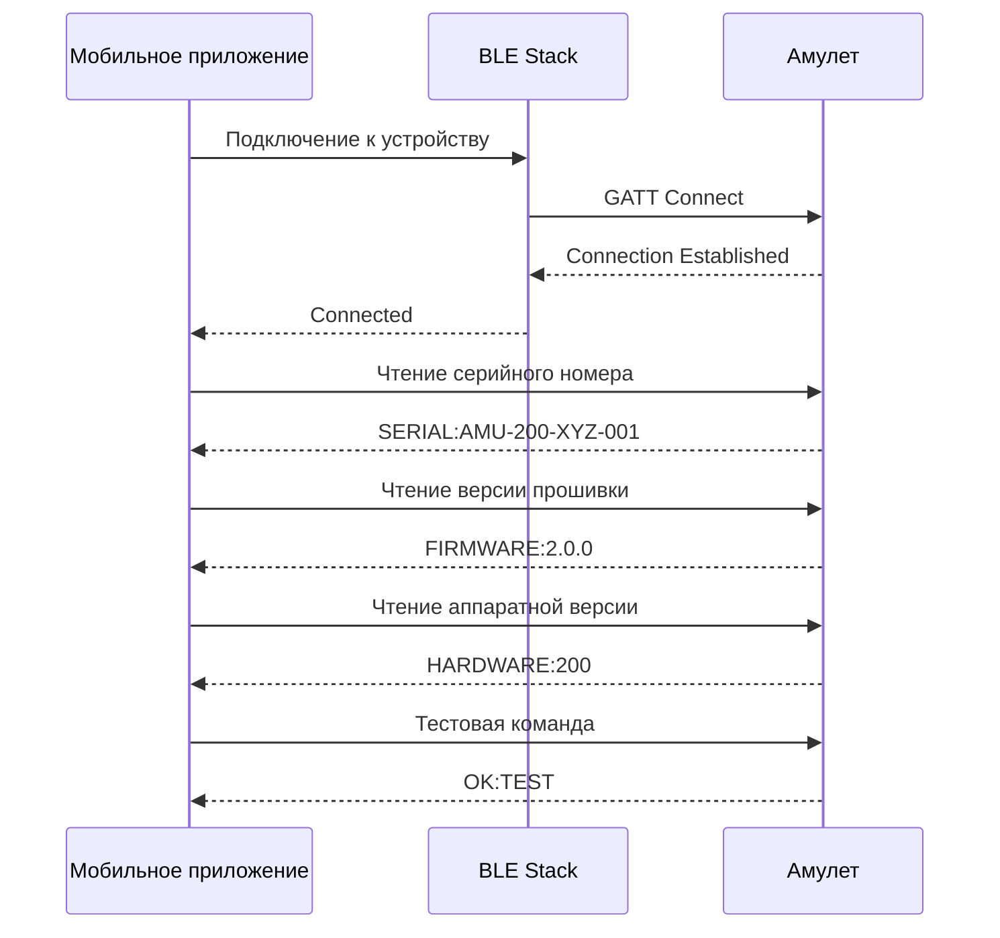
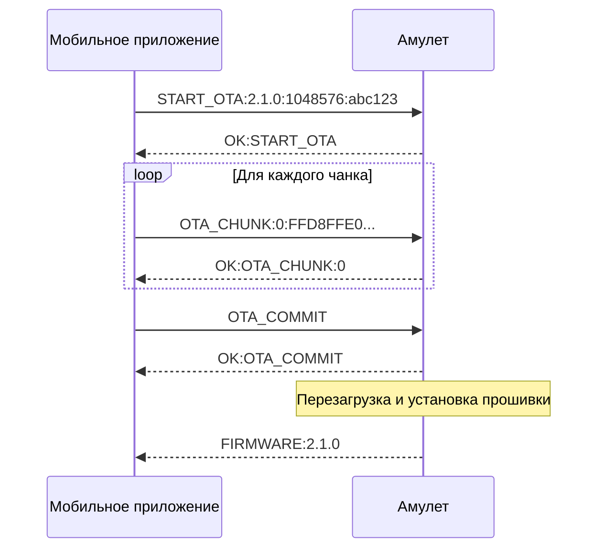
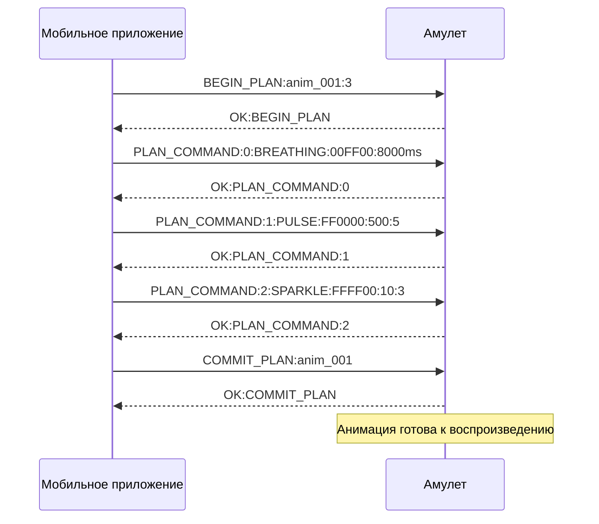

# BLE Протокол для Amulet Ecosystem

## Обзор

Данный документ описывает Bluetooth Low Energy (BLE) протокол для взаимодействия между мобильным приложением Amulet и физическим амулетом. Протокол спроектирован как масштабируемый и эффективный, обеспечивающий надежную передачу команд, анимаций и данных о состоянии устройства.

Протокол состоит из двух частей:
- **Низкоуровневый протокол** - контракт с прошивкой устройства
- **Высокоуровневый API** - контракт для остального приложения

---

## Часть 1: Низкоуровневый протокол (Контракт с прошивкой)

### 1.1. GATT Profile

| Service UUID | Название сервиса | Characteristic UUID | Свойства | Назначение |
|--------------|------------------|-------------------|----------|------------|
| `0000180F-0000-1000-8000-00805F9B34FB` | Battery Service | `00002A19-0000-1000-8000-00805F9B34FB` | Read, Notify | Уровень батареи (0-100%) |
| `12345678-1234-1234-1234-123456789ABC` | Amulet Main Service | `12345678-1234-1234-1234-123456789ABD` | Write, Notify | Командная характеристика |
| `12345678-1234-1234-1234-123456789ABC` | Amulet Main Service | `12345678-1234-1234-1234-123456789ABE` | Read, Write | Данные устройства (Read: серийный номер, версия прошивки, аппаратная версия; Write: имя устройства) |
| `12345678-1234-1234-1234-123456789ABC` | Amulet Main Service | `12345678-1234-1234-1234-123456789ABF` | Write, Notify | OTA обновления |
| `12345678-1234-1234-1234-123456789ABC` | Amulet Main Service | `12345678-1234-1234-1234-123456789AC0` | Write, Notify | Загрузка анимаций |

### 1.2. Формат команд

#### 1.2.1. Структура команд

Все команды передаются как строки в UTF-8 кодировке через командную характеристику.

**Общий формат:** `COMMAND_TYPE:PARAMETERS`

#### 1.2.2. Формат данных устройства

**Чтение данных устройства (Read):**
- **Формат:** `SERIAL:AMU-200-XYZ-001|FIRMWARE:2.0.0|HARDWARE:200`
- **Поля:**
  - `SERIAL` - серийный номер устройства
  - `FIRMWARE` - версия прошивки
  - `HARDWARE` - аппаратная версия (100 или 200)

**Запись имени устройства (Write):**
- **Формат:** `NAME:Пользовательское имя`
- **Пример:** `NAME:Мой Амулет`

#### 1.2.3. Команды управления анимацией

| Команда | Формат | Описание | Пример |
|---------|--------|----------|--------|
| `BREATHING` | `BREATHING:RRGGBB:DURATIONms` | Дыхательная анимация | `BREATHING:00FF00:8000ms` |
| `PULSE` | `PULSE:RRGGBB:SPEED:REPEATS` | Пульсация | `PULSE:FF0000:500:5` |
| `SPARKLE` | `SPARKLE:RRGGBB:COUNT:SPREAD` | Мерцание (v2.0+) | `SPARKLE:FFFF00:10:3` |
| `GRADIENT` | `GRADIENT:RRGGBB1:RRGGBB2:SPEED` | Градиент | `GRADIENT:FF0000:0000FF:1000` |
| `RAINBOW` | `RAINBOW:SPEED:REPEATS` | Радуга | `RAINBOW:2000:3` |
| `CHASE` | `CHASE:RRGGBB:SPEED:DIRECTION` | Бегущие огни (v2.0+) | `CHASE:00FF00:1000:1` |
| `CLEAR` | `CLEAR` | Очистить экран | `CLEAR` |

**Примечание:** Эффекты, предназначенные для кольца светодиодов (например, `CHASE`), на устройствах с `hardwareVersion < 200` адаптируются `PatternCompiler`-ом в совместимый аналог (например, `PULSE`).

#### 1.2.4. Команды управления устройством

| Команда | Формат | Описание | Пример |
|---------|--------|----------|--------|
| `BRIGHTNESS` | `BRIGHTNESS:0-100` | Установить яркость | `BRIGHTNESS:75` |
| `VIBRATION` | `VIBRATION:0-100` | Установить интенсивность вибрации | `VIBRATION:50` |
| `SLEEP` | `SLEEP` | Перевести в режим сна | `SLEEP` |
| `WAKE` | `WAKE` | Пробудить устройство | `WAKE` |

#### 1.2.5. OTA команды

| Команда | Формат | Описание | Пример |
|---------|--------|----------|--------|
| `START_OTA` | `START_OTA:VERSION:SIZE:CHECKSUM` | Начать OTA обновление | `START_OTA:2.1.0:1048576:abc123` |
| `OTA_CHUNK` | `OTA_CHUNK:INDEX:DATA` | Передать чанк прошивки | `OTA_CHUNK:0:FFD8FFE0...` |
| `OTA_COMMIT` | `OTA_COMMIT` | Подтвердить установку | `OTA_COMMIT` |
| `OTA_ABORT` | `OTA_ABORT` | Отменить обновление | `OTA_ABORT` |

#### 1.2.6. Команды загрузки анимаций

| Команда | Формат | Описание | Пример |
|---------|--------|----------|--------|
| `BEGIN_PLAN` | `BEGIN_PLAN:ID:COMMANDS_COUNT` | Начать загрузку плана анимации | `BEGIN_PLAN:anim_001:5` |
| `PLAN_COMMAND` | `PLAN_COMMAND:INDEX:COMMAND` | Добавить команду в план | `PLAN_COMMAND:0:BREATHING:00FF00:8000ms` |
| `COMMIT_PLAN` | `COMMIT_PLAN:ID` | Подтвердить план | `COMMIT_PLAN:anim_001` |
| `ABORT_PLAN` | `ABORT_PLAN:ID` | Отменить план | `ABORT_PLAN:anim_001` |

### 1.3. Формат ответов и уведомлений

#### 1.3.1. Ответы на команды

| Статус | Формат | Описание |
|--------|--------|----------|
| `OK` | `OK:COMMAND` | Команда выполнена успешно |
| `ERROR` | `ERROR:COMMAND:REASON` | Ошибка выполнения |
| `BUSY` | `BUSY:COMMAND` | Устройство занято |

#### 1.3.2. Уведомления о состоянии

| Тип | Формат | Описание |
|-----|--------|----------|
| `BATTERY` | `BATTERY:LEVEL` | Уровень батареи (0-100) |
| `STATUS` | `STATUS:STATE` | Состояние устройства |
| `GESTURE` | `GESTURE:TYPE` | Жест пользователя |
| `ERROR` | `ERROR:CODE:MESSAGE` | Ошибка устройства |

### 1.4. Ключевые сценарии (Sequence Diagrams)

#### 1.4.1. Подключение и "рукопожатие"



#### 1.4.2. OTA-обновление



#### 1.4.3. Загрузка анимации



---

## Часть 2: Высокоуровневый API (Контракт для остального приложения)

### 2.1. Интерфейс AmuletBleManager

```kotlin
// В :core:ble/AmuletBleManager.kt
interface AmuletBleManager {
    // Состояние подключения
    val connectionState: StateFlow<ConnectionState>
    
    // Метрики устройства
    val batteryLevel: Flow<Int>
    val deviceStatus: Flow<DeviceStatus>
    
    // Управление подключением
    suspend fun connect(deviceId: String, autoReconnect: Boolean = true)
    suspend fun disconnect()
    
    // Отправка команд
    suspend fun sendCommand(command: AmuletCommand): Result<Unit, AppError>
    
    // Загрузка анимаций
    suspend fun uploadAnimation(plan: DeviceCommandPlan): Flow<UploadProgress>
    
    // OTA обновления
    suspend fun startOtaUpdate(firmware: FirmwareInfo): Flow<OtaProgress>
    
    // Наблюдение за жестами
    fun observeGestures(): Flow<Gesture>
    
    // Настройки устройства
    suspend fun updateDeviceSettings(settings: DeviceSettings): Result<Unit, AppError>
}
```

### 2.2. Доменные модели

#### 2.2.1. Состояние подключения

```kotlin
// В :shared/domain/model/ConnectionState.kt
sealed interface ConnectionState {
    data object Disconnected : ConnectionState
    data object Connecting : ConnectionState
    data object Connected : ConnectionState
    data object ServicesDiscovered : ConnectionState
    data class Reconnecting(val attempt: Int) : ConnectionState
    data class Failed(val cause: AppError) : ConnectionState
}
```

#### 2.2.2. Команды амулета

```kotlin
// В :shared/domain/model/AmuletCommand.kt
sealed interface AmuletCommand {
    // Анимации
    data class Breathing(val color: Rgb, val durationMs: Int) : AmuletCommand
    data class Pulse(val color: Rgb, val speed: Int, val repeats: Int) : AmuletCommand
    data class Sparkle(val color: Rgb, val count: Int, val spread: Int) : AmuletCommand
    data class Gradient(val color1: Rgb, val color2: Rgb, val speed: Int) : AmuletCommand
    data class Rainbow(val speed: Int, val repeats: Int) : AmuletCommand
    data class Chase(val color: Rgb, val speed: Int, val direction: Int) : AmuletCommand
    data object Clear : AmuletCommand
    
    // Управление устройством
    data class SetBrightness(val level: Int) : AmuletCommand
    data class SetVibration(val intensity: Int) : AmuletCommand
    data object Sleep : AmuletCommand
    data object Wake : AmuletCommand
    
    // OTA
    data class StartOta(val version: String, val size: Long, val checksum: String) : AmuletCommand
    data class OtaChunk(val index: Int, val data: ByteArray) : AmuletCommand
    data object CommitOta : AmuletCommand
    data object AbortOta : AmuletCommand
}

// Вспомогательные типы
data class Rgb(val red: Int, val green: Int, val blue: Int)
```

#### 2.2.3. План команд устройства

```kotlin
// В :shared/domain/model/DeviceCommandPlan.kt
data class DeviceCommandPlan(
    val id: String,
    val commands: List<DeviceCommand>,
    val estimatedDurationMs: Long,
    val hardwareVersion: Int,
    val firmwareVersion: String
)

sealed interface DeviceCommand {
    data class Breathing(val color: Rgb, val durationMs: Int) : DeviceCommand
    data class Pulse(val color: Rgb, val speed: Int, val repeats: Int) : DeviceCommand
    data class Sparkle(val color: Rgb, val count: Int, val spread: Int) : DeviceCommand
    data class Gradient(val color1: Rgb, val color2: Rgb, val speed: Int) : DeviceCommand
    data class Rainbow(val speed: Int, val repeats: Int) : DeviceCommand
    data class Chase(val color: Rgb, val speed: Int, val direction: Int) : DeviceCommand
    data object Clear : DeviceCommand
}
```

#### 2.2.4. Прогресс загрузки

```kotlin
// В :shared/domain/model/UploadProgress.kt
data class UploadProgress(
    val totalChunks: Int,
    val sentChunks: Int,
    val percent: Int,
    val state: UploadState
)

sealed interface UploadState {
    data object Preparing : UploadState
    data object Uploading : UploadState
    data object Committing : UploadState
    data object Completed : UploadState
    data class Failed(val cause: AppError) : UploadState
}
```

#### 2.2.5. Статус устройства

```kotlin
// В :shared/domain/model/DeviceStatus.kt
data class DeviceStatus(
    val batteryLevel: Int,
    val isCharging: Boolean,
    val isOnline: Boolean,
    val lastSeen: Long,
    val firmwareVersion: String,
    val hardwareVersion: Int
)
```

#### 2.2.6. Жесты

```kotlin
// В :shared/domain/model/Gesture.kt
sealed interface Gesture {
    data object SingleTap : Gesture
    data object DoubleTap : Gesture
    data object LongPress : Gesture
    data class Shake(val intensity: Float) : Gesture
}
```

### 2.3. Политики отказоустойчивости

#### 2.3.1. Автоматическое переподключение

```kotlin
// В :core:ble/AmuletBleManagerImpl.kt
class AmuletBleManagerImpl : AmuletBleManager {
    private val reconnectPolicy = ReconnectPolicy(
        maxAttempts = 5,
        baseDelayMs = 1000,
        maxDelayMs = 30000,
        backoffMultiplier = 2.0,
        jitterRange = 0.1..0.3
    )
    
    private suspend fun attemptReconnection() {
        repeat(reconnectPolicy.maxAttempts) { attempt ->
            try {
                connect(deviceId, autoReconnect = false)
                return
            } catch (e: Exception) {
                if (attempt < reconnectPolicy.maxAttempts - 1) {
                    val delay = calculateBackoffDelay(attempt)
                    delay(delay)
                }
            }
        }
        _connectionState.value = ConnectionState.Failed(AppError.BleError.ConnectionFailed)
    }
}
```

#### 2.3.2. Таймауты команд

```kotlin
// В :core:ble/CommandExecutor.kt
class CommandExecutor {
    private val commandTimeouts = mapOf(
        AmuletCommand::class to 10000L, // 10 секунд для обычных команд
        AmuletCommand.StartOta::class to 30000L, // 30 секунд для OTA
        AmuletCommand.OtaChunk::class to 5000L, // 5 секунд для чанков
    )
    
    suspend fun executeCommand(command: AmuletCommand): Result<Unit, AppError> {
        val timeout = commandTimeouts[command::class] ?: 10000L
        return withTimeout(timeout) {
            // Выполнение команды
        }
    }
}
```

#### 2.3.3. Очередь команд

```kotlin
// В :core:ble/CommandQueue.kt
class CommandQueue {
    private val commandQueue = Channel<QueuedCommand>(Channel.UNLIMITED)
    
    data class QueuedCommand(
        val command: AmuletCommand,
        val priority: Int = 0,
        val retryCount: Int = 0,
        val maxRetries: Int = 3
    )
    
    suspend fun enqueueCommand(command: AmuletCommand, priority: Int = 0) {
        commandQueue.send(QueuedCommand(command, priority))
    }
    
    private suspend fun processQueue() {
        for (queuedCommand in commandQueue) {
            try {
                executeCommand(queuedCommand.command)
            } catch (e: Exception) {
                if (queuedCommand.retryCount < queuedCommand.maxRetries) {
                    // Повторная попытка с задержкой
                    delay(1000 * (queuedCommand.retryCount + 1))
                    commandQueue.send(queuedCommand.copy(retryCount = queuedCommand.retryCount + 1))
                }
            }
        }
    }
}
```

#### 2.3.4. Обработка ошибок BLE

```kotlin
// В :core:ble/BleErrorHandler.kt
class BleErrorHandler {
    fun handleBleError(exception: Throwable): AppError {
        return when (exception) {
            is BleConnectionException -> AppError.BleError.DeviceNotFound
            is BleServiceDiscoveryException -> AppError.BleError.ServiceDiscoveryFailed
            is BleWriteException -> AppError.BleError.WriteFailed
            is BleReadException -> AppError.BleError.ReadFailed
            is BleTimeoutException -> AppError.BleError.CommandTimeout(exception.command)
            is BleDisconnectedException -> AppError.BleError.DeviceDisconnected
            else -> AppError.BleError.ConnectionFailed
        }
    }
}
```

### 2.4. Конвертер паттернов в команды

```kotlin
// В :core:ble/PatternCompiler.kt
class PatternCompiler {
    fun compile(spec: PatternSpec, hardwareVersion: Int, firmwareVersion: String): DeviceCommandPlan {
        val commands = mutableListOf<DeviceCommand>()
        
        spec.elements.forEach { element ->
            when (element) {
                is PatternElement.Breathing -> {
                    commands.add(DeviceCommand.Breathing(
                        color = element.color.toRgb(),
                        durationMs = element.durationMs
                    ))
                }
                is PatternElement.Pulse -> {
                    commands.add(DeviceCommand.Pulse(
                        color = element.color.toRgb(),
                        speed = element.speed,
                        repeats = element.repeats
                    ))
                }
                is PatternElement.Sparkle -> {
                    if (firmwareVersion >= "2.1.0") {
                        commands.add(DeviceCommand.Sparkle(
                            color = element.color.toRgb(),
                            count = element.count,
                            spread = element.spread
                        ))
                    } else {
                        // Fallback для старых версий
                        commands.add(DeviceCommand.Pulse(
                            color = element.color.toRgb(),
                            speed = 200,
                            repeats = element.count
                        ))
                    }
                }
                is PatternElement.Gradient -> {
                    commands.add(DeviceCommand.Gradient(
                        color1 = element.color1.toRgb(),
                        color2 = element.color2.toRgb(),
                        speed = element.speed
                    ))
                }
                is PatternElement.Rainbow -> {
                    commands.add(DeviceCommand.Rainbow(
                        speed = element.speed,
                        repeats = element.repeats
                    ))
                }
                is PatternElement.Chase -> {
                    if (hardwareVersion >= 200) {
                        // Реализация для кольца светодиодов
                        commands.add(DeviceCommand.Chase(
                            color = element.color.toRgb(),
                            speed = element.speed,
                            direction = element.direction
                        ))
                    } else {
                        // Fallback для одного светодиода - простая пульсация
                        commands.add(DeviceCommand.Pulse(
                            color = element.color.toRgb(),
                            speed = element.speed,
                            repeats = 3
                        ))
                    }
                }
                // ... другие элементы
            }
        }
        
        return DeviceCommandPlan(
            id = spec.id,
            commands = commands,
            estimatedDurationMs = spec.elements.sumOf { it.durationMs },
            hardwareVersion = hardwareVersion,
            firmwareVersion = firmwareVersion
        )
    }
}
```

### 2.5. Интеграция с архитектурой

#### 2.5.1. DI конфигурация

```kotlin
// В :app/di/BleModule.kt
@Module
@InstallIn(SingletonComponent::class)
object BleModule {
    
    @Provides
    @Singleton
    fun provideAmuletBleManager(
        context: Context,
        errorHandler: BleErrorHandler,
        patternCompiler: PatternCompiler
    ): AmuletBleManager {
        return AmuletBleManagerImpl(context, errorHandler, patternCompiler)
    }
    
    @Provides
    fun provideBleErrorHandler(): BleErrorHandler = BleErrorHandler()
    
    @Provides
    fun providePatternCompiler(): PatternCompiler = PatternCompiler()
}
```

#### 2.5.2. Использование в UseCase

```kotlin
// В :shared/domain/usecase/SendAnimationUseCase.kt
class SendAnimationUseCase(
    private val bleManager: AmuletBleManager,
    private val patternCompiler: PatternCompiler
) {
    suspend fun execute(patternSpec: PatternSpec, deviceId: String): Flow<UploadProgress> {
        val plan = patternCompiler.compile(patternSpec, hardwareVersion = 200, firmwareVersion = "2.0.0")
        return bleManager.uploadAnimation(plan)
    }
}
```

---

## Заключение

Данный BLE протокол обеспечивает:

1. **Масштабируемость** - поддержка различных версий аппаратуры и прошивки
2. **Эффективность** - оптимизированные команды и минимальный overhead
3. **Надежность** - автоматическое переподключение и обработка ошибок
4. **Гибкость** - поддержка сложных анимаций и OTA обновлений
5. **Простота интеграции** - четкий API для остального приложения

Протокол спроектирован с учетом будущего развития продукта и может быть легко расширен новыми командами и возможностями.
