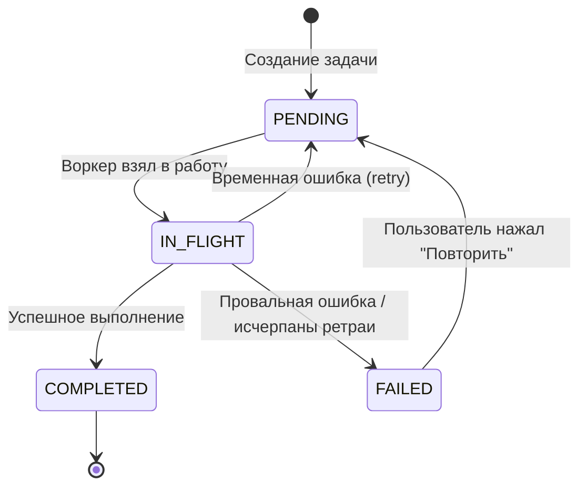

### Документ: `04_OFFLINE_SYNC.md`

**Название:** Стратегия офлайн‑синхронизации и обработки команд

**Цель документа:** Определить единый, надёжный и масштабируемый механизм обработки всех операций изменения данных и команд к устройству. Стратегия должна обеспечить мгновенный отклик UI (Optimistic UI), гарантированную доставку исходящих команд при восстановлении сети, и консистентность локального состояния. Основой служит паттерн Outbox и единственный источник истины — локальная БД (Room).

---

### 1. Ключевые концепции

- **Optimistic UI**: UI обновляется сразу после действия пользователя, не дожидаясь подтверждения сервера. Источник истины — `Flow` из DAO; статусы (например, `SENDING`) визуализируются через поля сущностей и/или связанные записи в `outbox_actions`.
- **Outbox Pattern**: Намерение изменить данные сохраняется в таблицу `outbox_actions` в той же БД, что и основные данные. Фоновый воркер читает очередь и отправляет команды на сервер, обеспечивая доставку даже после перезапуска приложения.
- **Архитектура «Движок и Плагины»**: 
  - Движок (`:core:sync`): универсальная диспетчеризация и исполнение outbox‑очереди (WorkManager, бэкофф, идемпотентность, маппинг ошибок на retry/fail). Не содержит бизнес‑логики.
  - Плагины (`:data:*`): конкретные `ActionProcessor` для доменных команд (HTTP) и делегирование BLE‑команд в `:core:ble`.
- **Единый источник истины (SSOT)**: UI всегда читает из Room; сеть и BLE выступают как источники событий для reconcile.

См. `docs/10_ARCHITECTURE/01_ARCHITECTURE_OVERVIEW.md` и `docs/20_DATA_LAYER/01_DATABASE.md`.

---

### 2. Архитектура и компоненты

- **Модуль `:core:sync` (движок):**
  - `OutboxScheduler`: абстракция планирования фоновой синхронизации; реализация `WorkManagerOutboxScheduler` использует `enqueueUniqueWork(KEEP)` и стандартный констрейнт `NetworkType.CONNECTED`.
  - `OutboxWorker` (`CoroutineWorker`): жизненный цикл задачи — выборка due‑элемента, установка `IN_FLIGHT`, делегирование в `ActionProcessor`, фиксация результата (`COMPLETED`/`FAILED`/retry). Бизнес‑логика отсутствует.
  - `ActionProcessor`: интерфейс «плагина» для обработки конкретного `OutboxActionType`.
  - `ActionProcessorFactory`: поставляет нужный `ActionProcessor` (DI @IntoMap via Hilt).

- **Модули `:data:*` (плагины):**
  - `*RepositoryImpl` (например, `HugsRepositoryImpl`): оркестрация CUD/команд. Транзакционно:
    1) создаёт/обновляет локальную сущность (например, статус `SENDING`),
    2) добавляет запись в `outbox_actions`,
    3) завершает транзакцию и вызывает `outboxScheduler.scheduleSync()`,
    4) возвращает успех немедленно (для Optimistic UI).
  - `*Processor` (например, `SendHugProcessor`): десериализует payload, вызывает `ApiService`, обрабатывает ответ, выполняет локальный reconcile (обновляет сущности/идемпотентные upsert’ы).

- **`:core:database`:** хранит `OutboxActionEntity`, `OutboxDao`, все таблицы домена и утилиты `withTransaction { ... }`. См. раздел «outbox_actions» в `docs/20_DATA_LAYER/01_DATABASE.md`.

- **`:core:ble` (для команд к устройству):** BLE‑команды не помещаются в HTTP‑outbox. Для длительных/критичных BLE‑передач есть собственная очередь/flow‑control внутри `:core:ble` с прогрессом и ретраями; HTTP‑outbox может триггерить BLE‑операции через процессор‑адаптер, если бизнес‑событие требует on‑device эффекта.

---

### 3. Жизненный цикл команды (пример: `HUG_SEND`)

Часть А — пользовательский поток (Optimistic UI):
1) UI → ViewModel → UseCase → `HugsRepository.sendHug()`.
2) Внутри `HugsRepositoryImpl`: `database.withTransaction { upsert(HugEntity(status=SENDING)); enqueue(outbox_actions) }` → `outboxScheduler.scheduleSync()`.
3) UI немедленно видит «объятие» со статусом `SENDING` из Room.

Часть Б — фоновая синхронизация:
1) WorkManager запускает `OutboxWorker` по констрейнтам.
2) `OutboxWorker` работает в цикле: на каждой итерации выбирает один due‑элемент (`PENDING`/`FAILED` с `available_at <= now()`). Если задач нет — завершает работу `Result.success()`.
3) Помечает выбранный элемент `IN_FLIGHT` и через `ActionProcessorFactory` получает соответствующий процессор, вызывает `process(payload)`.
4) На успех — фиксирует `COMPLETED`; на ретраибельную ошибку — рассчитывает бэкофф и переводит в `PENDING`; на не‑ретраибельную — `FAILED`.
5) Переходит к следующей итерации цикла, пока в очереди остаются due‑элементы.
6) UI автоматически обновляется из Room (иконка/статус меняется на «отправлено» или «ошибка»; доступен «Повторить»).

---

### 4. Схема данных и статусы

- Таблица `outbox_actions` (см. `01_DATABASE.md`):
  - Поля: `id`, `type`, `payload_json`, `status (PENDING|IN_FLIGHT|FAILED|COMPLETED)`, `retry_count`, `last_error`, `idempotency_key`, `priority`, `available_at`, `targetEntityId`, `created_at`, `updated_at`.
  - Индексы: `(status, available_at, priority DESC)`, `(type, status)`, `targetEntityId`, `idempotency_key` UNIQUE (nullable).
  - Приоритеты: HIGH для `HUG_SEND`, токенов FCM; NORMAL для профиля/устройств; LOW для паттернов.

- Локальные сущности (пример `hugs`):
  - Официальная стратегия: НЕ добавлять отдельное поле `syncStatus` в сущности. Статус вычислять на лету через `LEFT JOIN` с `outbox_actions` по `targetEntityId` (с фильтром `status != 'COMPLETED'`). DAO предоставляет `Flow<List<...WithStatus>>`.

Диаграмма состояний (Mermaid):



Пример DAO‑контракта (эскиз):

```kotlin
data class HugWithStatus(
    val hug: HugEntity,
    val syncStatus: String? // null = нет активной outbox‑задачи
)

@Query(
  """
  SELECT h.*, o.status AS syncStatus
  FROM hugs h
  LEFT JOIN outbox_actions o
    ON o.targetEntityId = h.id AND o.status != 'COMPLETED'
  WHERE h.toUserId = :uid OR h.fromUserId = :uid
  ORDER BY h.createdAt DESC
  """
)
fun observeHugsWithStatus(uid: String): Flow<List<HugWithStatus>>
```

Обоснование выбора `LEFT JOIN` вместо поля `syncStatus` в сущности:

- Преимущества: 1) База остаётся нормализованной — таблица `hugs` не содержит мета‑информацию о синхронизации; 2) Статус всегда консистентен и берётся из одного источника (`outbox_actions`).
- Недостатки: 1) Незначительное усложнение запросов. С правильными индексами по `targetEntityId` и `(type, status)` влияние на производительность минимально и является приемлемым компромиссом ради чистоты схемы.

---

### 5. Планировщик и WorkManager

- `enqueueUniqueWork(name="outbox_sync", ExistingWorkPolicy.KEEP)`.
- Констрейнты по умолчанию: `NetworkType.CONNECTED`. Для критичных пользовательских команд — `.setExpedited(OutOfQuotaPolicy.RUN_AS_NON_EXPEDITED_WORK_REQUEST)`.
- Бэкофф: экспоненциальный с джиттером `min(base*2^retries, MAX) * random(0.5..1.5)`; `available_at` хранится в БД и учитывается выборкой DAO.
- Утренние «чистки» (cleanup) по TTL: `COMPLETED > 7 дней`, `FAILED > 30 дней` — см. `01_DATABASE.md`.

Восстановление после сбоев (watchdog):

- Проблема: задача может «зависнуть» в статусе `IN_FLIGHT`, если процесс был убит до фиксации результата.
- Решение: при старте приложения и периодически по расписанию запускать сторожевой воркер, который переводит такие записи обратно в `PENDING`.
- Правило: считать «зависшими» записи `IN_FLIGHT`, у которых `updated_at < now() - 5 минут` (порог конфигурируемый).
- Реализация (эскиз SQL):

```sql
UPDATE outbox_actions
SET status = 'PENDING', updated_at = :now
WHERE status = 'IN_FLIGHT' AND updated_at < :cutoff;
```

Рекомендация по конфигурируемости:

- Порог «зависания» (например, 5 минут) вынести в удалённую конфигурацию (`:core:config`/Firebase Remote Config), чтобы корректировать его без релиза, если реальные операции занимают больше времени.

---

### 6. Обработка ошибок и маппинг на WorkManager

- Классы ошибок см. `01_ARCHITECTURE_OVERVIEW.md (AppError)`.
- Таблица правил (концептуально):
  - `Network`, `Timeout`, `Server(5xx)`, `RateLimited(429)` → `Result.retry()`; в БД: инкремент `retry_count`, `status=PENDING`, пересчёт `available_at`.
  - `Unauthorized`, `Forbidden`, `Validation(4xx)`, `NotFound` → `Result.failure()`; `status=FAILED`, `last_error`.
  - `Conflict(409)` для оптимистической блокировки (напр. `Pattern`) → `FAILED_REQUIRES_USER_INTERACTION` (см. ниже) или доменно‑специфичный путь.

UI реагирует на статусы через `Flow` из DAO, предлагая CTA «Повторить» (сброс `retry_count`, `available_at=now()`, `status=PENDING`) или «Отменить» (cleanup).

Правило безопасности (неожиданные исключения):

- Цикл обработки одной задачи в `OutboxWorker` (от выборки до фиксации результата) оборачивается в `try { ... } catch (e: Exception) { ... }`. Любое непредвиденное исключение (например, `NullPointerException` внутри процессора) должно:
  1) быть залогировано (Crashlytics/логгер),
  2) переводить задачу в `FAILED` с заполнением `last_error`, чтобы она не блокировала очередь,
  3) завершать обработку текущего элемента и переходить к следующему.

---

### 7. Синхронизация чтения и удалений

- Pull‑to‑refresh для пользовательских коллекций: стратегия «полная очистка и загрузка первой страницы», затем запись в БД и обновление `remote_keys`. Обеспечивает синхронизацию удалений, выполненных на других устройствах. См. `01_DATABASE.md`.
- Пагинация: Paging 3 + `RemoteMediator`; ключи — в `remote_keys`.

---

### 8. Разрешение конфликтов (оптимистическая блокировка)

- Для сущностей типа `Pattern` используется поле `version` и контракт `PATCH` с версионированием.
- При `409 Conflict` процессор помечает задачу специальным статусом (логически `FAILED_REQUIRES_USER_INTERACTION`), UI открывает диалог с опциями: «Сохранить мою версию», «Принять серверную», «Сохранить как копию», «Отмена». Подробности — в `01_ARCHITECTURE_OVERVIEW.md` (раздел редактора паттернов).

---

### 9. Интеграция с BLE

- BLE‑очередь команд и надёжная доставка реализованы в `:core:ble` и не смешиваются с HTTP‑outbox. Для длительных операций предусмотрены: flow‑control, ретраи, таймауты, прогресс (`Flow<UploadProgress>`). См. `docs/20_DATA_LAYER/03_BLE_PROTOCOL.md`.
- Если бизнес‑действие из outbox требует on‑device эффекта (например, подтверждение доставленного «объятия» — анимация), `ActionProcessor` может опционально триггерить UseCase/репозиторий BLE. Отказоустойчивость BLE управляется отдельно и не влияет на гарантии HTTP‑доставки.

---

### 10. Контракты интерфейсов (эскиз)

```kotlin
// :core:sync
interface OutboxScheduler { fun scheduleSync() }

interface ActionProcessor {
    suspend fun process(action: OutboxActionEntity): Result<Unit, AppError>
}

interface ActionProcessorFactory {
    fun get(type: OutboxActionType): ActionProcessor
}
```

```kotlin
// :data:hugs — оркестрация Optimistic UI + enqueue
class HugsRepositoryImpl(
    private val db: AppDatabase,
    private val outbox: OutboxDao,
    private val scheduler: OutboxScheduler,
) : HugsRepository {
    override suspend fun sendHug(draft: HugDraft): Result<Unit, AppError> =
        db.withTransaction {
            val local = HugEntity.fromDraft(draft, status = "SENDING")
            db.hugsDao().upsert(local)
            outbox.enqueue(
                type = OutboxActionType.HUG_SEND,
                payload = draft.toPayloadJson(),
                targetEntityId = local.id,
                priority = HIGH,
            )
        }.also { scheduler.scheduleSync() }.let { Result.success(Unit) }
}
```

---

### 11. Диаграмма потоков (упрощённо)

```
UI → ViewModel → UseCase → Repository (enqueue + local upsert) → Room (Flow → UI)
                                        ↓ schedule
                                   WorkManager
                                        ↓
                                OutboxWorker (Engine)
                                        ↓
                              ActionProcessor (Plugin)
                            ↙                         ↘
                      :core:network (HTTP)        :core:ble (optional)
```

---

### 12. Нефункциональные требования

- Надёжность: команды с типами из `OutboxActionType` доставляются при восстановлении сети; GET‑операции не ставятся в outbox.
- Идемпотентность: `idempotency_key` указывается для серверных CUD; повторные попытки не должны создавать дубликаты. Критически важный контракт с бэкендом: все CUD‑эндпоинты, вызываемые из `OutboxWorker`, ОБЯЗАНЫ поддерживать идемпотентность по `Idempotency-Key`. Повторная отправка запроса с тем же ключом должна возвращать тот же успешный результат, что и первый, без создания дублей.
- Производительность: минимизировать размер `payload_json`; тяжёлые вложения хранить отдельно и ссылаться из payload.
- Безопасность/приватность: см. локальное шифрование БД и согласия в `01_DATABASE.md` и `01_ARCHITECTURE_OVERVIEW.md`.

---

### 13. Чек‑лист внедрения

- Создать модуль `:core:sync` с `OutboxScheduler`, `OutboxWorker`, `ActionProcessorFactory` и базовой обработкой ошибок/бэкофа.
- В `:core:database` добавить `OutboxActionEntity`, `OutboxDao`, индексы, транзакционные утилиты.
- В `:data:*` реализовать `*RepositoryImpl` с транзакционной оркестрацией и `*Processor` на каждую команду.
- Прописать DI биндинги в `:app` (строгая изоляция фич соблюдается). См. `02_MODULARIZATION.md`.
- Интегрировать UI статусы через `Flow` из DAO и CTA на ретраи.
- Настроить WorkManager: unique work, констрейнты, expedited для критичных команд, ежедневные cleanups.

---

### 14. Примечания по эволюции

- Возможна специализация движка для отдельных очередей (HTTP‑outbox и BLE‑очередь) при сохранении общих принципов ретраев/приоритетов.
- Для редких доменов, где нужен конфликт‑диалог, придерживаться оптимистической блокировки и UI‑разрешения (см. раздел для `Pattern`).


