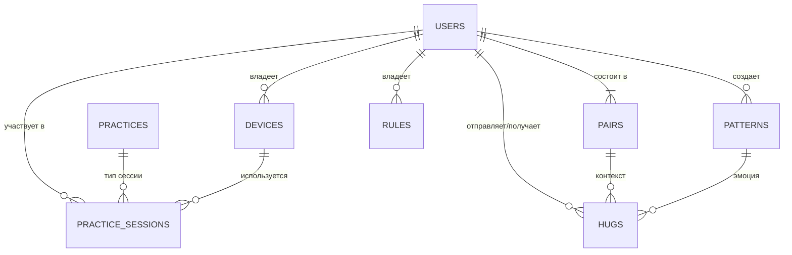

### Цель документа

Документ:
- Определяет ключевые доменные модели (бизнес‑сущности) проекта.
- Устанавливает правила и соглашения для разработки и эволюции моделей.
- Разграничивает Domain Models от DTO и Database Entities.
- Служит справочником для разработчиков Domain/UseCase/ViewModel.

---

### 1. Философия и принципы

- Назначение: «Доменные модели — это чистые, иммутабельные структуры данных, представляющие бизнес‑сущности и концепции приложения. Они — язык взаимодействия `UseCase`, `Repository` (интерфейсов) и `ViewModel`. Это источник истины для бизнес‑логики».
- Место в архитектуре:
  - Модуль: только `:shared` (KMP). Никаких Android/Retrofit/Room зависимостей.
  - Технология: `data class`, `enum class`, `sealed interface`/`sealed class`.
  - Без аннотаций фреймворков: никаких `@Entity`, `@Serializable`, `@Parcelize` и т.п.
- Трёхслойная система моделей:
  - DTO — в `:core:network`, структура следует внешнему API.
  - Database Entities — в `:core:database`, структура оптимальна для Room.
  - Domain Models — в `:shared`, структура диктуется бизнес‑требованиями (этот документ).

---

### 2. Общие соглашения по моделям

- Иммутабельность: все свойства через `val`. Изменения — только через `.copy(...)`.
- Nullability: `null` только для реально опциональных с точки зрения бизнеса полей (например, ссылка‑ответ у «объятия»). Не использовать `null` для загрузки/ошибок.
- Типобезопасные идентификаторы: все ID — value‑классы.

```kotlin
@JvmInline value class UserId(val value: String)
@JvmInline value class DeviceId(val value: String)
@JvmInline value class HugId(val value: String)
@JvmInline value class PairId(val value: String)
@JvmInline value class PatternId(val value: String)
@JvmInline value class PracticeId(val value: String)
@JvmInline value class PracticeSessionId(val value: String)
@JvmInline value class RuleId(val value: String)
@JvmInline value class FirmwareId(val value: String)
```

- Время: использовать `kotlinx.datetime.Instant` в Domain.
- Перечисления и иерархии: для фиксированных наборов значений — `enum class` или `sealed interface` (например, `PairStatus`, `ReviewStatus`, `PracticeType`, `PracticeSessionStatus`).
- Именование: простое и бизнес‑ориентированное (`User`, `Hug`, `Pair` без суффиксов `Model`).

---

### 3. Ключевые доменные модели

Ниже — канонические определения (Kotlin, Domain), краткие описания полей и связи.

#### 3.1 User

```kotlin
data class User(
  val id: UserId,
  val displayName: String?,
  val avatarUrl: String?,
  val timezone: String?,
  val language: String?,
  val consents: UserConsents?,
  val createdAt: Instant?,
  val updatedAt: Instant?
)

data class UserConsents(
  val analytics: Boolean = false,
  val usage: Boolean = false,
  val crash: Boolean = false,
  val diagnostics: Boolean = false
)
```

- Связи: `User` владеет `Device`, создаёт `Pattern`, отправляет/получает `Hug`, участвует в `Pair`, инициирует `PracticeSession`, владеет `Rule`.

#### 3.2 Device

```kotlin
enum class DeviceStatus { ONLINE, OFFLINE, CHARGING, ERROR, BANNED }

data class Device(
  val id: DeviceId,
  val ownerId: UserId,
  val serial: String,
  val hardwareVersion: Int, // 100/200
  val firmwareVersion: String?,
  val name: String?,
  val batteryLevel: Double?,
  val status: DeviceStatus?,
  val pairedAt: Instant?,
  val updatedAt: Instant?
)
```

- Связи: `User` — владелец; `Device` может быть контекстом для `PracticeSession` и превью `Pattern`.

#### 3.3 Pair

```kotlin
enum class PairStatus { ACTIVE, PENDING, BLOCKED }

data class Pair(
  val id: PairId,
  val memberIds: List<UserId>,
  val status: PairStatus,
  val blockedBy: UserId?,
  val blockedAt: Instant?,
  val createdAt: Instant
)
```

- Связи: `Pair` объединяет пользователей; «объятия» могут ссылаться на `pairId`.

#### 3.4 Pattern

```kotlin
enum class PatternKind { LIGHT, HAPTIC, COMBO }
enum class ReviewStatus { PENDING, APPROVED, REJECTED }

data class Pattern(
  val id: PatternId,
  val version: Int,
  val ownerId: UserId?, // null для системных
  val kind: PatternKind,
  val spec: PatternSpec,
  val public: Boolean,
  val reviewStatus: ReviewStatus?,
  val hardwareVersion: Int, // 100/200
  val title: String,
  val description: String?,
  val tags: List<String> = emptyList(),
  val usageCount: Int? = null,
  val sharedWith: List<UserId> = emptyList(),
  val createdAt: Instant?,
  val updatedAt: Instant?
)

sealed interface PatternElement

data class PatternSpec(
  val type: String,
  val hardwareVersion: Int,
  val durationMs: Int? = null,
  val loop: Boolean = false,
  val elements: List<PatternElement> = emptyList()
)
```

- Связи: `User` (owner), `Pattern` может использоваться в `Hug` и `Practice`.
- Примечание: в Domain допускаем агрегирование `PatternSpec` как чистой структуры; детали сериализации остаются за DTO/Entity.

#### 3.5 Hug

```kotlin
data class Hug(
  val id: HugId,
  val fromUserId: UserId,
  val toUserId: UserId?,
  val pairId: PairId?,
  val emotion: Emotion,
  val payload: Map<String, Any?>?,
  val inReplyToHugId: HugId?,
  val deliveredAt: Instant?,
  val createdAt: Instant
)

data class Emotion(
  val colorHex: String,
  val patternId: PatternId?
)
```

- Связи: `User` → `Hug` (from/to), опционально `Pair`, опционально `Pattern` как эмоция.

#### 3.6 Practice и PracticeSession

```kotlin
enum class PracticeType { BREATH, MEDITATION, SOUND }
enum class PracticeSessionStatus { ACTIVE, COMPLETED, CANCELLED }

data class Practice(
  val id: PracticeId,
  val type: PracticeType,
  val title: String,
  val description: String?,
  val durationSec: Int?,
  val patternId: PatternId?,
  val audioUrl: String?,
  val createdAt: Instant?,
  val updatedAt: Instant?
)

data class PracticeSession(
  val id: PracticeSessionId,
  val userId: UserId,
  val practiceId: PracticeId,
  val deviceId: DeviceId?,
  val status: PracticeSessionStatus,
  val startedAt: Instant,
  val completedAt: Instant?,
  val durationSec: Int?,
  val intensity: Double?,
  val brightness: Double?,
  val completed: Boolean
)
```

- Связи: `User` ↔ `PracticeSession` ↔ (`Practice`, `Device`).

#### 3.7 Rule (IFTTT)

```kotlin
data class Rule(
  val id: RuleId,
  val ownerId: UserId,
  val trigger: RuleTrigger,
  val action: RuleAction,
  val schedule: Map<String, Any?>? = null,
  val enabled: Boolean = true
)

data class RuleTrigger(
  val type: String,
  val params: Map<String, Any?> = emptyMap()
)

data class RuleAction(
  val type: String,
  val params: Map<String, Any?> = emptyMap()
)
```

- Связи: `User` владеет правилами; локальные триггеры могут воздействовать на `Device`/BLE через UseCase.

#### 3.8 FirmwareInfo (OTA)

```kotlin
data class FirmwareInfo(
    val id: FirmwareId,
    val hardwareVersion: Int,
    val version: FirmwareVersion,
    val downloadUrl: String,
    val changelog: String?,
    val isMandatory: Boolean,
    val sizeBytes: Long?,
    val checksum: String?
)

data class FirmwareVersion(
    val name: String,
    val code: Int
) : Comparable<FirmwareVersion> {
    
    override fun compareTo(other: FirmwareVersion): Int {
        return this.code.compareTo(other.code)
    }
}
```

- Связи: используется при принятии решений в UseCase/оркестраторах OTA.

---

### 4. Диаграмма взаимодействия моделей (Domain‑уровень)



Примечание: Диаграмма на уровне домена; фактические таблицы и индексы см. `20_DATA_LAYER/01_DATABASE.md`.

---

### 5. Разграничение слоёв и маппинг

- DTO (`:core:network`) ↔ Domain (`:shared`) ↔ Entities (`:core:database`) конвертируются в `:data:*` модулях через мапперы.
- В Domain — только чистые типы, `Instant`, value‑ID, enum/sealed.
- Время в DTO может приходить в разных форматах (ISO/Timestamp) — нормализуется сериализаторами в DTO; в Domain передаётся как `Instant`/числа бизнес‑смысла.

---

### 6. Частые доменные перечисления

```kotlin
enum class PairStatus { ACTIVE, PENDING, BLOCKED }
enum class ReviewStatus { PENDING, APPROVED, REJECTED }
enum class PracticeType { BREATH, MEDITATION, SOUND }
enum class PracticeSessionStatus { ACTIVE, COMPLETED, CANCELLED }
enum class DeviceStatus { ONLINE, OFFLINE, CHARGING, ERROR, BANNED }
```

---

### 7. Правила эволюции моделей

1) Изменение в API → сперва обновить DTO в `:core:network`.
2) Обсуждение → решаем, как (и нужно ли) отражать изменение в Domain. Не все поля DTO должны попадать в Domain.
3) Обновление Domain Model → внести изменения в `:shared` (value‑классы/enum/поля/типы времени `Instant`).
4) Обновление мапперов → адаптировать преобразования в `:data:*` (DTO→Domain, Entity↔Domain).
5) Обновление Entities → при необходимости обновить Room‑сущности и миграции.
6) Обновление кода → UseCase, ViewModel, UI. Компилятор поможет найти места использования.

Контрольный список:
- Сохранить иммутабельность и типобезопасные ID.
- Проверить влияние на конфликты/версионирование (например, `Pattern.version`).
- Обновить тесты мапперов и UseCase.

---

### 8. Доменные анти‑паттерны (избегать)

- Протекание DTO/Entity в Domain/UseCase/ViewModel.
- Использование `String`/`Long` вместо value‑ID классов.
- Представление времени как `Long` без бизнес‑контекста — используйте `Instant`.
- «Магические строки» для статусов — используйте `enum`/`sealed`.
- Мутируемые состояния в моделях.

---

### 9. Примеры маппинга (концептуально)

```kotlin
// :data:hugs
fun HugDto.toDomain(): Hug = Hug(
  id = HugId(id),
  fromUserId = UserId(fromUserId),
  toUserId = toUserId?.let(::UserId),
  pairId = pairId?.let(::PairId),
  emotion = Emotion(colorHex = emotion.color, patternId = emotion.patternId?.let(::PatternId)),
  payload = payload, // приведено к Map по правилам
  inReplyToHugId = inReplyToHugId?.let(::HugId),
  deliveredAt = deliveredAtInstant,
  createdAt = createdAtInstant
)
```

Где `deliveredAtInstant/createdAtInstant` — нормализация в `Instant` на уровне DTO сериализаторов.

---

### 10. Глоссарий (коротко)

- Domain Model — чистая бизнес‑модель (`:shared`).
- DTO — сетевой контракт (`:core:network`).
- Entity — схема хранения (`:core:database`).
- UseCase — атомарная бизнес‑операция над Domain.
- Orchestrator — координация многошаговых процессов (использует Domain/UseCase).


