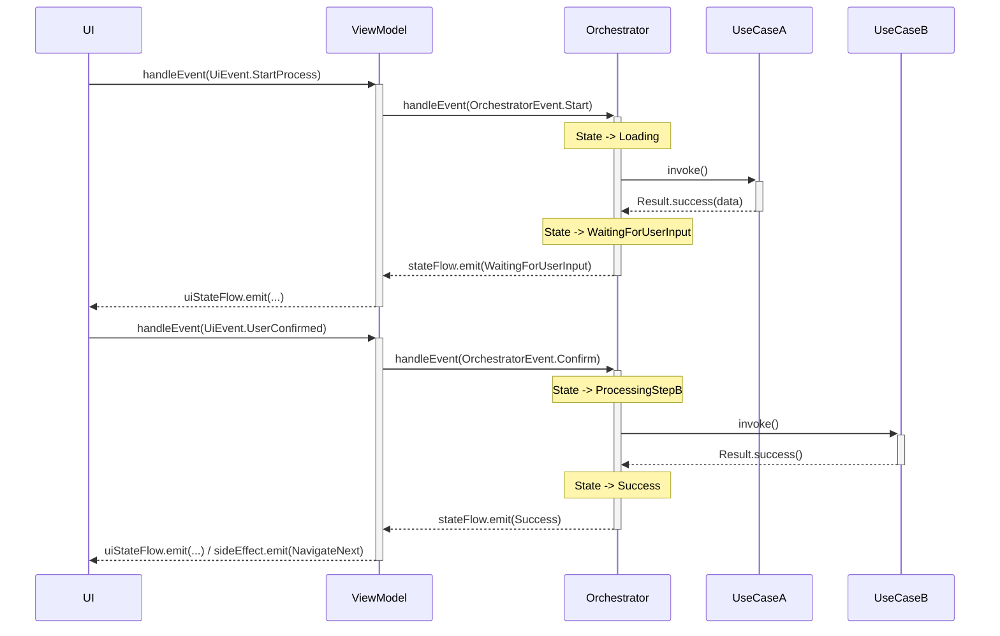

### Цель документа

Документ отвечает на три вопроса:
1. ЧТО такое Оркестратор в контексте проекта
2. КОГДА его использовать (и когда достаточно UseCase)
3. КАК правильно реализовывать, тестировать и интегрировать его с ViewModel

---

#### 1. Назначение и философия

- Определение: Оркестратор — это stateful‑компонент доменного слоя (`:shared`), управляющий сложным, многошаговым бизнес‑процессом. Он координирует несколько атомарных UseCase для достижения одной крупной цели.
- Место в архитектуре: между ViewModel и UseCase. ViewModel делегирует управление процессом оркестратору; оркестратор использует UseCase как строительные блоки.
- Отличие от UseCase: UseCase — один атомарный «глагол», stateless. Оркестратор — сценарий из нескольких шагов, stateful (хранит состояние шага/контекста).

Ключевые цели:
- Снизить связанность ViewModel c множеством UseCase и последовательностями их вызовов
- Сконцентрировать транзакционность, компенсации и долгоживущие процессы в одном месте
- Повысить тестируемость сложных сценариев (детерминированная модель состояний)

---

#### 2. Когда использовать Оркестратор (Критерии)

Использовать, если процесс:
- Многошаговый: включает 2+ последовательных вызова UseCase
- Имеет состояние: процесс переходит через стадии (ожидание ввода, загрузка, обработка, ошибка на шаге N)
- Интерактивный: требует участия пользователя между шагами
- Требует транзакционности/компенсации: при падении шага N+1 нужно откатить шаг N
- Долгоживущий: длится дольше мгновенного действия

Хорошие кандидаты:
- Сопряжение устройства (NFC → облачная привязка → BLE‑настройка → тест)
- Онбординг (профиль → согласия → разрешения → обучение)
- Мастер создания правила в Control Center (валидации и превью по шагам)

НЕ использовать (достаточно UseCase):
- Простые CRUD‑операции: отправка «объятия», изменение имени профиля, получение списка практик

---

#### 3. Каноническая структура и контракт

State: внутренняя модель состояния процесса (не UI). Пример для сопряжения (идея состояний): Idle, WaitingForNfc, ClaimingOnServer, ConfiguringBle, Success, Failed(step, error).

Event: внешние события, которыми управляют процессом (например: StartPairing, NfcTagScanned(token), UserConfirmed, RetryStep).

Класс Оркестратора — контракт:
- Вход (Input): `fun handleEvent(event)` — единая точка управления процессом
- Выход (Output): `val state: StateFlow<ProcessState>` — поток состояний процесса
- Зависимости: только UseCase интерфейсы (`:shared`)
- Размещение: `:shared` (KMP), без платформозависимых API

Инварианты:
- Оркестратор не обращается напрямую к DAO/ApiService/UI
- Все ошибки типизированы `AppError` (см. Error Handling)
- Ветвления и компенсации локализованы внутри оркестратора

---

#### 4. Диаграмма взаимодействия

---

#### 5. Детальный пример: DevicePairingOrchestrator (без кода)

State (смысл):
- Idle → WaitingForNfc → ClaimingDevice(serial) → ConfiguringBle(device) → Success(device) / Failed(error)

События (смысл):
- StartPairing, NfcTagScanned(token), UserConfirmed, RetryStep, Cancel

Логика процесса (смысл):
- StartPairing переводит в WaitingForNfc
- NfcTagScanned вызывает UseCase «ClaimDevice», на успех — переход в ConfiguringBle; на ошибку — Failed
- В ConfiguringBle вызывает UseCase конфигурации BLE; на успех — Success; на ошибку — Failed

Интеграция с ViewModel (смысл):
- ViewModel подписывается на `orchestrator.state` и редьюсит его в `ScreenState` (например, ClaimingDevice → isLoading=true, message="Привязываем амулет…")
- Одноразовые события UI (навигация/диалоги) генерируются на основании переходов состояний

---

#### 6. Обработка ошибок и компенсация

Проброс ошибок:
- Любые `Result.failure` от UseCase переводятся в состояние Failed с указанием шага

Компенсация (Saga‑подход):
- Если шаг N+1 упал, оркестратор выполняет компенсирующие действия для шага N (например, после успешного ClaimDevice при неудачном BLE‑настройке — вызывает UnclaimDevice)
- Компенсации должны быть идемпотентны и безопасны при повторах

Политики ретраев:
- Для временных ошибок возможно повторение с бэкофом; для бизнес‑ошибок — перевод в Failed и ожидание решения пользователя

---

#### 7. Жизненный цикл и DI

- Создание: оркестратор создаётся для конкретного экрана/процесса; не singleton
- Жизненный цикл: привязан к `viewModelScope`; все корутины должны корректно отменяться
- DI: оркестратор получает UseCase через DI (Koin в `:shared` + мост в Hilt на Android)

---

#### 8. Тестирование

Что тестируем:
- Корректность переходов между состояниями на каждое событие и исход UseCase
- Обработку ошибок, выполнение компенсаций, ретраи

Как тестируем:
- Мокаем все UseCase‑зависимости
- Используем Turbine для проверки `StateFlow` состояний
- Примеры проверок (смысл): из ClaimingDevice при ошибке UseCase → состояние Failed; при успехе BLE‑настройки → Success

---

Резюме
- Оркестратор — единая точка координации многошаговых процессов
- Делегирование ViewModel → Orchestrator упрощает UI‑слой и повышает тестируемость
- Чёткая модель State/Event/Effects обеспечивает предсказуемость и масштабируемость

